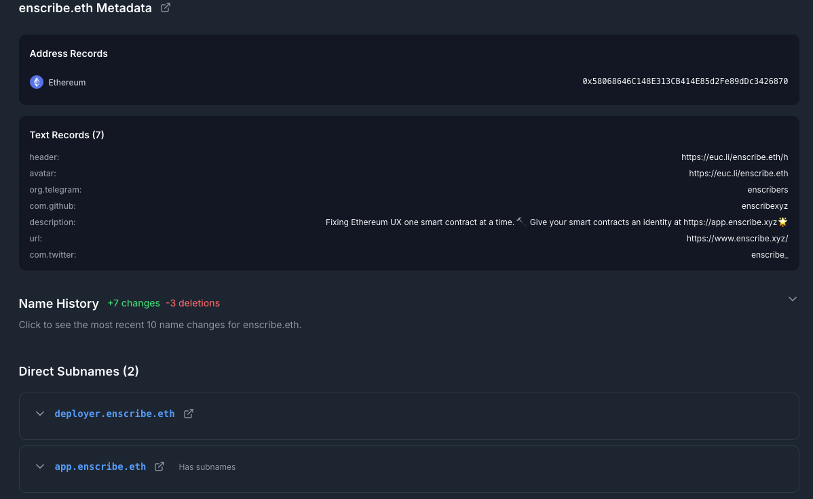
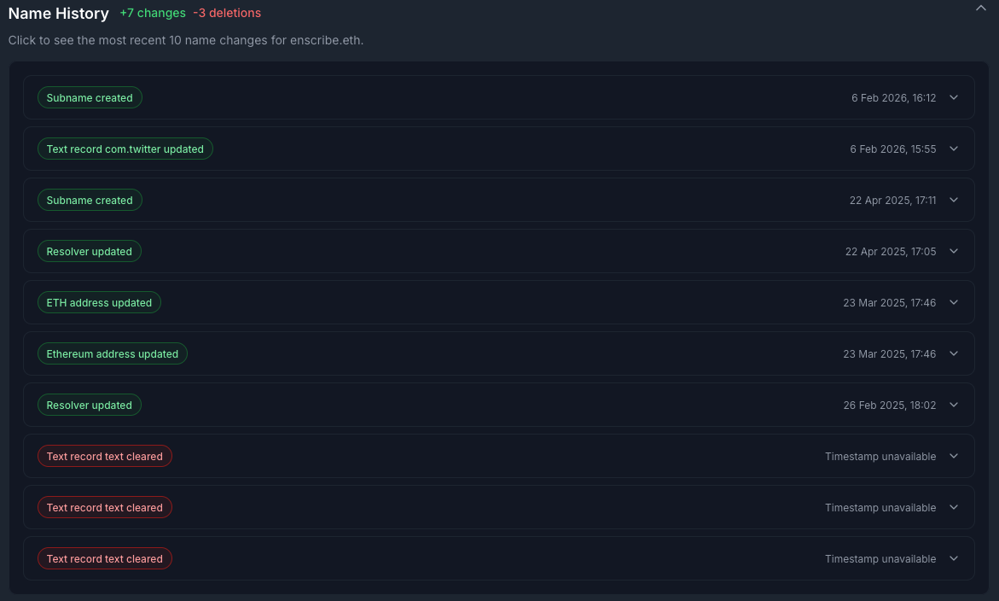
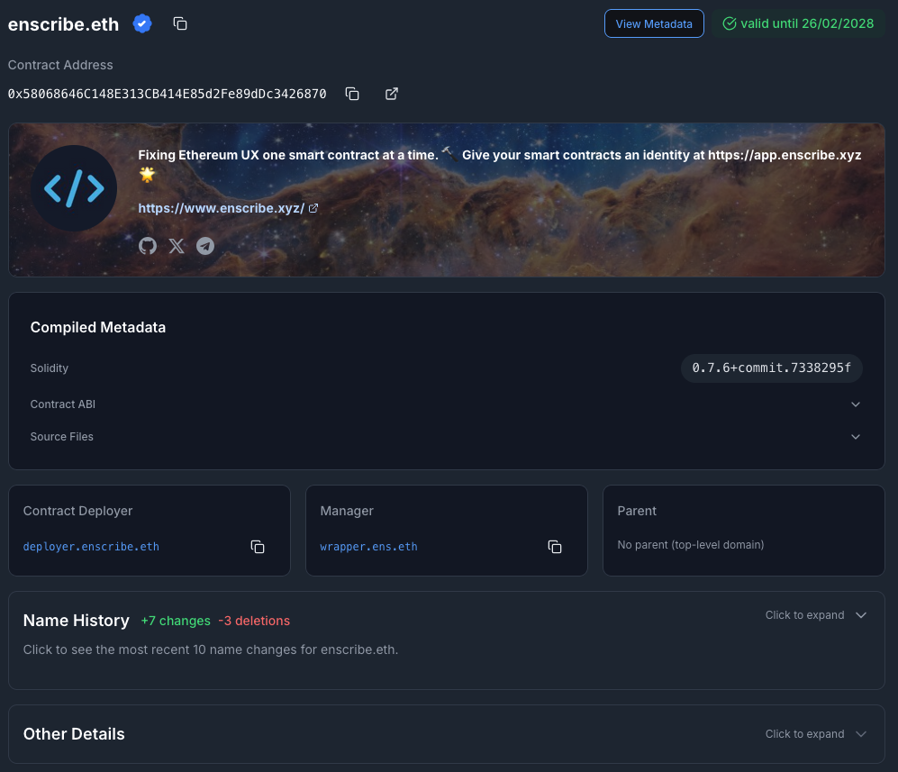

It is important to know the history of a name, especially when you want to understand how a name has changed over time.

That's why we have added a new **Name History** section to the Name Explorer & Contract Details pages in Enscribe. It gives you a compact record of recent activity for a name, including metadata updates, resolver changes, and subname activity.

{/* truncate */}

## What the Name History section is about

Name History is a recent activity view for a single ENS name. Instead of showing only the current state of a name, it shows how that state changed over time. A text record update, a content hash change, a resolver change, or a subname created now has a place in the UI.

The section is compact by default. You can expand it, scan the latest entries, and open only the events you care about. That keeps the page readable while still exposing the operational context behind a name.

## Why it helps to show a name’s history

Current metadata tells you what a name looks like now. History tells you what happened.

That matters when a team is managing contracts, wallets, agents or subnames under one namespace. If an address record changed, you want to know that it changed. If a subname was deleted, you want that reflected in the interface. If a resolver moved, you want to see it without comparing transaction traces by hand.

For operators, history makes review easier. For collaborators, it adds context. For users, it makes a name feel less opaque.

We show this history on the [Name Explorer page](https://app.enscribe.xyz/nameMetadata?name=enscribe.eth):

This is how it looks when expanded:

The naming history is also available on the [Contract Details page](https://app.enscribe.xyz/explore/1/enscribe.eth):

## How we fetch the data

We fetch a bounded set of recent events from the subgraph and merge them into one recent-history feed. The UI currently includes text record changes, multicoin address changes, interface changes, ETH address changes, content hash changes, and resolver changes.

For subname activity, we also query recent child domains under the current name. If a child domain resolves to the zero address owner, we render that as a deletion entry in the history view.

The result is a recent, readable view of what happened to a name, not just what it stores today.

This tells you the history of a name, not just what it stores today.

Happy naming! 🚀
