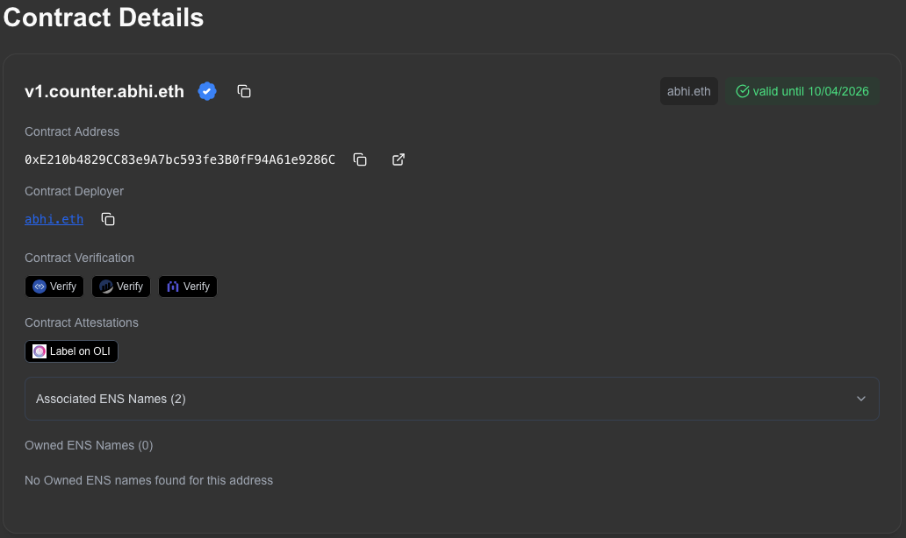

Foundry is one of the most popular toolchains for Ethereum smart contract development. Built in Rust, Foundry provides everything needed to build, test, and deploy smart contracts. At the center of this workflow is Forge, Foundry’s scripting and deployment tool. Forge scripts are written in Solidity itself, allowing developers to deploy contracts and interact with them.

However, one key step that developers miss in their workflows is to name their contracts right after the deployment is done. This is where our new [Enscribe](https://github.com/enscribexyz/enscribe) plugin comes in.

The key idea behind Enscribe is simple: naming should be automated and baked into the deployment scripts. Using Enscribe, a Forge script can register or update an ENS name for a deployed contract, optimally only set forward resolution (ENS → address), and set reverse resolution (address → ENS). Because this logic runs in Solidity, it integrates naturally with Foundry’s scripting environment.

Let’s see how developers can set names for their contract with Enscribe and Forge working together.

1. Create a new project:

   ```bash
   forge init counter
   cd counter
   ```

2. Install the Enscribe plugin:

    ```bash
    forge install enscribexyz/enscribe
    ```

3. Install openzeppelin:

    ```bash
    forge install OpenZeppelin/openzeppelin-contracts
    ```

4. Create `remapping.txt` in the root dir and add the following to it to simplify imports:

    ```bash
    enscribe/=lib/enscribe/src/
    @openzeppelin/contracts/=lib/openzeppelin-contracts/contracts/
    ```

5. Make `Counter` implement `Ownable`:

    ```solidity
    import "@openzeppelin/contracts/access/Ownable.sol";  

    contract Counter is Ownable {      
        constructor(uint256 initialCount) Ownable(msg.sender) {
            number = initialCount      
        }
    }
    ```

6. Edit our deployment script `Counter.s.sol` to set a primary name for the contract once deployed:

    ```solidity
    import {Ens} from "enscribe/Ens.sol";  
    import {Script, console} from "forge-std/Script.sol";
    import {Counter} from "../src/Counter.sol";

    contract CounterScript is Script {
        Counter public counter;  

        function setUp() public {}

        function run() public {
            vm.startBroadcast();  

            counter = new Counter(0);
                Ens.setName(block.chainid, address(counter), "v1.counter.abhi.eth");
            
            vm.stopBroadcast();
        }
    }
    ```

7. Run the script  to deploy the contract on Sepolia and set the name at deployment!

    ```bash
    forge script script/Counter.s.sol:CounterScript --chain-id 11155111 --rpc-url $SEPOLIA_RPC_URL --broadcast --private-key $PRIVATE_KEY
    ```

You can now [view the deployed contract in Enscribe app](https://app.enscribe.xyz/explore/11155111/v1.counter.abhi.eth):



This simplification means that teams can use Enscribe to name their releases. For example, we not only named our contract but versioned it too with v1.counter.abhi.eth.

By making contract naming easier and part of the deployment workflow with Foundry, Enscribe encourages better UX and improves safety and usability across the Ethereum ecosystem.

In a world where users increasingly should see human-readable names instead of hex addresses in wallets and explorers, Enscribe helps ensure that smart contracts are just as legible as the accounts that interact with them.

Give it a try.

Happy naming! 🚀