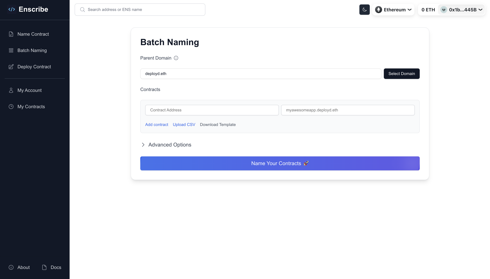
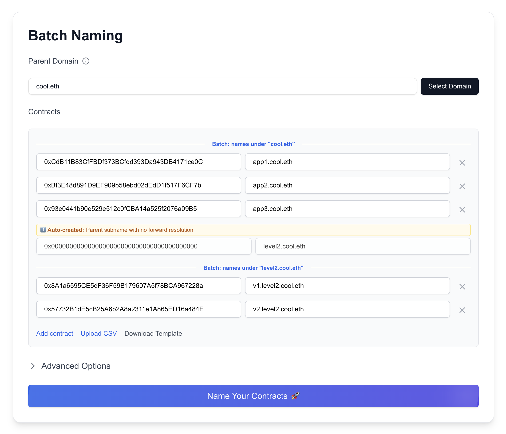
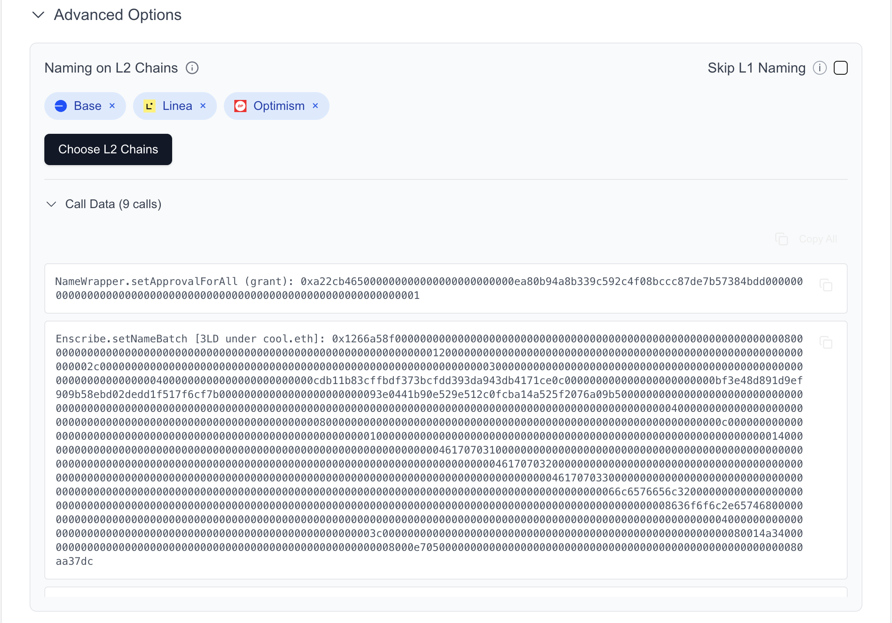
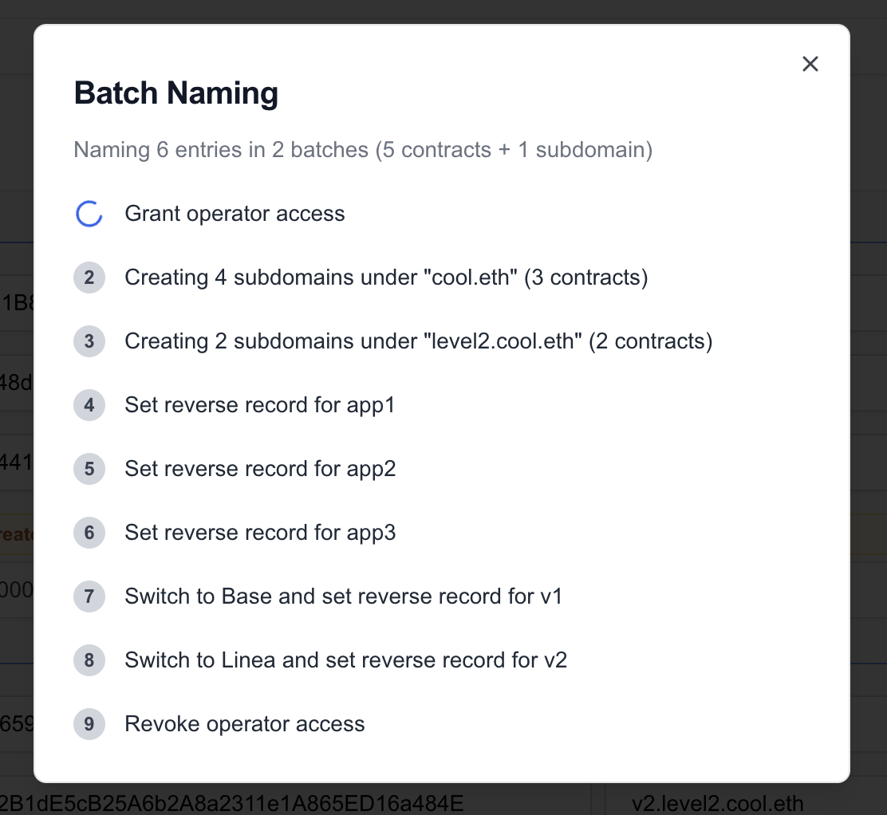

import AppUrl from '@site/src/components/AppUrl';

Enscribe has shipped **Contract Batch Naming** feature for our [Enscribe UI app](https://app.enscribe.xyz/batchNaming). Teams and projects can now name multiple smart contracts at once under a single parent domain. This reduces the contract naming process for projects with multiple deployed contracts from hours to minutes.

## Why Batch Naming?

Managing multiple smart contracts across different chains has always been a challenge and time-consuming. Whether you're a DAO with governance contracts, a DeFi with multiple vault, protocol, core and utility contracts, or an infrastructure project with contracts deployed across chains, naming each contract individually means repeating the same steps: creating subnames, setting forward resolutions, and setting reverse resolutions. Each step costs gas.

When we worked with [Nouns DAO](https://nouns.wtf) to name their contracts, we saw this problem firsthand. They had to create subnames, set forward resolutions, and set reverse resolutions for each contract as a new step and their governance only allows maximum 10 transaction in a single proposal. This was their first proposal: [ENS x Nouns, Name our Smart Contracts](https://www.nouns.camp/candidates/ens-x-nouns%2C-name-our-smart-contracts-2117bf88b4cb0186eaa87500a045fc998290e42a?tab=transactions) which didn't get through because of this issue.

Thus we built the Enscribe V2 contract to support batch naming with multi-chain support. This contract is now live on Ethereum mainnet and Sepolia testnet. You can read more about it in this [blog post](/blog/enscribe-v2). Using the Enscribe V2 contract, you can name multiple contracts in one transaction.

We are now adding this batch naming feature support to our [Enscribe UI app](https://app.enscribe.xyz/batchNaming).

## How Batch Naming Works

Batch naming uses the Enscribe V2 contract's `setNameBatch()` function. This involves a single transaction for creating subnames under the same parent domain and setting forward resolutions for all contracts at once. For example, if you're naming 10 contracts under `myproject.eth`, you just need one transaction to create 10 subnames and forward resolutions for all 10 contracts.

But for setting primary names, you need to execute one transaction for each compatible contract (contracts that are ownable/ERC-173 compliant) to set reverse resolution. Here's what happens under the hood:

### The Technical Flow

1. **Operator Access**: First, Enscribe requests operator approval for your parent ENS domain. This is a one-time permission that allows the Enscribe contract to create subnames under your domain.

2. **Batch Creation**: All contract addresses and their corresponding names are sent in a single transaction to the Enscribe V2 contract. This creates subnames and sets forward resolutions for all contracts at once.

3. **Reverse Resolution (L1)**: For contracts which are ownable/ERC-173 compliant and owned by your wallet, Enscribe sets up reverse resolution on Ethereum mainnet (or testnet), enabling address-to-name lookups.

4. **L2 Primary Names**: If you've selected L2 chains, Enscribe automatically switches to each chain and sets up primary names for the contracts there, ensuring consistent naming across all networks.

5. **Operator Revocation**: Finally, operator access is revoked, returning full control of your ENS domain to you.

All of this happens in one modal flow, with clear progress indicators for each step.

### Parent Subdomains Support

Batch naming supports automatic parent subdomain creation. If you're naming contracts hierarchically (e.g., `vault1.defi.myproject.eth`, `vault2.defi.myproject.eth`), Enscribe automatically creates the intermediate parent (`defi.myproject.eth`) with no forward resolution. This keeps your namespace organized.

Note that each new level of parent subdomain requires a new batch naming transaction. For example, if you're naming three contracts under `myproject.eth` (app1.myproject.eth, app2.myproject.eth, app3.myproject.eth) and two more contracts under `defi.myproject.eth` (vault1.defi.myproject.eth, vault2.defi.myproject.eth), you need two separate batch naming transactions:

1. First transaction: `app1.myproject.eth`, `app2.myproject.eth`, `app3.myproject.eth`, `defi.myproject.eth`
2. Second transaction: `vault1.defi.myproject.eth`, `vault2.defi.myproject.eth`

## Step-by-Step Guide: Batch Naming Your Contracts

Let's walk through naming multiple contracts using batch naming.

### 1. Navigate to Batch Naming

Head to <AppUrl/> and click on "Batch Naming" from the homepage.

### 2. Choose Your Parent Domain

Select the parent ENS domain under which all your contracts will be named. You can use:
- Your project's ENS domain (e.g., `myproject.eth`)
- The default Enscribe parent (`deployd.eth`)

:::tip Operator Access
Batch naming requires operator access to create subnames. An info tooltip explains this next to the Parent Domain field. Don't worry—access is revoked after naming completes or else it can be revoked manually anytime.
:::

### 3. Add Your Contracts

Enter your contract addresses and their desired names. You can:
- Add contracts one by one using the "Add Entry" button or use `Upload CSV` to import a CSV file with contract addresses and names.
- You can also download a template CSV file to get started with the format. It has two columns - `address` and `name`.
- Use hierarchical names with dots (e.g., `vault1.defi`, `vault2.defi`)
- Mix different types of contracts in the same batch

**Validation Features:**
- Real-time validation of contract addresses
- Duplicate address detection
- Duplicate name detection
- Invalid label format warnings
- Auto-generated parent subdomains highlighted

### 4. Advanced Options: L2 Chain Selection

Expand the Advanced Options section to configure L2 primary names.

Click "Choose L2 Chains" to select which Layer 2 networks you want to set up primary names on:
- Optimism
- Arbitrum
- Base
- Scroll
- Linea

The system will add the corresponding coin types and create additional transaction steps to switch to each chain and set primary names.

If you only want to set up L2 primary names without L1 forward/reverse resolution, enable "Skip L1 Naming" in the Advanced Options. 

### 5. Review and Submit

Once you've added all contracts and configured your options, click "Name Your Contracts". The system will:
- Validate all entries
- Verify contract ownership (for reverse resolution)
- Add steps for naming process

### 6. Execute Transaction Steps

A modal will guide you through each step of the process:

**Step Progress:**
- ✅ Grant operator access
- ✅ Create subnames and set forward resolution (batched)
- ✅ Set reverse records (for owned contracts)
- ✅ Switch to L2 chains and set primary names
- ✅ Revoke operator access

Once all steps complete, you'll see a success screen showing:

- Your parent domain
- An expandable list of all named contracts with their addresses
- Share buttons for X/Twitter and Farcaster
- POAP claiming button (for mainnet deployments)

## Limitations and Considerations

### Prerequisites

- You must connect from an L1 chain (Ethereum mainnet or Sepolia)
- You need to give operator access for the parent domain (granted during the flow)
- For reverse resolution, you must own the contract (also contract must be ownable/ERC173 compatible)

### Gas Considerations

Batch naming is more gas-efficient than individual naming, but naming many contracts still requires significant gas. The transaction cost will depend on:
- Number of contracts in the batch
- Number of L2 chains selected

Maximum recommended batch size: 50 contracts (gas limits may reach for larger batches)

## Try Batch Naming Today

Ready to name multiple contracts? Visit <AppUrl/>, connect your wallet to Ethereum mainnet or Sepolia, navigate to "Batch Naming", and start naming.

We'd love to hear about your batch naming experience:
- Share your use cases and suggestions on [Discord](https://discord.gg/8QUMMdS5GY)
- Join the conversation on [Telegram](https://t.me/enscribers)
- Follow us on [X/Twitter](https://x.com/enscribe_)

Happy batch naming! 🚀
