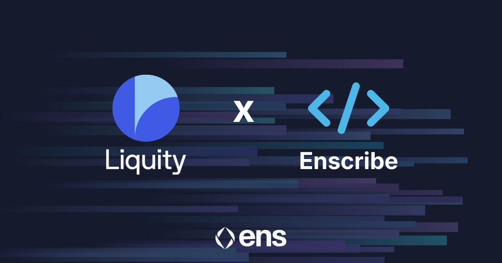
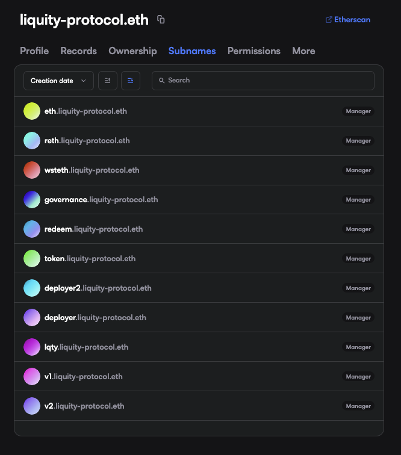

[Liquity V2](https://www.liquity.org/) has adopted ENS-based naming across its core smart contract infrastructure. Liquity V2 allows users to take out loans against their (staked) ETH at a fixed rate they set, in its fully decentralized stablecoin $BOLD. Liquity is one of the few projects with immutable contracts and no upgradable parameters — meaning no governance and no unpredictable changes to the protocol can be implemented.

The registration of Liquity’s immutable contracts with Enscribe introduces clear, human-readable, and verifiable identities for the contracts, replacing reliance on raw hexadecimal addresses alone.

The protocol’s mechanics remain unchanged. What improves is how those mechanics are identified, verified, and integrated across the ecosystem.

## Motivation

Liquity V2 is designed around simplicity, robustness, and minimising trust assumptions. As the protocol has matured, a growing number of contracts underpin core functionality such as borrowing, stability operations, liquidations, and system coordination.

While contract addresses are precise, they do not communicate intent. This introduces avoidable friction for:

- auditors reviewing deployments and upgrades
- developers integrating Liquity into tooling and applications
- researchers and users verifying onchain interactions

ENS-based naming makes contract roles explicit, without altering protocol behaviour.

## Structured contract naming

Each Liquity V2 contract is now assigned a structured ENS name that reflects its function within the protocol architecture.

These names form a coherent onchain directory that mirrors Liquity’s system design. Wallets, explorers, and dashboards that support ENS resolution can display these identities, making it immediately clear which component of the protocol is being interacted with.

Names are resolved to their deployed addresses, ensuring they remain verifiable and trusted.

## Benefits

### Auditability

Clear naming simplifies locating and viewing contracts by reducing the cognitive overhead of address mapping.

### Integration safety

Developers can reference contracts by name rather than by address alone, reducing the risk of misconfiguration.

### Operational transparency

Tooling and analytics can present Liquity interactions with greater precision and confidence.

### User assurance

Human-readable identities make it easier to verify that interactions are occurring with the intended contracts.

## Enscribe’s role

This rollout is supported the Enscribe contract naming infrastructure, which includes the [Enscribe App](https://app.enscribe.xyz) and plugins for [Foundry](/docs/dev-tools/enscribe-sol) and [Hardhat](/docs/dev-tools/hardhat-enscribe).

Enscribe ensures that Liquity’s contract identities remain consistent and resolvable across ENS-enabled wallets, explorers, and developer tooling.

## Long-term maintainability

ENS-based contract naming is a small change in surface area, but an important improvement in how the protocol is understood and interacted with over time.

By making contract intent explicit, Liquity strengthens transparency, reduces operational risk, and improves long-term maintainability — without compromising the protocol’s core principles.

## Name your contracts. Strengthen your protocol

Naming isn’t just for Liquity, it’s for any projects building on Ethereum.

Whether you’re a DAO, social app, game, or DeFi protocol with dozens of contracts, Enscribe helps you structure and create trust for your users.

Join the growing standard for Ethereum: Name your contracts with Enscribe.

Happy naming! 🚀
