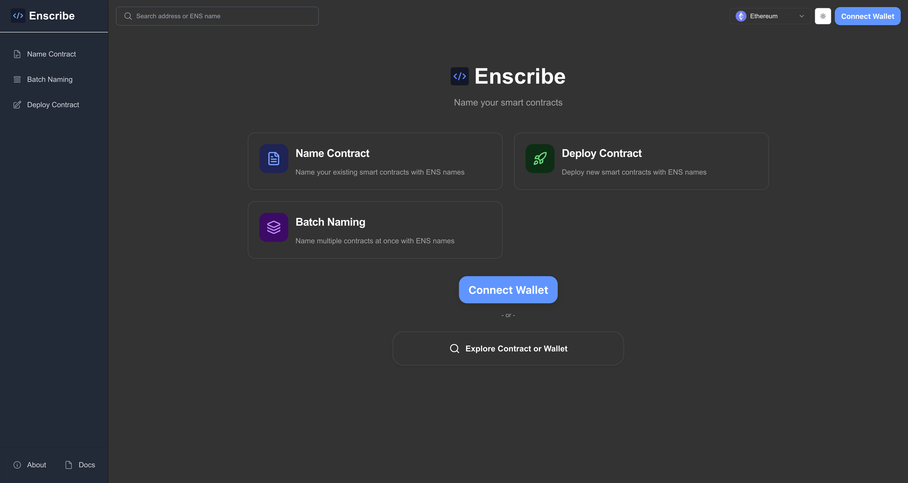
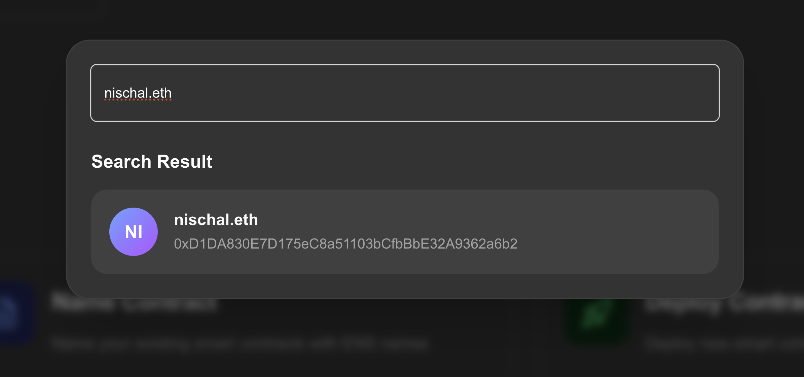
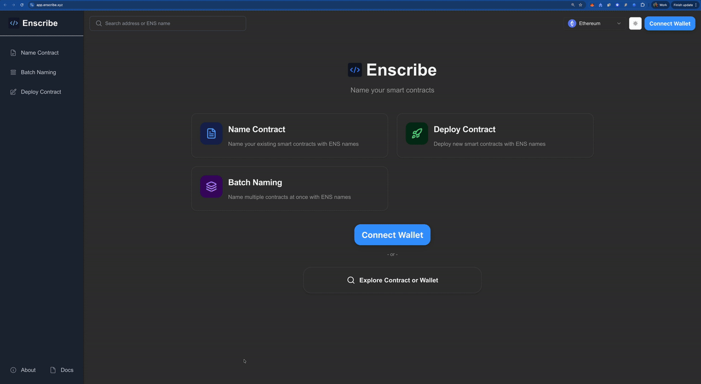

The [Enscribe](https://app.enscribe.xyz) homepage has been redesigned. The new layout uses three feature cards for clearer navigation, and the search now resolves ENS names in your browser before making any backend calls.

## Why We Changed It

As Enscribe added the new feature [Batch Naming](/blog/batch-naming), the text-heavy homepage made it hard for new users to find what they needed.

The search bar also created unnecessary load. Users would search for an ENS name, navigate to a details page, and only then discover the name didn't resolve or pointed somewhere unexpected or they were on the wrong chain. This meant:

- Wasted API calls for typos and invalid names
- Extra clicks to discover resolution failures
- Backend queries for exploratory searches

The redesign fixes both issues.

## Card-Based Navigation

The homepage now shows three feature cards:

#### 📄 Name Contract
Name existing smart contracts with ENS names. Set forward and reverse resolution for contracts you've already deployed.

#### 🚀 Deploy Contract
Deploy and name contracts in one flow. Skip the extra step of naming after deployment.

#### 📚 Batch Naming
Name multiple contracts under a single parent domain.

## Client-Side ENS Resolution

The search bar is now a modal that resolves ENS names before you navigate.

### How It Works

1. Click "Explore Contract or Wallet"
2. Type an ENS name like `vitalik.eth` or `0x1234...5678`
3. See the resolved address: `vitalik.eth → 0x1234...5678` on the desired chain
4. Verify it's correct and resolves to an address, then click to view details

If the name doesn't resolve, you see it immediately — no wasted navigation.

### Why This Matters

**For users:**
- Catch typos before navigating
- Verify resolution and chain before committing

**For the platform:**
- ENS resolution happens in the browser using viem
- Only validated searches hit the backend

The new design is live at [Enscribe](https://app.enscribe.xyz). We'd like to hear what you think:
- Does the card layout help you find what you need?
- Is the search modal helpful?
- What would you like to see in the future?

Reach out on [Discord](https://discord.gg/8QUMMdS5GY), [Telegram](https://t.me/enscribers), or [X](https://x.com/enscribe_).

Happy naming! 🚀
