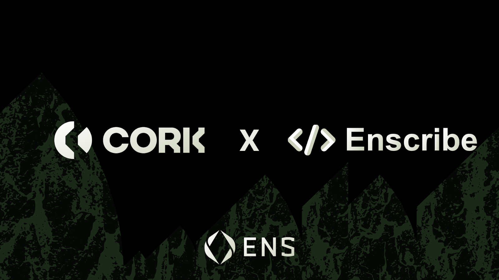
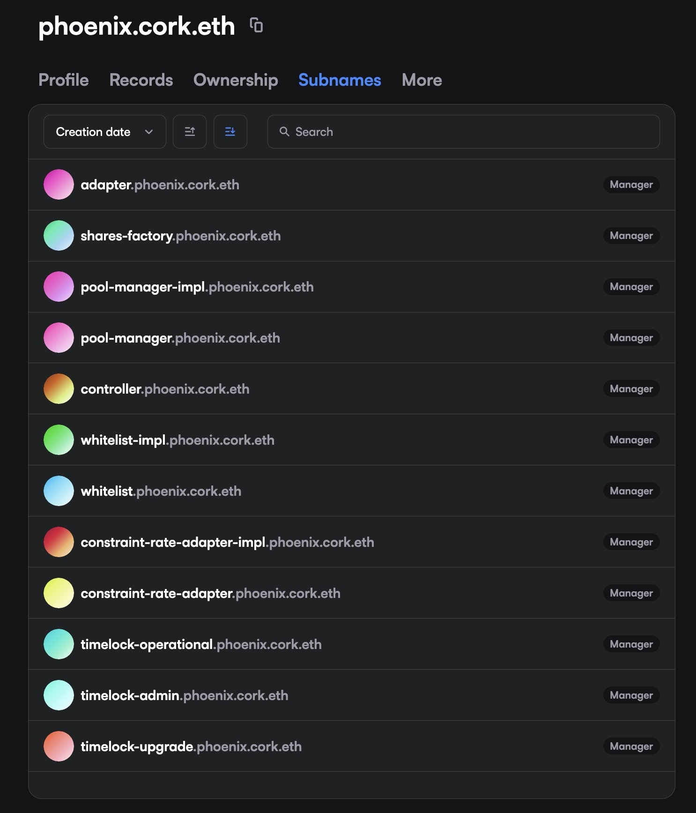

[Cork](https://www.cork.tech/) has adopted ENS-based naming across its smart contract infrastructure, using Enscribe to assign clear, verifiable identities to its core protocol contracts and wallets.

Cork is tokenized risk infrastructure: a programmable risk layer for onchain assets such as RWAs, vault tokens, and yield-bearing stablecoins.

This marks another step toward making contract naming a default expectation for production-grade DeFi protocols, not an optional enhancement, but foundational infrastructure.

## From addresses to identities

Smart contracts are the backbone of onchain applications, yet they are still most commonly identified by opaque hexadecimal addresses. While precise, addresses provide no information about intent, ownership, or role within a protocol.

As protocols scale, this creates friction:
- audits require repeated address-to-purpose mapping
- integrations become more error-prone
- analysts and explorers rely on off-chain labels to verify deployments

ENS-based naming replaces ambiguity with explicit, verifiable identity.

## How Cork uses Enscribe

Using Enscribe, Cork has assigned structured ENS names across its contract stack. Each subsystem is given a clear namespace, and each contract is named according to its role within the protocol’s architecture.

These names are bound to deployed addresses via ENS. Wallets, explorers, and dashboards that support ENS can surface these identities automatically, without requiring any protocol changes.

The result is a coherent, browsable onchain directory that mirrors how Cork is actually built.

## Why this matters beyond Cork

While this rollout directly benefits Cork’s users and contributors, it also reflects a broader shift happening across Ethereum.

More protocols are recognising that:
- human-readable contract identities improve safety
- structured naming reduces operational risk
- ENS resolution is already widely supported across the ecosystem

Naming contracts is becoming part of the baseline for how serious onchain systems present themselves.

## Enscribe’s role

Enscribe provides the tooling and infrastructure that makes structured contract naming practical at scale.

For Cork, Enscribe ensures that contract identities remain:
- consistent across deployments
- verifiable via ENS standards
- compatible with wallets, explorers, and developer tooling

Our goal is simple: make contract naming boring, reliable, and universal.

## Naming as shared infrastructure

ENS-based naming doesn’t change how protocols work — it changes how they are understood.

Cork’s adoption reinforces a growing norm: if a contract is important enough to secure value, it should have a name that clearly communicates what it does.

## Name your contracts. Strengthen your protocol

Naming isn’t just for Cork, it’s for any project building on Ethereum.

Whether you’re a DAO, social app, game, or DeFi protocol with dozens of contracts, Enscribe helps you structure and create trust for your users.

Join the growing standard for Ethereum: Name your contracts with Enscribe.

Happy naming! 🚀

