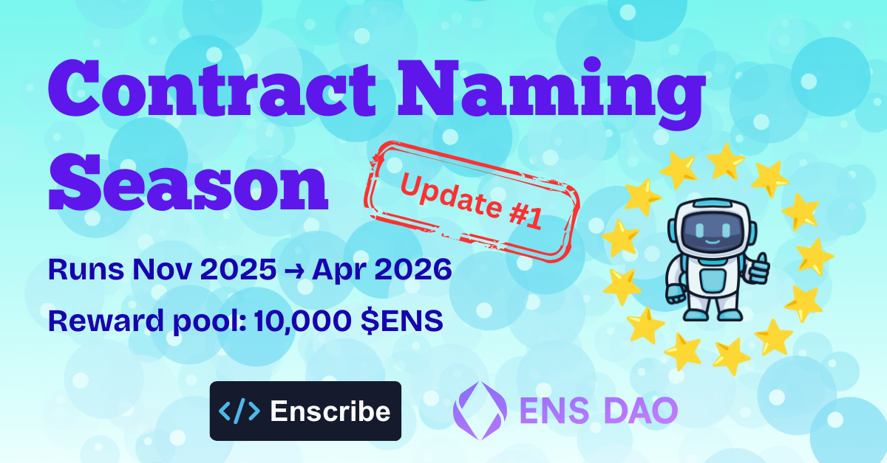
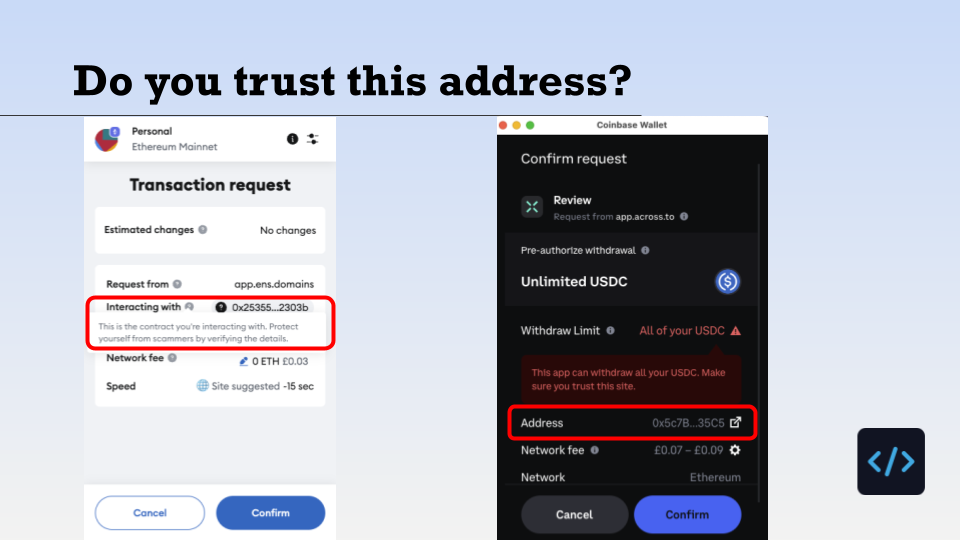

import AppUrl from '@site/src/components/AppUrl';

When ENS Contract Naming Season [launched](contract-naming-season), our goal was simple — to increase trust for users of smart contracts in Ethereum through contract naming with ENS.
A few months in, we’re starting to see that shift take shape.

Teams across the ecosystem are naming deployed contracts, integrating ENS into deployment workflows, and treating contract identity as part of core infrastructure rather than an afterthought.

This post is a short update on why Contract Naming Season exists, what has changed so far, and what to expect next.

## Why Smart Contracts Need Onchain Identities

Despite significant progress in Ethereum UX, users still interact with **unnamed hex addresses** every day across explorers, wallets, governance tools, and DeFi applications.

That has real consequences:

- **Security risks**, including spoofing and address poisoning
- **Poor usability**, particularly for non-technical users
- **Loss of context**, where it’s unclear what a contract actually represents

Contract naming directly addresses these issues. It improves clarity, trust, and interpretability across the stack, while extending ENS usage well beyond EOAs.

Contract Naming Season exists to accelerate this shift through a combination of coordination, incentives, and tooling.

## Protocols Are Naming Key Contracts

One of the most encouraging outcomes so far is that contract naming is already happening in practice.

Multiple protocols have publicly announced contract naming efforts, with others actively in progress. In many cases, naming has been applied across entire contract suites, rather than single deployments.

At the time of publication, we’ve already shared updates about [Cork](cork), [Liquity](liquity) and [Nouns DAO](nouns), with more to follow very soon!

This reflects a growing understanding that contract identity needs to be consistent, hierarchical, and maintainable over time. This is especially important for protocols, applications, and DAOs with long-lived infrastructure.

## Contract Naming Takes Time

It’s also worth noting that contract naming for established protocols is not an instantaneous process. For teams with mature deployments, multiple environments, and governance controls, lead times of **two to three months** are common.

This includes protocol wallet and contract inventory work, review of naming structures, multisig coordination, and, in some cases, governance approval. As a result, many naming efforts currently underway will surface gradually, and we expect the **cadence of public announcements** to increase as Contract Naming Season continues.

## Tooling Has Caught Up

Momentum around contract naming has been supported by meaningful improvements in tooling.

Since launch, Enscribe has shipped updates aimed at real-world protocol needs, including:

- **[Batch contract naming](batch-naming)**, to support large deployments
- **[Full Safe support](enscribe-safeapp)**, aligning with standard treasury and admin setups
- **[Calldata export](viewing-calldata)**, enabling review, coordination, and use with custom multisig workflows

On the developer side, we have integrated contract capabilities into Foundry and Hardhat via our [developer plugins](/docs/dev-tools), reducing friction and making naming easier to adopt as part of standard deployment and maintenance processes.

## Naming Audits

A notable secondary outcome of Contract Naming Season has been the emergence of what teams are calling **naming audits**.

It can be challenging for teams to know where to start with respect to naming their existing protocol contracts and wallets. When we first speak to projects we often find:

- A lack of good ENS name hygiene
- No standardised approach to contract naming
- Relying on docs and GitHub repos to articulate key project contracts
- No naming of deployment and treasury wallets

With our naming audits, we help teams better understand their on-chain footprint and document it using ENS names. In addition we are using our learnings to help establish better practices about contract naming and versioning with ENS.

You can read more about how we approach them on our dedicated [Naming Audits page](/audit).

## What’s Next

Contract Naming Season is moving into its next phase.

In the coming weeks, this will include:

- Further protocol announcements and outreach
- **The first Contract Naming Season awards**, with the first batch of $ENS distributions expected soon
- New category additions the [ENS Awards Contract Naming Season leaderboard](https://ensawards.org/leaderboards/dao)
- Continued improvements to Enscribe, including hierarchical name browsing and richer metadata support

Together, these steps are intended to reinforce contract naming as a normal and expected part of Ethereum infrastructure.

## Looking Ahead

If you deploy smart contracts, naming is a crucial component of how users understand and trust your protocol.

Contract Naming Season provides a practical opportunity to:

- Improve security and user confidence
- Make contracts legible across wallets, explorers, and applications
- Contribute to how smart contract identity evolves on Ethereum

The groundwork is in place, participation is growing, and the first recognitions are about to be distributed.

The best time to name your contracts was yesterday, the next best time is today.

Happy naming! 🚀
