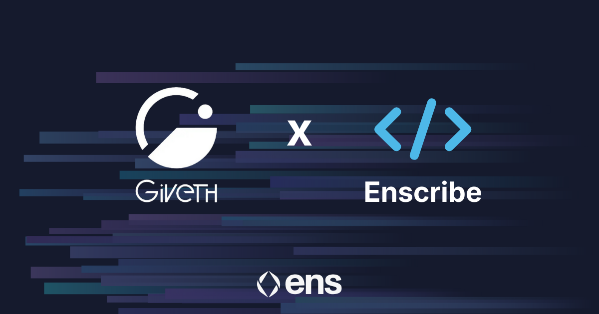
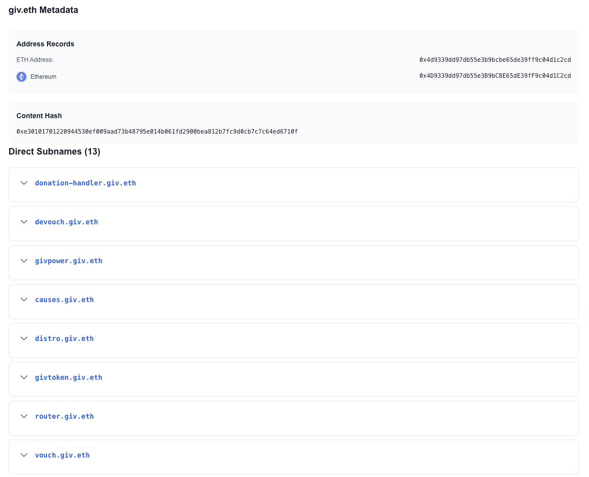

[Giveth](https://giveth.io/) has adopted ENS-based naming across its core smart contract infrastructure, bringing clear, human-readable identities to the contracts that power the Giveth ecosystem.

This update makes it easier for donors, builders, researchers, and ecosystem partners to understand and verify how Giveth works onchain — without changing how the protocol itself operates.

## Why Contract Naming Matters for Giveth

Giveth exists to support public goods, community funding, and transparent coordination. Trust and transparency are foundational to that mission.

However, raw contract addresses are difficult to interpret, especially for:

- donors who want confidence in where funds are flowing
- contributors and integrators building tools around Giveth
- researchers and community members analysing impact and governance

ENS-based naming helps bridge this gap by making contract roles explicit and verifiable.

## Clear, Structured Naming Across the Protocol

Giveth’s smart contracts are now organised under a structured ENS namespace, with each contract receiving a name that reflects its purpose within the system.

These names form a clear, browsable onchain directory of Giveth’s infrastructure. This makes it easier to understand what powers donations, project funding, governance, and supporting infrastructure across the Giveth ecosystem.

## What This Improves

**Transparency for Donors**

Human-readable contract names make it easier to verify that donations and interactions are going to the intended components of the protocol.

**Safer Integrations**

Builders and partners can integrate against named contracts, reducing the risk of address-level mistakes.

**Easier Research and Accountability**

Clear naming improves long-term traceability of how Giveth’s onchain infrastructure evolves over time.

**Accessibility**

Lowering the cognitive barrier to understanding smart contracts helps make Giveth more approachable to a broader audience.

**Enscribe’s Role**

This rollout is supported by Enscribe, which provides the infrastructure for creating and managing structured, verifiable ENS names for smart contracts.

Enscribe ensures that Giveth’s contract identities remain consistent and resolvable across ENS-enabled wallets, explorers, and developer tools.

**Supporting Public Goods Through Better Infrastructure**

ENS-based contract naming may seem like a small change, but it meaningfully improves how onchain systems are understood, trusted, and maintained.

By making its contract infrastructure more legible and accessible, Giveth continues to lead by example in building transparent, community-oriented public goods on Ethereum.

## Name Your Contracts. Strengthen 🦾 Your Protocol

Naming isn’t just for Giveth, it’s for any project building on Ethereum.

Whether you’re a funding platform like Giveth, DAO, game, or DeFi protocol with dozens of contracts, Enscribe helps you structure and create trust for your users.

Join the growing standard for Ethereum: Name your contracts with Enscribe.

Happy naming! 🚀
