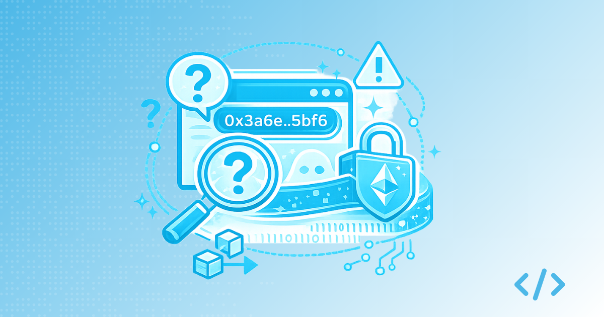
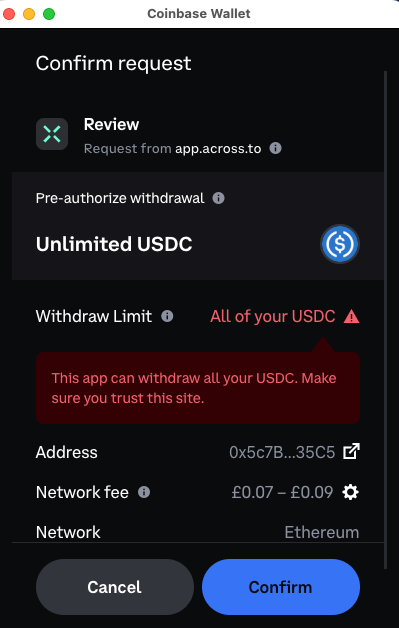
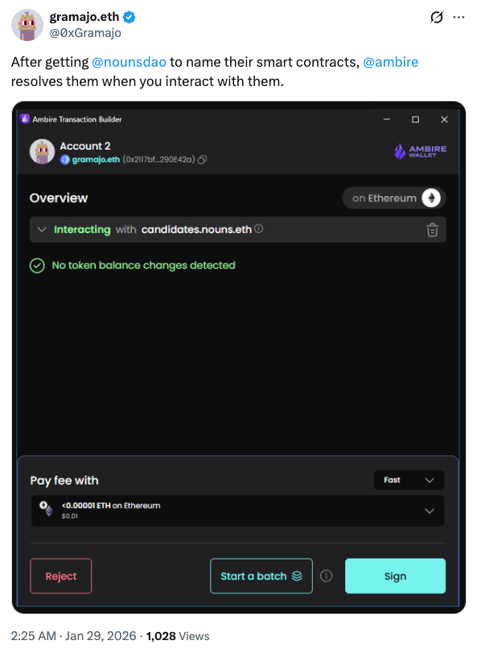
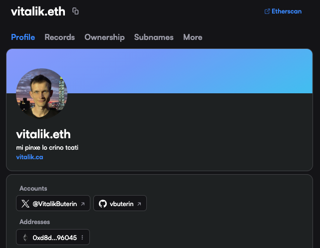
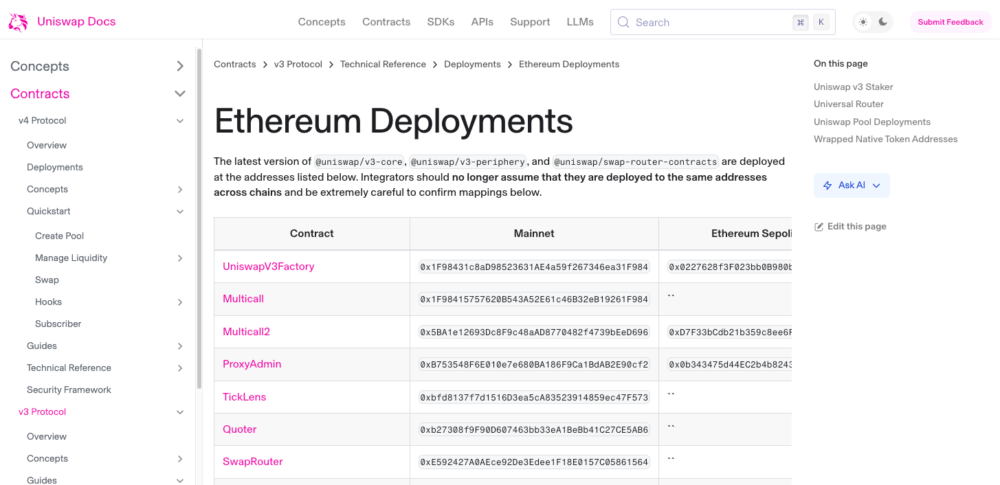
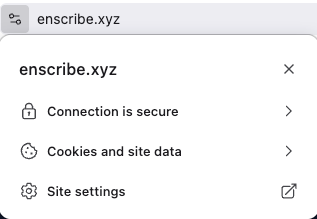
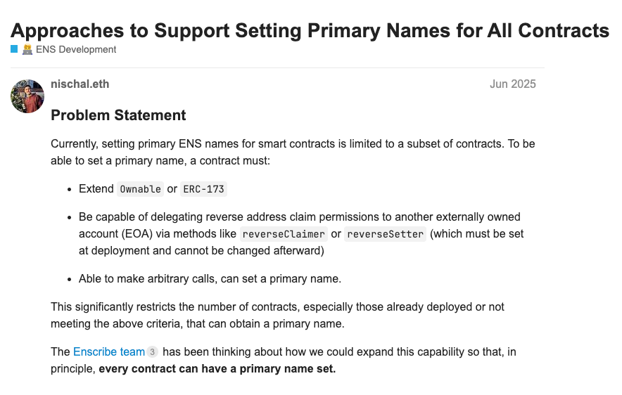

If you have spent any time using Ethereum wallets or block explorers, have you ever questioned why smart contracts are still referred to via their hexadecimal addresses?

You don’t have to enter numeric digits to visit websites. Why can’t you refer to smart contracts by name?

Smart contracts can have human-readable names. The Ethereum Name Service (ENS) has existed for almost 9 years which solves this problem. Some protocols already use human-readable names for their smart contracts. And yet, for most users, smart contracts still appear as long hexadecimal strings that are opaque, hard to distinguish, and easy to confuse.

This is not an accident, and it is not because naming does not work. It is the result of several structural choices in how Ethereum infrastructure evolved. Understanding those choices matters, because the lack of discoverable contract identity is not just a UX issue. It has real security and trust implications for users.

So why, in practice, are contract names not discoverable by default?

## **1\. Wallets and infrastructure do not surface primary names**

The most immediate reason is simple. Many wallets do not show ENS primary names for smart contracts, even when they exist.

Take MetaMask as a common example. When interacting with a contract, MetaMask may display:

* An Etherscan label, if one exists
* A Solidity file name, if the contract is verified

Coinbase’s Base wallet, on the other hand, simply shows a hexadecimal contract address.

What neither wallet reliably displays is the ENS primary name associated with that contract address.

Other wallets are experimenting in this direction. Ambire, for example, has started to surface ENS names more prominently in contract interactions, showing that better visibility is possible today.

The result is that a contract can be correctly named in ENS and the user still only sees a hex address in their wallet.

From a user’s perspective, the name effectively does not exist. From a protocol’s perspective, the effort spent naming contracts has limited downstream impact unless wallets and explorers choose to surface that information.

This is a visibility problem at the infrastructure layer. The data exists, but the most important interfaces do not yet treat it as first-class.

## **2\. ENS identity has historically focused on wallets, not contracts**

ENS identities have typically been associated with wallet identities for individuals and projects. ENS names became a way to represent people, DAOs, and accounts, rather than deployed infrastructure.

There has never been a coordinated push to establish smart contract identities as a first-class concern. As a result, naming contracts was not treated as a default expectation, either socially or technically.

This shaped how tooling, documentation, and mental models evolved. ENS was widely understood as an account naming system, not as a layer for organisational or protocol infrastructure.

This gap is a large part of why Enscribe exists. The goal is not to replace ENS, but to extend it into the domain it has historically underserved — smart contracts.

## **3\. Developers historically have not named contracts**

This wallet-centric framing was reinforced by developer practice.

For most of Ethereum’s history, developers simply did not name their smart contracts once they were deployed. Contracts were deployed and verified at best. Then identified primarily by addresses listed on docs portals or in GitHub repos.

This made sense in a smaller, highly technical ecosystem. Developers knew which address was which. Users were expected to rely on audits, documentation, or social context rather than any notion of onchain identity.

But Ethereum has changed. Smart contracts are now interacted with by:

* End users
* DAOs and governance systems
* Wallet interfaces
* Agentic systems

At this scale, it’s embarrassing to have unnamed infrastructure.

Compounding this, many of the largest and most respected protocols in the ecosystem, including Uniswap and Aave, have historically not named the majority of their deployed contracts. When leading protocols do not treat contract naming as important, there is less incentive for others to do so.

One of the goals of Enscribe is to change this default. That means making it straightforward to name existing deployed contracts, and making it easy to name new contracts at deployment time.

Crucially, this has to fit into existing developer workflows. That is why Enscribe focuses on [developer tooling](https://www.enscribe.xyz/docs/dev-tools) that integrates directly with environments developers already use, such as Foundry and Hardhat, rather than introducing entirely new processes.

Naming needs to become something developers do by default, not something that feels optional.

## **4\. Users have been conditioned to accept hex as normal**

The combination of wallet behaviour and developer practice has had a direct effect on user expectations.

Because ENS identities were primarily associated with wallets, and because most smart contracts were never named in the first place, users have spent years interacting with contracts that had no visible identity at all. Over time, this conditioned users to accept hexadecimal addresses as normal.

Ethereum users, even non-developers, scroll past hex strings, copy them, and compare the first and last few characters almost instinctively. What began as a technical necessity gradually became a learned behaviour.

This conditioning hides how problematic hex addresses really are:

* They are visually noisy

* They take up a disproportionate amount of space in wallet interfaces

* They are almost impossible to distinguish reliably at a glance

In most other computing contexts, this would be unacceptable. We do not identify websites, applications, or organisations by raw identifiers. We use names.

But because smart contract identity was never treated as a first-class concern, users were never given a viable alternative. Wallets did not surface names, protocols did not consistently set them, and expectations adjusted accordingly.

The absence of pushback is not evidence that this model works. It is evidence that users have adapted to a system that offers very little transparency at the moment when trust decisions matter most.

## **5\. Primary name mechanics are still constrained**

Even when teams want to do everything correctly, there are real mechanical limitations today.

Setting an ENS primary name for an address typically requires the address to the ERC-173 Ownable standard. This works well for some contracts, but not all smart contracts fit neatly into that model.

As a result:

* Some contracts can have forward-resolving names but no primary name
* Some naming setups are technically correct but invisible to wallets
* Some teams simply give up because the rules are unclear or restrictive

There are [ongoing discussions](https://discuss.ens.domains/t/approaches-to-support-setting-primary-names-for-all-contracts/20919) within the ENS ecosystem about expanding the scope of what can set and manage primary names, particularly for contracts. These discussions are important, but changes at this level take time.

In the meantime, the ecosystem lives with a fragmented approach to contract identity.

## **Why this matters**

When contract names are not discoverable by default, there is a real cost to users.

They experience:

* Confusion during transactions
* Difficulty distinguishing real contracts from impostors
* Increased susceptibility to spoofing and address poisoning
* Over-reliance on off-chain, often centralised labels

This doesn’t need to be the case. The pieces for a better system already exist. What is missing is alignment between naming practices, infrastructure support, and user expectations.

Contract identity should not be a nice-to-have. It is foundational infrastructure for transparency and trust at scale.

If Ethereum is going to support millions of users interacting with thousands of contracts per protocol, then human-readable, discoverable identity needs to stop being optional and start being treated as essential.

