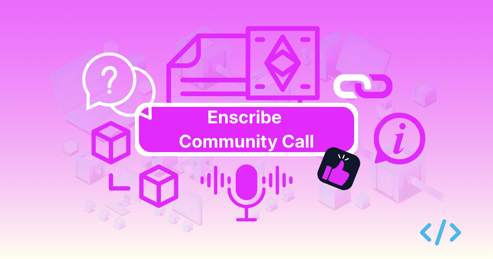

We’ve spent the last few months focused entirely on the technical side of [Enscribe](https://app.enscribe.xyz/) building out the web app and tools for [Foundry](https://github.com/enscribexyz/enscribe) and [Hardhat](https://github.com/enscribexyz/enscribe-hardhat) to make ENS integration for smart contracts less of a headache.

But we don't want to build in isolation. Smart contract identity is complex and the best way to build and improve tools for it is to actually talk to the people who are interacting with naming contracts every day.

{/* truncate */}

We’re moving away from just sharing updates. Instead, we want to build a space where smart contract developers and ENS enthusiasts can actually get into the weeds with us.

We already have our active communities on [Discord](https://discord.gg/4fcuVq8a) and [Telegram](https://t.me/enscribers), but in today’s increasingly AI-driven environment, we believe it's important to have more of a human connection with our users and community.

Starting next week, we’re hosting monthly Enscribe community calls. These are the activities we will be doing during the sessions:

- Showcases: Hands-on sessions on naming contracts, using our libraries, and getting the most out of the Enscribe web app and our developer tooling.
- Contract identity clinics: Support for breaking down the more hairy parts of the ENS protocol so it’s easier to build on.
- Roadmap & Demos: We’ll show you what we’re shipping next before it goes live and we want to see what you’re building too.

The goal here is to be a high-signal spot for our community to learn more about contract identity services, provide feedback, suggest features and help us shape where Enscribe goes.

We want to hear how you’re using the web app and our developer tools so we can refine them to fit real-world workflows. If a library doesn't play nice with your specific dev environment, we want to hear about it. We’re opening this community specifically to get your feedback so we can iterate on things that actually matter to your workflow.

We’ve officially set the date for our first community sync. If you’re building with ENS or just curious about what we’re putting together, we’d love to have you there.

You can register for the call [here](https://luma.com/k4tjbdwg?tk=WG4PCZ).

Happy naming! 🚀
