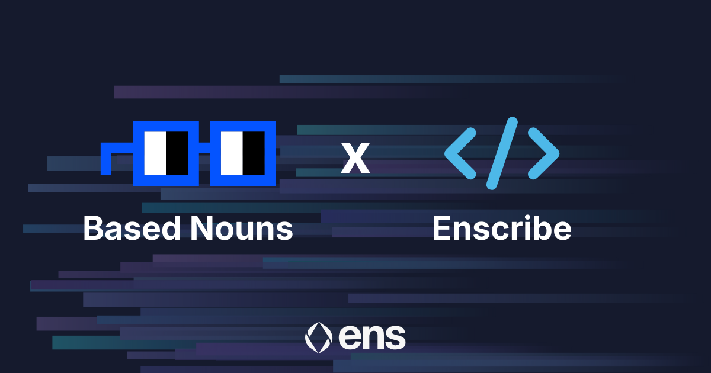
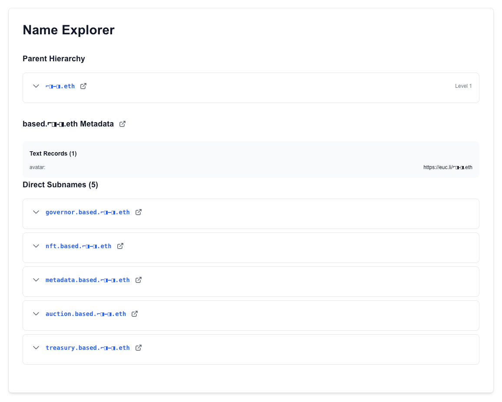

[Based Nouns](https://nouns.build/) has adopted ENS-based naming across its smart contract infrastructure, using Enscribe to assign clear, human-readable identities to the contracts that power the DAO.

As a Nouns Builder–based DAO deployed on Base, Based Nouns operates with a faster iteration cycle and a more experimental governance environment than mainnet Nouns. Clear contract naming helps ensure that this agility does not come at the cost of safety.

## A different kind of Nouns DAO

Based Nouns is not a fork of Nouns DAO — it’s an independent DAO built using the Nouns Builder framework and deployed on Base.

This means:

* a modular contract architecture
* more frequent experimentation and upgrades
* a broader set of contributors interacting directly with the protocol

In this environment, relying on raw contract addresses quickly becomes a bottleneck for understanding, reviewing, and integrating DAO infrastructure.

ENS-based naming makes contract intent explicit.

## How naming helps Based Nouns

Using Enscribe, Based Nouns has assigned structured ENS names to its core contracts, reflecting their roles within the DAO’s governance, auction, and treasury systems.

*View Based Nouns contracts in the [Enscribe App](https://app.enscribe.xyz/nameMetadata?name=based.%E2%8C%90%E2%97%A8-%E2%97%A8.eth)*

These names form a coherent onchain directory that mirrors the DAO’s architecture. ENS reverse resolution cryptographically links each name to its deployed address, allowing wallets, explorers, and dashboards to surface trusted identities automatically.

This is particularly valuable for DAOs like Based Nouns, where contributors, builders, and delegates may be onboarding continuously.

## Benefits for the Based Nouns ecosystem

**Faster governance review**

Delegates can more easily understand which contracts are referenced in proposals and upgrades.

**Safer tooling and integrations**

Builders working with Based Nouns can integrate against named contracts rather than manually tracking addresses.

**Lower cognitive overhead**

Community members and researchers can reason about the DAO’s infrastructure without needing deep address-level context.

**Future-proofing experimentation**

As the DAO evolves, naming helps preserve clarity even as contracts change.

## Enscribe’s role

Enscribe provides the infrastructure that enables DAOs to manage structured, verifiable ENS names for smart contracts.

For Based Nouns, this ensures that contract identities remain consistent, resolvable, and compatible across ENS-enabled tooling, regardless of deployment cadence or network.

## Naming for the next generation of DAOs

ENS-based contract naming is not just for long-lived mainnet protocols. It is equally important for newer, faster-moving DAOs building on L2s.

Based Nouns’ adoption reflects a growing norm: if a contract matters, it should have a name that clearly communicates what it does.

## Name your contracts. Strengthen your protocol

Naming isn’t just for Based Nouns, it’s for anyone building on Ethereum.

Whether you’re a DAO, social app, game, or DeFi protocol with dozens of contracts, Enscribe helps you structure and create trust for your users.

Join the growing standard for Ethereum: Name your contracts with Enscribe.

Happy naming! 🚀