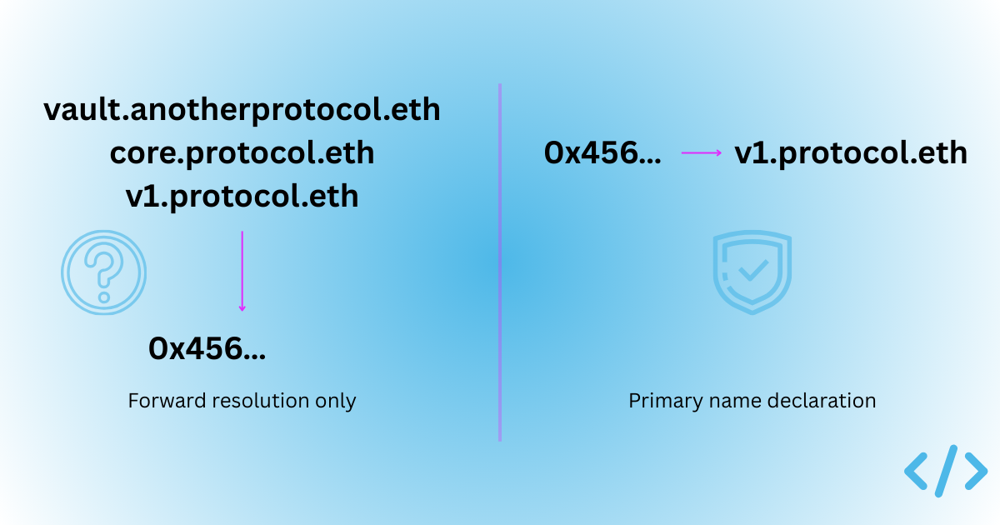

ENS supports two ways of associating names with addresses.

1. A name can **forward resolve** to an address (`myname.eth -> 0x1234…`).
2. An address can declare a primary name which contains a forward resolving address record **and a reverse record** that points back to the name (`0x1234… -> myname.eth`).

It’s important to be aware of this distinction between forward resolution and primary names as it defines a security boundary within ENS.

Especially as smart contract identity becomes more visible in wallets and other key infrastructure.

## **Primary names are definitive**

A primary name is unique per address. An externally owned account or a smart contract can declare exactly one ENS name as its primary identifier.

`0x1234… -> myname.eth`

When configured correctly, that declaration establishes a canonical mapping from address to name. If a wallet encounters the address and retrieves a valid primary name, there is no ambiguity about which ENS name represents it. The address has explicitly asserted its ENS identity.

This matters because identity is often needed in the reverse direction. Users do not typically begin with a name and look up an address. They encounter an address first in a transaction confirmation screen, governance proposal, or contract interaction. At that moment, the system must decide whether it can replace the hex string with something human-readable.

## **Forward resolution is not the same thing**

Forward-resolving names work the other way around. A name resolves to an address. If someone types the name into a resolver, they receive the correct destination.

`myname.eth -> 0x1234…`

This is closer to traditional DNS behaviour. A domain name resolves to an IP address. Reverse DNS exists, but it is inconsistently configured and rarely treated as authoritative identity. Many IP addresses either lack reverse records or have generic ones. As a result, reverse DNS is not widely relied upon as a definitive signal of identity.

In addition, the resources that DNS records point to are ephemeral —  web services come and go, their IP addresses are changing as this happens. Wallet and smart contract addresses are permanent — they exist as long as the blockchain they reside on does.

Forward-only resolution in ENS has a similar limitation. A name resolving to an address does not mean the address stands behind that name as its identity. It simply means the name points there.

## **Multi-naming systems**

There is an additional subtlety here. Reverse resolution in ENS is specific to ENS itself. If you perform a reverse lookup on an address, you are querying the ENS reverse registry. That lookup assumes ENS is the naming system associated with the address.

In a multi-naming-system world, a reverse record is only authoritative within the scope of the naming service you are querying. This makes the primary name declaration unique to ENS and authoritative within its namespace, but not universally global in the way IP-to-domain relationships are sometimes perceived to be.

That distinction reinforces why primary declaration matters. Within ENS, it provides a canonical answer. Outside of it, identity depends on which naming system an interface chooses to trust.

## **Ambiguity in forward resolution**

Consider a protocol that deploys a contract at a single address and ends up with several ENS names pointing to it:

* `v1.protocol.eth -> 0x456…`
* `core.protocol.eth -> 0x456…`
* `vault.anotherprotocol.eth -> 0x456…`

All three forward-resolve to the same contract, two are from one ENS namespace, another from an entirely separate one.

From a naming perspective, they could be viewed as labels that cater for different end-users. From a wallet’s perspective, it creates a problem. When the wallet encounters the address first, which name should it display, or even trust?

Without a primary name declaration, there is no protocol-level answer. Interfaces must rely on heuristics. They may look at other names associated with ENS names in the same namespace, or other more sophisticated reasoning models looking at activity of the different domains.

In some cases they may fall back to explorer labels or simply display hex.

None of these approaches are wrong. But none can guarantee a consistent result. This is the fundamental challenge with relying on forward resolution alone.

## **The ideal expectation**

In a more mature model, every address with an ENS name would also declare a primary name.

Under that expectation, it's very simple for wallets to fully support resolution:

* If the address has a primary name, display it.
* If it does not, display the address.

Forward resolution would continue to support discovery, but identity at the point of interaction would be at the discretion of the wallet.

Alternatively, an external system could issue attestations asserting that a particular forward-resolving name is the authoritative identity for a given address. Wallets could then rely on those attestations when deciding which name to display.

However, this introduces an additional trust layer. An attestation requires an issuer. That issuer becomes a trusted authority within the identity model. The security boundary shifts outward, from protocol guarantees to the credibility of whoever is signing the assertion.

This may be appropriate in some contexts. But it is fundamentally different from an address declaring its own primary name onchain.

## **The mechanical constraint**

As highlighted in our recent [article](/blog/why-smart-contract-names-are-not-discoverable-by-default#5-primary-name-mechanics-are-still-constrained), setting a primary name for a smart contract is not always straightforward. While externally owned accounts can configure a primary name easily, smart contracts depend on ownership semantics set by the ENS protocol.

Not all projects are willing to make the requisite changes to their smart contracts code to support this.

As a result, teams may stop after configuring forward resolution. The name resolves correctly, but the contract does not assert itself as having a primary name.

## **Why this is a security boundary**

A security boundary lies at the point where guarantees end and we rely instead on assumptions.

Primary name declaration provides a guarantee. The address has a single, unique identity.

Forward resolution alone provides a somewhat ambiguous mapping. When wallets must choose between multiple forward-resolving names, or infer identity based on context. They are operating beyond guarantees of the naming service.

As ENS data becomes more visible in transaction flows and contract interactions, the distinction between asserted and inferred identity becomes more important.

If smart contract identity is to serve as serious infrastructure, forward resolution alone cannot be treated as sufficient. Primary names must become normalised.

The difference between a name that points somewhere and an address that declares who it is is subtle in implementation. In practice, it is the boundary between a loose versus definitive identity.

