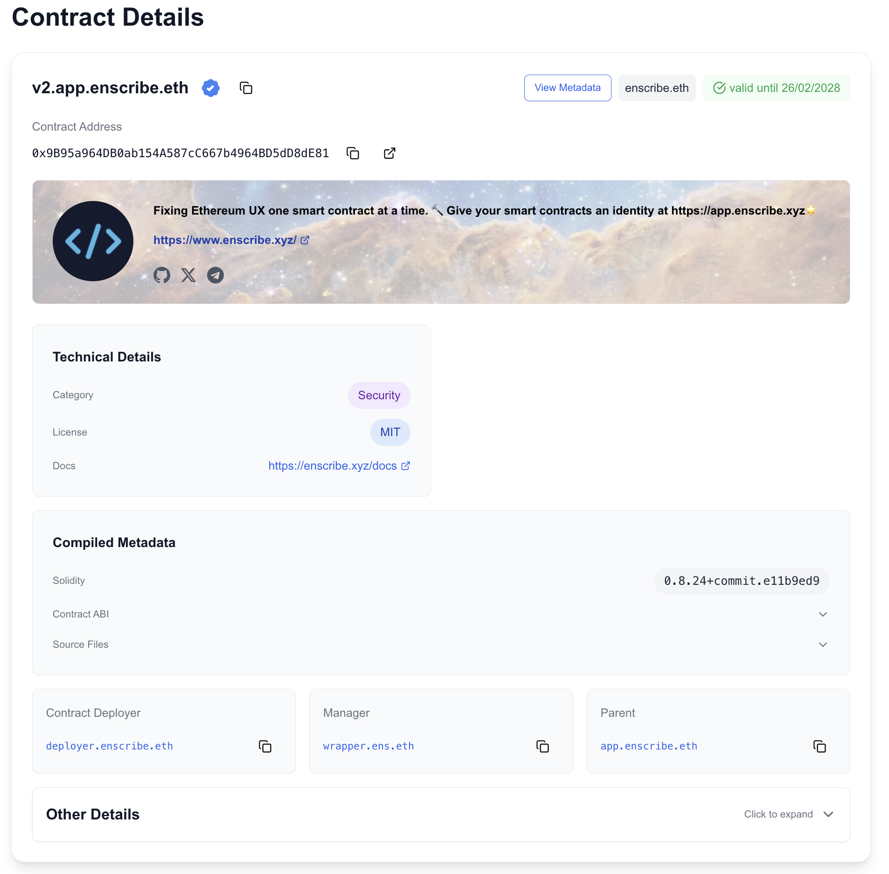

Smart contracts are the backbone of onchain applications, but discovering information about them has always been fragmented. Contract metadata lives across multiple platforms — documentation on one site, audits on another like github, social links scattered everywhere. Basic information like "what does this contract actually do?" is often nowhere to be found.

Enscribe brings contract metadata onchain through ENS text records.


## The Contract Metadata Standard

As part of the [Contract Naming Season](/blog/contract-naming-season), we've been working on a draft [ENSIP proposal for contract metadata standards](https://github.com/ensdomains/ensips/pull/50). This proposal defines a set of text records that projects can use to attach information to their smart contracts.

When you look at a contract's ENS name, you can see who built it, what it does, where to find documentation, security audits, and more — all in one place.

## Contract Metadata Fields

Contract details pages show several categories of text records that contracts or their parent organizations can set:

### Basic Information
- **name**: Display name for the contract (e.g., "Uniswap V3 Router")
- **description**: What the contract does
- **url**: Official website or landing page
- **avatar**: Contract logo or icon (IPFS hash, HTTP URL, or data URI)
- **header**: Banner or background image

### Social & Community
- **com.github**: GitHub repository URL
- **com.twitter**: Twitter/X profile
- **org.telegram**: Telegram community link
- **com.linkedin**: LinkedIn company page
- Any other social text record you want to set

### Documentation & Audit Reports
- **docs**: Documentation URL
- **audits**: Security audit reports (can link to a page with multiple audits)
- **category**: Contract type or category (e.g., "DeFi", "NFT", "Governance")
- **license**: Software license information

## Organization-Level vs Contract-Level Metadata

Metadata inheritance lets you set metadata at the organization level (the parent ENS name) and have it automatically apply to all contracts under that name.

For example, if you set an avatar and social links on `protocol.eth`, all contracts named under it (`router.protocol.eth`, `factory.protocol.eth`, etc.) will inherit those values — unless they set their own.

### How It Works

```
protocol.eth (organization)
├─ avatar: ipfs://QmXyz...
├─ com.github: github.com/protocol
├─ com.twitter: twitter.com/protocol
│
├─ router.protocol.eth
│  └─ inherits all metadata from protocol.eth
│
├─ factory.protocol.eth
   ├─ description: "Factory contract for creating pairs"
   └─ inherits avatar and social links from protocol.eth
```

This means you can establish your project's identity once at the top level, and all your contracts benefit from it. You only need to set contract-specific details (like descriptions or audit links) for individual contracts.

## The Contract Explore Page

The contract explore page displays this metadata.



**Header & Avatar Section**
- Circular avatar prominently displayed
- Header image as a subtle background
- Contract name and description
- Social links with branded icons, making it easy to find official channels

**Clean Layout**
- Contract details like docs, audits, category, license organized in clear sections
- ENS management and organization information (owner, manager, parent)
- Contract deployer and verification status
- ABI and source code when verified on Sourcify

All text records are visible in a dedicated metadata section.

## How Contract Metadata is Retrieved

Behind every contract page on Enscribe is a metadata retrieval API that queries ENS records at multiple levels and integrates with external verification services.

### Multi-Level Querying

When you view a contract on Enscribe, the system doesn't just look at that specific contract's ENS name. It builds a complete hierarchy and queries each level to find the most specific metadata available.

When the Contract Metadata API receives a request for `router.v3.uniswap.eth`, here's how it works:

```
1. router.v3.uniswap.eth (most specific)
   ↓ no metadata found
2. v3.uniswap.eth (parent level)
   ↓ avatar, name found
3. uniswap.eth (organization level)
   ↓ social links, header found
4. eth (TLD)
   ↓ stop
```

The system queries all levels in parallel for maximum speed, then prioritizes the most specific value found for each field. A contract can inherit its organization's avatar and social links, override the description with contract-specific details, and use the project-level header image — all determined automatically based on what's set at each level.


## The Contract Metadata API

We've built a public API endpoint to access this metadata:

```
https://app.enscribe.xyz/api/v1/contractMetadata/<chain-id>/<ens-name>
```

### Example Request

```bash
curl https://app.enscribe.xyz/api/v1/contractMetadata/1/v2.app.enscribe.eth
```

### Example Response

```json
{
    "name": "Enscribe V2 Contract",
    "avatar": "https://euc.li/enscribe.eth",
    "description": "Fixing Ethereum UX one smart contract at a time. 🔨 Give your smart contracts an identity at https://app.enscribe.xyz🌟",
    "header": "https://euc.li/enscribe.eth/h",
    "url": "https://www.enscribe.xyz/",
    "category": "Security",
    "license": "MIT",
    "docs": "https://enscribe.xyz/docs",
    "audits": '[{"Cantina":"https://github.com/coinbase/smart-wallet/blob/main/audits/Cantina-December-2023.pdf"}]',
    "com.github": "enscribexyz/enscribe-contracts",
    "com.twitter": "enscribe_",
    "org.telegram": "enscribers"
}
```

The API works across all chains Enscribe supports (Ethereum, Base, Optimism, Arbitrum, Scroll, Linea, and their testnets). It automatically checks parent domains for inherited metadata, fetches all records concurrently for speed, and returns a standard JSON format with all available text records.

### Use Cases

- **Wallets**: Display rich contract information in transaction confirmations
- **Block explorers**: Show official metadata alongside contract data
- **DApp frontends**: Pull verified information about contracts you interact with
- **Aggregators**: Build indices of contract metadata across the ecosystem
- **Documentation sites**: Auto-generate contract directories with official info

## Why This Matters

**Set contract information once, inherit everywhere.** Projects establish a single source of truth through ENS name ownership. Set branding and metadata at the organization level, then all contracts inherit it automatically.

**Users verify before signing.** Check official links, documentation, and audit reports directly from contract metadata. See who's behind a contract and what it does at a glance.

**Onchain, not centralized.** Contract metadata lives onchain through ENS text records. No reliance on external databases or APIs that can go offline.

**Standard format across all projects.** Any tool can read and display contract metadata. The system is extensible — projects can add custom fields beyond the standard set.

## Join the Conversation

We'd love to hear your thoughts on contract metadata:
- What fields would be most useful for your projects?
- What other information should be standardized?
- How are you using contract metadata?

Share your feedback on [Discord](https://discord.gg/8QUMMdS5GY), [Telegram](https://t.me/enscribers), or [X](https://x.com/enscribe_). Or start a discussion on [GitHub](https://github.com/ensdomains/ensips/pull/50).

Contract metadata brings order to onchain information. With a standard approach to contract identity, we can build better tools, clearer interfaces, and more transparent onchain interactions.

Happy naming! 🚀
