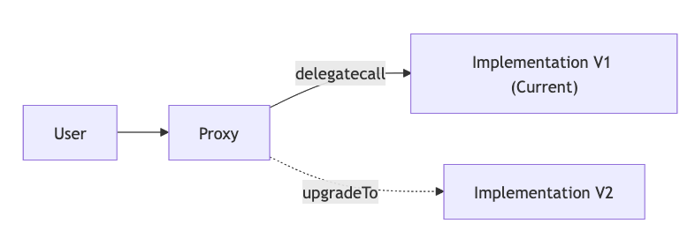
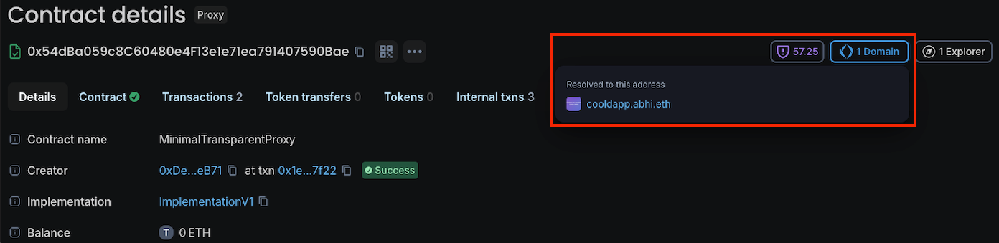
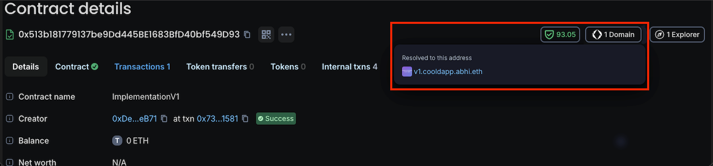

In our [recent guide on smart contract versioning](https://www.enscribe.xyz/blog/smart-contract-versioning), we explored how smart contracts can be versioned and suggested a few ideas on how to integrate contract versioning in your existing deployment pipelines. This post is a sequel explaining how similar ideas can be applied when you have upgradeable contracts.

In smart contract engineering, the proxy pattern is a standard for smart contract upgradability. By separating the proxy (stable user-facing abstraction) from the implementation (the upgradeable logic), developers can ship improvements without breaking contract calls on the clients because the address changed.

Whilst naming the implementation contract is awesome, what happens if you just name either the proxy contract or the implementation contract? It introduces a ‘*transparency problem*’ —  without naming both the contracts, figuring out which contract does what and which version of the logic is currently active behind a proxy becomes a headache for users, developers and auditors.



## A simple proxy and implementation contract

How can a proxy contract differentiate a transaction that is meant to upgrade the implementation address it points to from a transaction that is meant to interact with it?

TransparentUpgradeableProxy pattern ensures that only the admin can upgrade the implementation whilst for normal users, it ‘transparently’ forwards the transaction to the implementation contract, executing the logic, as if the proxy wasn’t there (hence the name).

Let’s first see how the [TransparentUpgradeableProxy](https://github.com/OpenZeppelin/openzeppelin-contracts/blob/master/contracts/proxy/transparent/TransparentUpgradeableProxy.sol) proxy contract from OpenZeppelin that uses the transparent upgradeable proxy pattern looks like.

We have a constructor that configures the proxy admin and the implementation address:

```solidity
constructor(address _logic, address initialOwner, bytes memory _data) payable ERC1967Proxy(_logic, _data) {
    _admin = address(new ProxyAdmin(initialOwner));

    // Set the storage value and emit an event for ERC-1967 compatibility
    ERC1967Utils.changeAdmin(_proxyAdmin());
}
```

The `_fallback` function implements differentiating an admin trying to upgrade the contract from other accounts trying to call the implementation’s logic:

```solidity
function _fallback() internal virtual override {
    if (msg.sender == _proxyAdmin()) {
        if (msg.sig != ITransparentUpgradeableProxy.upgradeToAndCall.selector) {
            revert ProxyDeniedAdminAccess();
        } else {
            _dispatchUpgradeToAndCall();
        }
    } else {
        super._fallback();
    }
}
```
A proxy admin is only allowed to upgrade the proxy’s implementation address. Any calls to execute business logic are reverted.

Now let’s take a look at our implementation contract the proxy points to.

For a contract to have a primary name set, a [reverse record needs to be set with the Reverse Registrar](https://docs.ens.domains/registry/reverse/). This can be done only by the owner of the contract. To support ownership, a contract needs to implement the Ownable interface. This is how a simple [Ownable](https://docs.ens.domains/web/naming-contracts/#ownable-recommended) implementation contract would look:

```solidity
// SPDX-License-Identifier: MIT
pragma solidity ^0.8.24;
import "@openzeppelin/contracts/access/Ownable.sol";
import "@openzeppelin/contracts/proxy/utils/Initializable.sol";

contract ImplementationV1 is Initializable, Ownable {

    string public message;

    // Runs only on the implementation instance (not on proxy storage).
    constructor() Ownable(msg.sender) {
        _disableInitializers(); // prevents initializing the implementation directly
    }

    // Runs through proxy via delegatecall; writes owner/message into proxy storage.
    function initialize(address initialOwner, string calldata initialMessage) external initializer {
        _transferOwnership(initialOwner);
        message = initialMessage;
    }

    function setMessage(string calldata newMessage) external onlyOwner {
        message = newMessage;
    }
}
```

We can now deploy both these contracts and point the proxy contract to the implementation by using a number of ways:

    If deploying a new proxy: pass `(implementationAddress, adminAddress, initData)` to proxy constructor.
    If upgrading an existing proxy: admin calls `upgradeToAndCall(newImplementationAddress, initData)` (or `upgradeTo` if already initialized).


The naming convention for proxy and implementation contracts

To effectively version a proxy contract and the implementation contract, we recommend a simple approach:

    The proxy Identity: Assign your primary ENS name (e.g., `app.mydomain.eth`) directly to the proxy contract. This is the stable address that frontends and users interact with.
    The Logic Versions: Assign versioned subnames (e.g., `v1.app.mydomain.eth`, `v2.app.mydomain.eth`) to the individual Implementation contracts as they are deployed.

## Versioning with Foundry

The following CI/CD pipeline deployment uses the Enscribe Foundry library to set names for the proxy and its implementation. In a deploy script, you simply deploy the new proxy, its implementation and tag the new version programmatically.

```solidity

// SPDX-License-Identifier: MIT
pragma solidity ^0.8.0;
import {Script} from "forge-std/Script.sol";
import {TransparentUpgradeableProxy} from "@openzeppelin/contracts/proxy/transparent/TransparentUpgradeableProxy.sol";
import {ImplementationV1} from "../src/ImplementationV1.sol";
import {Ens} from "enscribe/Ens.sol";

contract UpgradeScript is Script {
    function run() public {
        // Deployer EOA that signs deployment txs.
        uint256 deployerPrivateKey = vm.envUint("PRIVATE_KEY");

        // App owner (calls app functions via proxy, e.g. setMessage).
        address appOwner = vm.envAddress("APP_OWNER");

        // Proxy admin (upgrade authority). Keep separate from appOwner in transparent pattern.
        address proxyAdmin = vm.envAddress("PROXY_ADMIN");

        // Example init value for app state.
        string memory initialMessage = vm.envString("INITIAL_MESSAGE");

        require(appOwner != proxyAdmin, "Use separate app owner and proxy admin");

        vm.startBroadcast(deployerPrivateKey);

        // Deploy implementation contract (logic only).
        ImplementationV1 impl = new ImplementationV1();

        // Encode initializer call to run via delegatecall in proxy context.
        bytes memory initData = abi.encodeCall(
            OwnableAppV1.initialize,
            (appOwner, initialMessage)
        );

        // Deploy proxy pointing to implementation, with admin + init data.
        TransparentUpgradeableProxy proxy = new TransparentUpgradeableProxy(
            address(impl),
            proxyAdmin,
            initData
        );

       
        // Version the proxy (e.g., app.mydomain.eth)
        Ens.setName(
            block.chainid,
            address(implementation),
            string.concat("app", vm.envString("ENS_PARENT"))
        );

        // Version the implementation (e.g., v1.app.mydomain.eth)
        Ens.setName(
            block.chainid,
            address(implementation),
            string.concat(vm.envString("VERSION"), ".", "app",  vm.envString("ENS_PARENT"))
        );

        vm.stopBroadcast();
    }
}
```

Just like with standard contracts, you can run this via GitHub Actions exporting `VERSION=v1` and `ENS_PARENT=mydomain.eth` in addition to other environment variables. The proxy and implementation are instantly versioned the moment they are deployed.

When we now go to block explorers, we can now clearly see that our user-facing app (the proxy) is named as `app.mydomain.eth` and the concrete implementation it points to is named as `v1.app.mydomain.eth`. 

Here’s an example of how this same proxy contract named as `cooldapp.abhi.eth` looks like on Blockscout:



And here’s how the implementation contract named as `v1.cooldapp.abhi.eth` looks like:



Should you want to update the implementation, you can simply deploy and name it as `v2.app.mydomain.eth` and upgrade the proxy to point to this new version.

For other approaches to versioning regular smart contracts you can refer to our [recent guide on smart contract versioning](https://www.enscribe.xyz/blog/smart-contract-versioning).

## Why versioning matters for upgradeable contracts

Adopting onchain versioning for upgradeable contracts solves the transparency problem. We are moving from a world where users are forced to blindly trust an app upgrade to one where every implementation logic is distinctly named, human-readable and easy to verify on block explorers.

Ready to bring transparency to your upgrades? Check out the Enscribe Foundry Library, Hardhat Plugin, and TypeScript SDK to start versioning your proxies today.

Happy versioning! 🚀