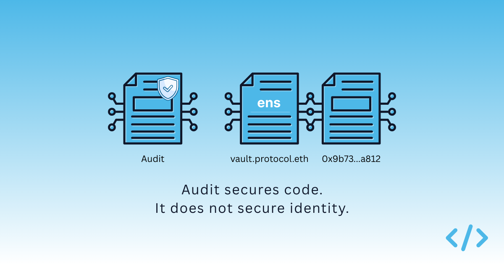

import AppUrl from '@site/src/components/AppUrl';

Security audits are an essential part of deploying production-grade smart contracts. They review logic, identify vulnerabilities, and reduce the likelihood of catastrophic exploits. For serious protocols, audits are a core component of their security framework.

What audits do not do, however, is establish identity.

There is a persistent assumption in the ecosystem that an audited contract is, by virtue of being audited, protected from impersonation. That assumption conflates two separate concerns: whether a contract behaves correctly, and whether a user is interacting with the intended contract in the first place.

Audits address the first question, but they do not address the second.

## What an audit actually verifies

A smart contract audit evaluates a specific codebase at a specific address and at a specific point in time. The auditor reviews the source code, analyses potential vulnerabilities, and produces a report documenting risks and remediation steps.

The output of that process increases confidence that the contract, when interacted with, behaves as expected. It reduces the probability of reentrancy bugs, arithmetic errors, or flawed access control logic.

But the scope of an audit is akin to a code review. It does not extend to naming, discoverability, or identity.

If an attacker deploys a separate contract using identical source code at a different address, the original audit does not prevent users from interacting with the impersonator. The code may appear identical. However, the difference is in the deployer and configuration of the contract.

## A real-world pattern

A recurring incident pattern looks like this.

A protocol launches a core contract that has been audited and widely publicized. The address is shared on social media, added to documentation, and integrated into frontends.

Shortly afterwards, a copycat deployment appears.

The malicious contract may:

- Use the same verified source code
- Expose identical function signatures
- Carry a similar or near-identical name
- Be deployed on the same network

To users browsing a block explorer, the contracts can look almost indistinguishable. Both are verified, reference the same code repository, and appear secure.

The only meaningful difference is the address.

From a purely audit perspective, nothing is wrong. The code is safe. The logic is sound.

But if a user interacts with the impersonating contract, perhaps because it was shared in a Telegram group, surfaced in a token list, or appeared in a wallet suggestion, the audit offers no protection.

The risk shows up at signing time: users can approve or send funds to the impersonating address because interface signals look legitimate.

This problem is not unique to onchain systems. There are parallels with phishing on the web, where copies of legitimate websites are spun up with malicious code or software to prey on unsuspecting users.

## Code assurance is not identity assurance

Code assurance answers the question: if I interact with this contract, will it execute safely?

Identity assurance answers a different question: is this the contract I intend to interact with?

Smart contract audits operate almost entirely at the first layer. They provide confidence in execution. They do not create a canonical, onchain assertion that binds a human-readable identity to a specific address.

Without that binding, identity is inferred through softer mechanisms. Explorer labels, verified source files, and social reputation fill the gap. These are useful signals, but they are not protocol-level guarantees.

The result is a subtle but important security gap. A contract can be fully audited and yet remain vulnerable to impersonation if users cannot reliably distinguish its address from lookalikes.

## Where identity infrastructure fits

This is where identity infrastructure becomes relevant.

If a contract declares a primary ENS name, that declaration provides an explicit, onchain assertion of identity within the ENS namespace. Wallets and interfaces can use that signal to replace hexadecimal addresses with canonical names at the point of interaction.

An impersonating contract cannot legitimately assert the same primary name unless it controls the underlying ENS record. The security model shifts from "which address looks familiar" to "which address has formally declared this identity."

Identity controls therefore complement audits by covering a separate failure mode: impersonation at the point of interaction.

## Why the misconception persists

The confusion persists because "audited" has become shorthand for "secure." In practice, that shorthand collapses multiple dimensions of security into one label.

Protocols announce audit completions as milestones, and rightly so. But over time, audit status becomes conflated with overall trustworthiness. The nuance that audits do not address identity is rarely emphasized.

As long as identity remains discoverable only through heuristics or offchain labeling, audited contracts can be mimicked convincingly enough to mislead inattentive users.

## A more complete security model

As the ecosystem matures, it becomes useful to think of smart contract security as layered:

1. Code correctness and exploit resistance
2. Operational governance and key management
3. Identity and discoverability

Audits focus on the first, but do not solve the third.

If identity remains weak, the overall system remains fragile at the interface layer, regardless of how robust the underlying logic is. This is especially problematic for end users.

Audits test execution correctness. Identity controls reduce impersonation risk by helping users verify they are interacting with the canonical deployment.

For production contracts, publish audit reports and attach them to ENS names so users can validate both code quality and contract identity in one place.

This workflow is now live in Enscribe, including support for attaching audit reports to ENS names for smart contracts. If you head to our <AppUrl path="/nameMetadata">Name Explorer</AppUrl> you can see more.
