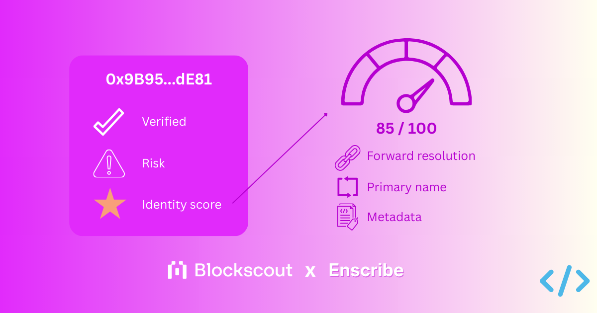
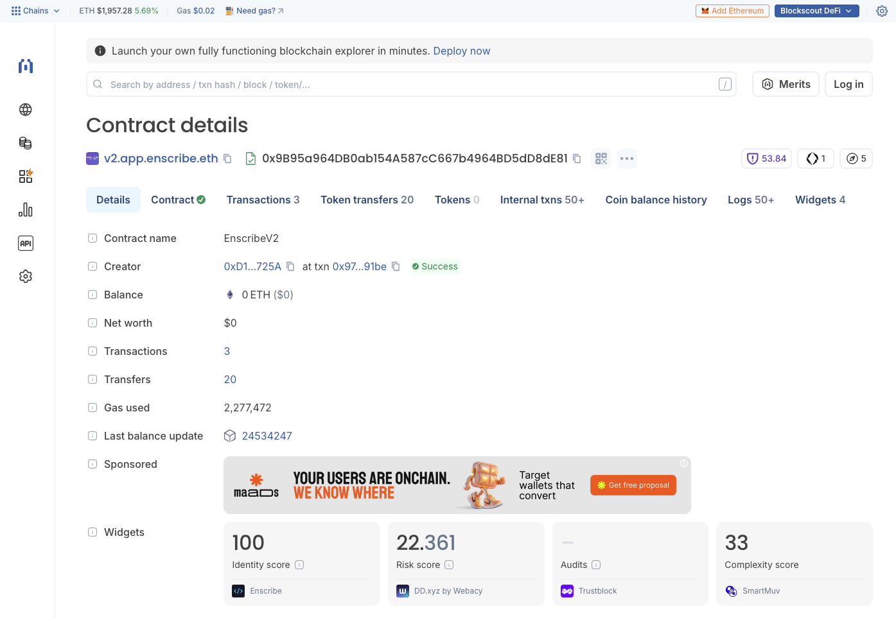
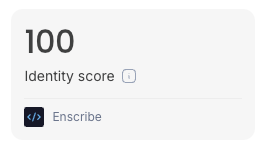

import AppUrl from '@site/src/components/AppUrl';

[Blockscout](https://www.blockscout.com/) smart contract pages now include an **Identity score** powered by Enscribe.

Blockscout is a leading open-source blockchain explorer for viewing transactions, smart contracts, and onchain activity across hundreds of networks.

The score provides a structured way to measure how clearly a contract is identified onchain with ENS. It is calculated by the Enscribe smart contract scoring API and displayed directly within Blockscout’s contract interface.

Contract identity now sits next to verification and risk details on [Blockscout contract pages](https://eth.blockscout.com/address/0x9B95a964DB0ab154A587cC667b4964BD5dD8dE81).

## What the identity score represents

The identity score ranges from 0 to 100. It reflects how well a contract’s ENS configuration establishes a clear, canonical onchain identity.

The score is derived from three measurable signals:

- **Forward resolution count** — how many ENS names resolve to the contract address  
- **Primary name (reverse resolution)** — whether the contract resolves back to a canonical ENS name  
- **Metadata text records** — whether descriptive ENS text records are set  

Each tier reflects a progressively stronger configuration, where a zero score means no identity information is set for the contract, through to 100 where a primary name is set as well as relevant metadata.

Multiple forward records lower the score because it creates ambiguity as to its true identity.

## How the integration works

Blockscout retrieves identity data from the [Enscribe API](https://www.enscribe.xyz/api/enscribe-api). When queried, the API:

1. Checks ENS forward resolution and reverse resolution for the address  
2. Reads ENS metadata text records  
3. Calculates a score according to the tier model  

Responses are short-lived cached. This supports stable and fast explorer lookups while allowing changes to propagate as ENS records are updated.

The scoring logic is deterministic and based entirely on publicly verifiable ENS state.

## Identity versus verification

For some time, it's been considered a best practice for developers to verify their smart contracts, but this isn't the same as having a concrete identity. 

Source code verification confirms that deployed bytecode matches published source, whereas identity scoring demonstrates if a contract is clearly and consistently identified onchain.

A contract may be verified but still lack:

- A canonical ENS name  
- A primary name  
- Descriptive metadata  

Without those elements, users must rely on raw addresses or external documentation to interpret what they are interacting with.

The identity score addresses that gap directly within the explorer interface. Users can then click on the identity score to [view the contract in Enscribe](https://app.enscribe.xyz/explore/1/0x9B95a964DB0ab154A587cC667b4964BD5dD8dE81) to see all of the identity information associated with the smart contract.

## Why this matters for explorers

Blockscout aggregates multiple signals to help users understand contracts. Identity scoring complements those signals without overlapping them.

It does not measure security, risk, or audit status. It measures identification which is vital for enhancing user trust.

By making ENS configuration visible as a score, Blockscout:

- Encourages consistent naming practices  
- Makes identity gaps observable  
- Provides a simple benchmark for improvement  

Because the score is numeric and tiered, it can be compared across contracts in a consistent way.

## Improving your score

Contracts reach the highest identity score by configuring:

- One forward-resolving ENS name  
- A primary name (reverse resolution)  
- Complete ENS metadata text records  

These signals are entirely onchain and publicly verifiable, and can easily be managed in the <AppUrl path="/nameMetadata">Enscribe App</AppUrl>.

Teams can update ENS configuration at any time, and the score will reflect those changes.

## Try it

The identity score is now live on Blockscout.

View a contract page to see how identity is measured, or use Enscribe to configure ENS names and metadata for your own contracts.

Happy naming! 🚀
