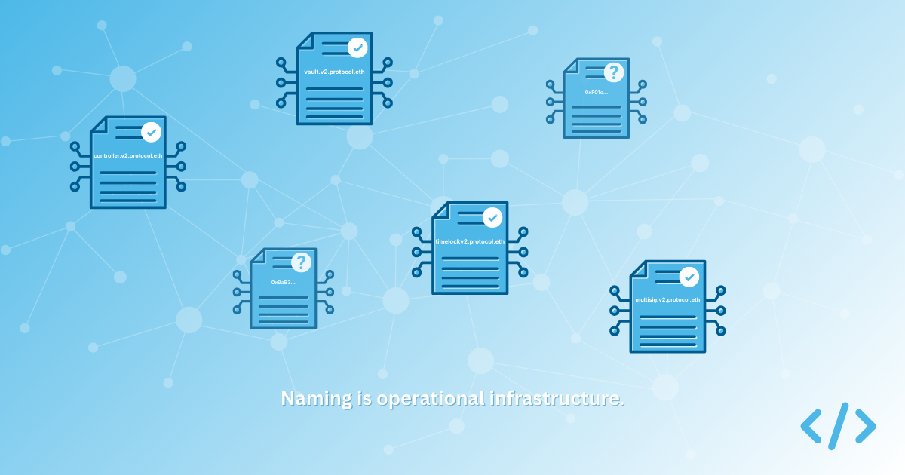
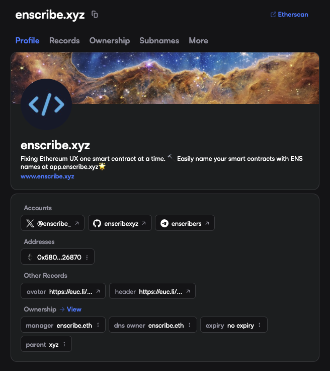

When teams talk about shipping securely onchain, audits usually dominate the conversation. Deployment scripts are reviewed carefully, contracts are verified and monitoring is configured.

Naming rarely receives the same attention.

It is often treated as administrative overhead, something to tidy up once the important work is done. A label in a block explorer. An ENS record configured after launch. A task that can wait.

In practice, naming is not decoration, it is crucial operational infrastructure. If someone outside your core engineering team cannot look at your onchain footprint and understand what belongs to your protocol, which version is current, and which addresses control upgrades or funds, identity is not yet doing its job.

Over time, a small set of recurring mistakes appears. They are usually the result of sensible teams focusing on other priorities, but they compound.

## Treating naming as an afterthought

The most common issue is timing. Projects deploy, audit and verify their contracts, but then naming is postponed.

This happens because deployment pipelines are designed around bytecode, not identity. Foundry or Hardhat scripts focus on signing contract bytecode and constructor arguments. There is rarely a step that enforces canonical identity before release.

As a result, naming becomes manual and optional. It depends on someone remembering to configure forward resolution, set primary names where feasible, and update documentation.

If naming is not incorporated into deployment workflows, it drifts. Multiple ENS names may end up pointing to the same address. Primary names may never be set. Version migrations become harder to reason about.

The solution is straightforward, but requires discipline. Naming should be part of the release checklist. If you are using Foundry or Hardhat, identity configuration should sit alongside verification and post-deployment validation. Tooling can help automate this, but the important shift is cultural. Identity must be treated as part of shipping.

## No version namespace

Many protocols deploy successive versions of contracts without creating a clear namespace for each release. Names end up flat and loosely related. Over time, it becomes difficult to see which contracts belong together and which are legacy.

A cleaner pattern is to introduce a version namespace and group contracts beneath it. For example, a protocol might create a root such as `v2.protocol.eth` and then register contracts under it:

- `vault.v2.protocol.eth`
- `controller.v2.protocol.eth`
- `timelock-admin.v2.protocol.eth`

This structure communicates code hierarchy. It makes migrations clearer and allows older versions to remain visible without confusion. It also makes scanning a set of contracts in a wallet or explorer simpler.

Without a namespace, every contract name competes at the same level. The system may still function correctly, but it becomes harder to reason about, especially for users, researchers, and auditors who are not involved in day-to-day development.

## Naming contracts but neglecting identity metadata

Having an ENS name is not sufficient on its own. The root name must carry context about your project or protocol.

If someone visits your primary ENS name, what do they see? Is there a link to your website? Are social handles present? Is there descriptive text explaining what the name represents? Does it clearly appear to belong to your organisation?

An ENS name without metadata is technically configured, but socially ambiguous.

This becomes especially relevant when the most obvious handle is unavailable. A protocol may not control `project.eth` and instead use something like `project-labs.eth` or `protocol-xyz.eth`. There is nothing wrong with that decision, provided it is clearly established as canonical.

The important question is not whether you own the shortest possible name. It is whether the name you do use is visibly tied to your organisation across surfaces. Some projects reinforce this by linking their ENS name from their website, social profiles, and documentation, creating a coherent identity that connects DNS, ENS, and public presence.

Without those proof points, users are left to infer authenticity. For example, in the case of Enscribe, our DNS name `enscribe.xyz` on ENS is managed by `enscribe.eth` demonstrating a relationship between the two records.

## Assuming forward resolution is enough

Forward resolution solves discovery. It allows a name to point to an address. It does not, on its own, eliminate ambiguity unless an address points back to that name via a reverse registry.

If multiple names resolve to the same address and no primary name is declared, interfaces must choose what to display. That choice may rely on heuristics, namespace assumptions, or external labels.

Primary names provide a stronger guarantee because they are unique per address within ENS. Where feasible, setting a primary name establishes a canonical identifier and reduces reliance on interpretation.

Treating forward resolution as sufficient leaves identity partially defined. It increases the likelihood that wallets and explorers rely on inference rather than on explicit declaration.

## Forgetting wallets and control surfaces

Logic contracts tend to receive the most attention because they encode the core behaviour of a protocol. In practice, some of the most sensitive components of a system are not logic contracts at all.

Timelocks, multisigs, upgrade managers, guardians, treasury wallets, fee collectors, and even deployment wallets often carry more operational risk than the contracts they control. They hold authority over upgrades, parameter changes, and funds.

These addresses are frequently left unnamed or inconsistently labelled. A protocol may carefully name its vaults and controllers, while the multisig that can upgrade them remains a bare hexadecimal string in a wallet.

If identity is meant to help users, auditors, and governance participants understand the system, it cannot stop at user-facing contracts. It must cover every address that has meaningful control or financial significance.

Complete coverage is the goal. Naming only the obvious contracts leaves the most powerful components of your protocol opaque.

## Naming as operational discipline

Naming mistakes rarely cause immediate failure, but they do create friction. They make audits harder to interpret. They make migrations more confusing, and make incident response slower. It also compounds over time.

A robust naming strategy is not about naming a few contracts. It is about complete identity coverage. Every contract, every governance address, every multisig, and every deployment or treasury wallet that matters to the system should be legible.

If you had to respond to an incident tomorrow, could an external auditor, integrator, or governance participant look at your onchain footprint and understand:

- Which contracts belong to the current version?
- Which addresses control upgrades?
- Which wallets hold authority or funds?
- Which ENS name is canonical for your organisation?
- How your DNS domain, social presence, and ENS identity connect?

If the answer is unclear, naming is not yet infrastructure, you only have partial coverage.

Audits protect logic, monitoring protects uptime, naming protects users.

Treating identity as part of deployment, and ensuring complete coverage across contracts and wallets, is a small operational shift, but it materially improves how your system is understood, governed, and trusted.
