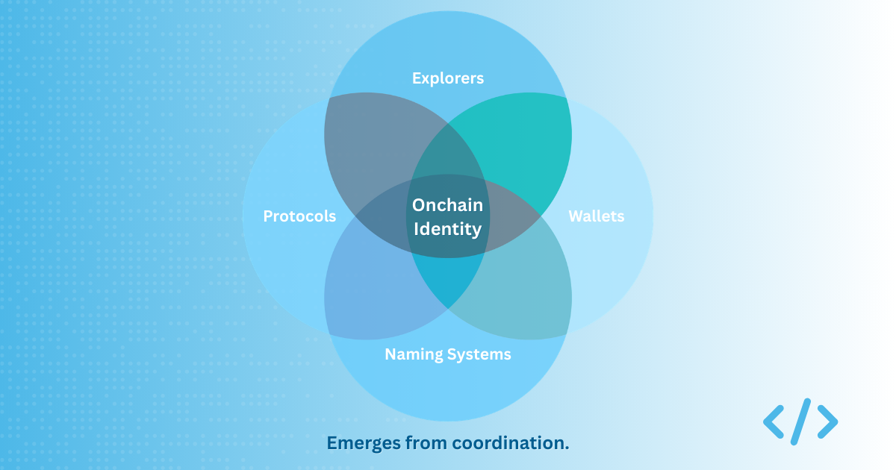
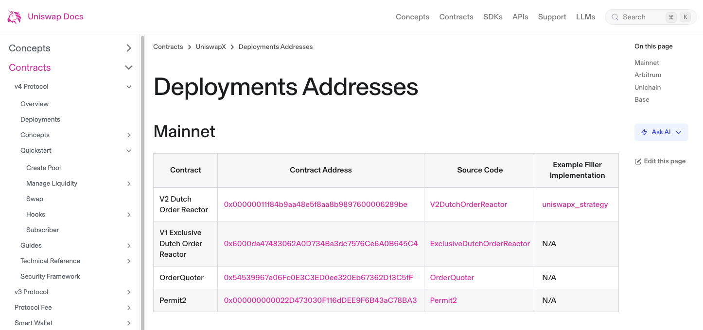
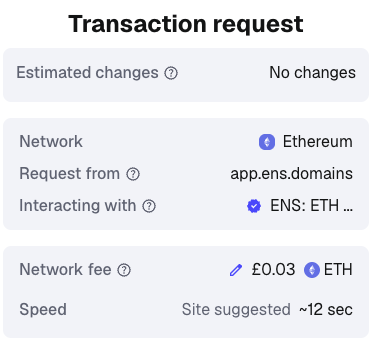
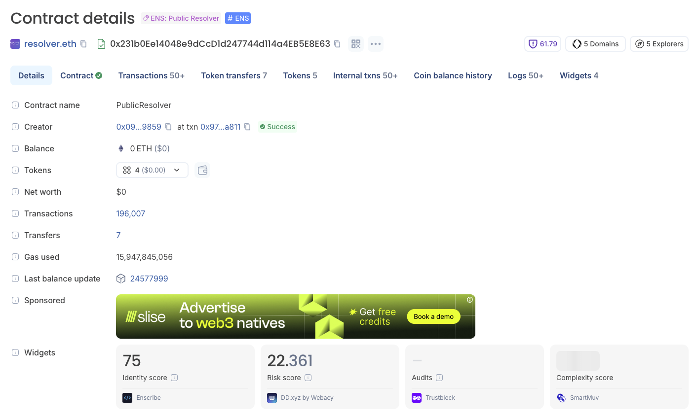
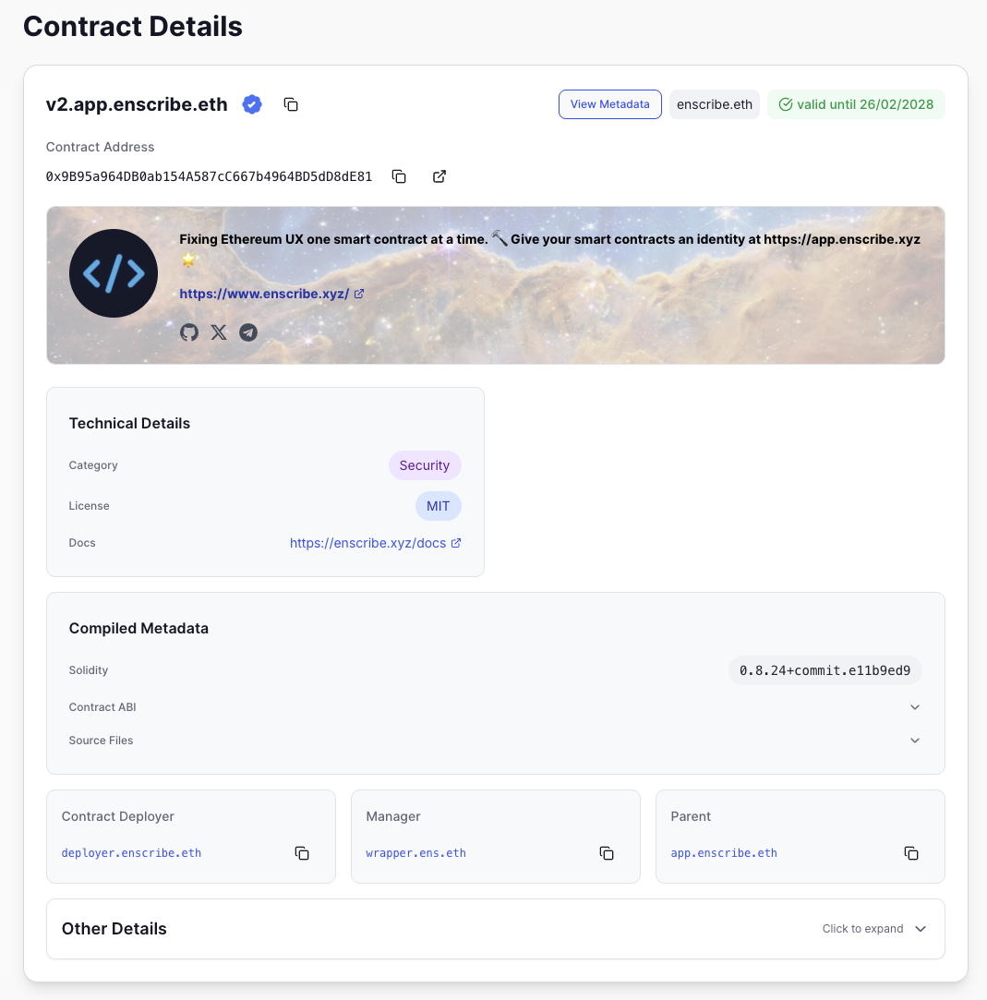

import AppUrl from '@site/src/components/AppUrl';

## Identity is often framed as a feature

Over the past year working on Enscribe, we have noticed that identity is often discussed as if it were a product capability. A wallet "adds identity support," a protocol "integrates ENS," and an explorer "improves labels." The framing implies that identity is something a single team can implement and ship, like a new dashboard or API endpoint.

{/* truncate */}

The reality is more complicated. Onchain identity is not a feature that one layer can solve in isolation. It is a property that emerges from how protocols, wallets, explorers, naming systems, and users behave collectively.

Without support across those actors, identity weakens.

## Protocol teams control the raw material

Builders of onchain protocols and apps sit closest to the source of identity. They deploy contracts, manage multisigs, upgrade proxies, and control treasury wallets underpinning their project. They are in the best position to provide human-readable names for their addresses, create primary ENS records, and maintain metadata that ties their ENS root to a website or public presence.

*An extract of the Uniswap docs showing their hex smart contract addresses*

If that work is skipped or treated as optional, wallets cannot reliably compensate for it later without building their own service, or relying on some form of centralized labeling.

Wallets can display what exists, but they cannot invent canonical identity where none has been declared by the team establishing those onchain assets.

In my experience, this is often where the gap begins, not because teams are careless, but because identity is treated as secondary to shipping core functionality.

## Wallets decide what users actually see

Wallets sit at the moment of decision for users. They are used to interact with protocols and perform onchain activity. Wallet interfaces decide whether an address is presented as a hex string, a label, or a canonical name. They translate raw onchain data into human judgment.

*Some wallets such as Metamask use labels from Etherscan for smart contract identities*

If wallets default to their own heuristics, or treat identity as nice to have rather than authoritative, they dilute whatever discipline a protocol team has applied upstream. In some cases, wallets become the de facto identity layer, which was never the intention.

This is not necessarily a flaw in wallet design. It is often a pragmatic response to low adoption of identity and naming practices by protocol teams. It does, however, highlight the shared nature of the responsibility.

## Explorers fill the gaps

Blockchain explorers often step in to provide additional context for users. Labels are added, sometimes manually and sometimes through internal processes that are opaque to most users. Those labels are helpful, but they are not canonical.

*Blockscout shows both ENS names for contracts and labels*

Ironically, the more reliable those labels appear, the less pressure there is for protocol and app teams to configure identity properly in the first place. The ecosystem quietly shifts toward soft signals, which in many cases are centralized rather than protocol-level assertions.

Over time, that creates a system where identity feels present, but is not deterministically anchored or guaranteed.

This also keeps the barrier to using onchain applications high. Without intuitive, human-readable identities, onchain systems are harder for new users.

No company would present users with IP addresses to access web applications, yet hexadecimal addresses for wallets and contracts remain common in onchain interfaces.

## The coordination problem

There is a clear technical solution to much of this in ENS. It provides forward resolution, primary names, and metadata that teams can set for protocols.

*The <AppUrl path="/explore/1/v2.app.enscribe.eth">Enscribe App</AppUrl> provides an aggregated view of smart contract identites using onchain data*

Wallets can surface those records. Protocols can declare canonical names. In principle, the pieces fit together.

In practice, each actor optimizes locally. Protocol teams focus on code and audits. Wallet teams focus on interface design. Explorers focus on discoverability. Naming systems provide primitives without enforcing norms.

Each decision is rational in isolation. Collectively, they produce ambiguity for users.

A common response is trying to combine every function into a single application with smooth UX, often at the expense of decentralization.

The internet did not face this exact problem at the same scale with DNS, partly because academic and government institutions collaborated to establish shared infrastructure early. Onchain infrastructure has developed with stronger commercial fragmentation, which makes coordination harder.

## Shared responsibility requires norms

In my view, this is why identity should not be framed as a feature. Features are owned by one team. Shared infrastructure requires widely adopted standards and operating norms.

Protocol teams need to treat naming and metadata as part of deployment. Wallets need to treat canonical identity declarations as authoritative signals rather than optional enhancements.

Explorers need to be explicit about the difference between labels and identity. Naming systems need to reduce friction in establishing primary names.

None of this requires new primitives. It requires alignment.

As systems grow more complex and more actors interact with them, ambiguity compounds. At some point, identity stops being a convenience and becomes a prerequisite for safe coordination.

That shift will not happen because one team ships a feature. It will happen when enough teams decide that identity is not someone else's problem.
