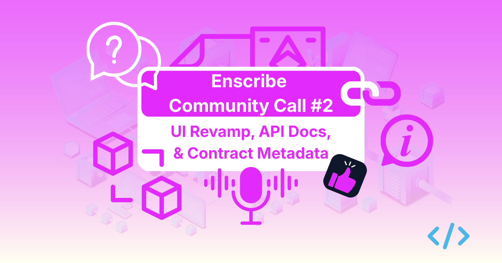

After a good kickoff last month, we’re back for our second monthly community sync. We’ve been busy incorporating feedback from the first call, and we have significant updates to share across the Enscribe ecosystem.

This session will dive straight into the technical improvements we’ve shipped over the last few weeks.

## The agenda

### 1. Revamped UI and implementation refactoring

We’ve given the Enscribe web app a major facelift. It’s not just about aesthetics; we’ve streamlined the user flow to make naming contracts faster and clearer. We’ll also talk briefly about the code refactoring we’ve done to make the platform more stable and scalable.

### 2. Versioning Registrar implementation

One of the more technical milestones we’re excited to discuss is our initial implementation of a Versioning Registrar to version contract deployments. We’ll walk through how this implementation works.

### 3. New API documentation

We’ve had the public Enscribe API since the beginning, but lacked proper documentation. We’ve integrated the Docusaurus plugin to provide clean, searchable API docs.

### 4. Contract metadata

We’ve built a new feature that allows users to attach essential metadata directly to their contract identity. Whether it’s a GitHub URL, documentation links, or project socials, you can now provide full context for your contract right within Enscribe. We’ll show you how to set this up and how to view all metadata for contracts on Enscribe.

We’ll also be joined by [Lighthouse](https://lighthouse.cx) to discuss contract metadata. Lighthouse removes friction from governance, making it easier for anyone to stay active in their community without getting bogged down by technical complexity or security concerns.

## Join the call

We want to keep these sessions high-signal. Come hang out and get your questions answered.

- **Date:** Wednesday, March 11, 2026
- **Time:** 3 PM GMT
- **Where:** Google Meet

You can register for the call [here](https://luma.com/z1nhtad8).

Happy naming!
