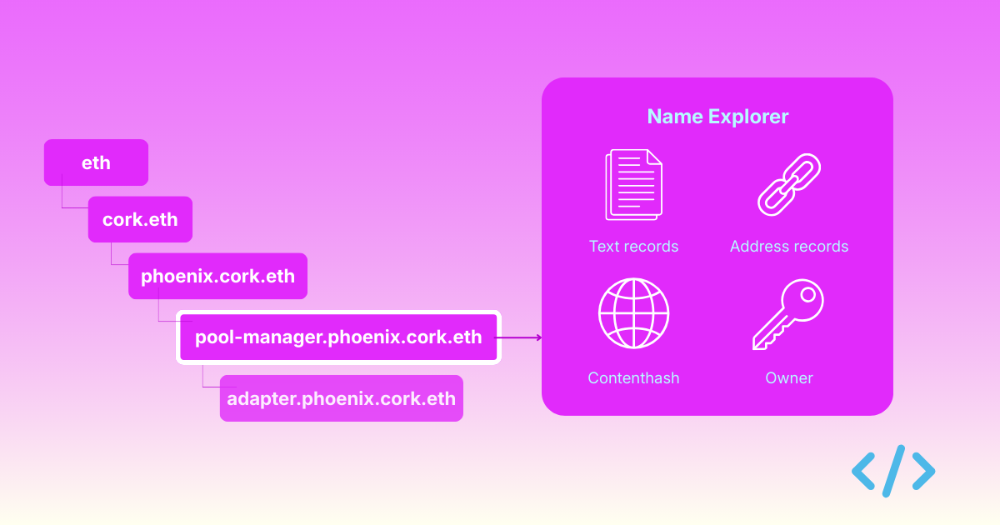
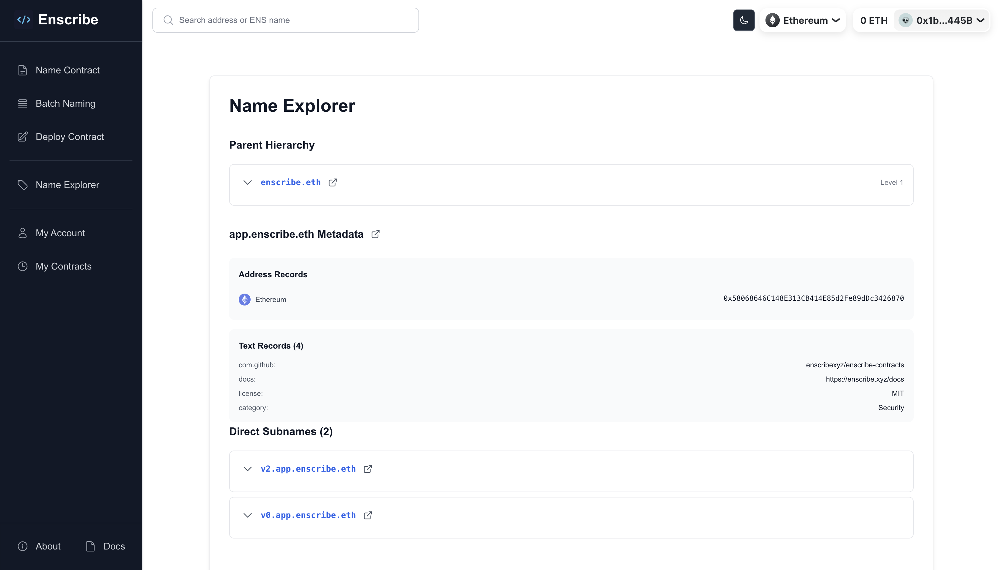

ENS names form a hierarchical namespace, where names can have parents and children, each with their own metadata and ownership. But exploring this structure and the metadata attached to names has always been really hard and un-intuitive.

Thats why we added **Name Explorer** to Enscribe — a dedicated interface for navigating ENS name hierarchies, viewing metadata, and managing text records all in one place.

{/* truncate */}

## The problem: ENS names are more than addresses

When you interact with ENS, you typically think about resolution: "What address does `vitalik.eth` point to?"

But ENS names are rich data structures. Each name can have:
- Multiple text records (metadata)
- A parent name above it in the hierarchy
- Subnames below it
- Cross-chain address records
- Contenthash attached to the name

Previously, to explore all this information, you'd need to:
- Use the ENS Manager app to see text records
- Manually construct parent names to browse upward
- Query subgraphs to find subnames
- Switch between multiple tools and interfaces

**Name Explorer brings all of this into one interface.**

## What Name Explorer does

Name Explorer is a new page on Enscribe designed specifically for exploring ENS names, their metadata, and their place in the naming hierarchy.

You can access it from:
- The main navigation: "Name Explorer"
- Via search results when you search for an ENS name
- Through contract details page

Key capabilities:

- **Two search modes** — search by address to view contract/account details, or explore a name directly to see its metadata and hierarchy
- **Parent hierarchy navigation** — traverse the full parent chain of any name with a click
- **Subname browsing** — list all direct subnames under a name and click through to explore them
- **Metadata viewing and editing** — see every text record set on a name, and edit them directly if you're the owner or manager
- **Multicall support** — set multiple metadata fields in a single transaction

For a detailed walkthrough of each feature, see the [Name Explorer docs page](/docs/getting-started/name-explorer).

## Try it now

Name Explorer is live on [Enscribe](https://app.enscribe.xyz/nameMetadata):
- Search for any ENS name
- Explore public metadata
- Navigate hierarchies
- Connect your wallet to edit your names

Whether you're managing a protocol with hundreds of contracts, exploring the ENS namespace, or simply want to see what metadata is attached to your favorite names, Name Explorer provides the visibility and control you need.

Join the conversation and give us your feedback on [Discord](https://discord.gg/8QUMMdS5GY), [Telegram](https://t.me/enscribers) or [X](https://x.com/enscribe_)

Happy naming! 🚀
