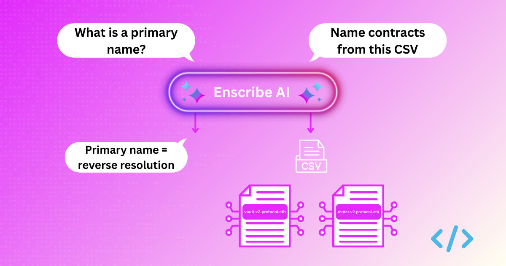
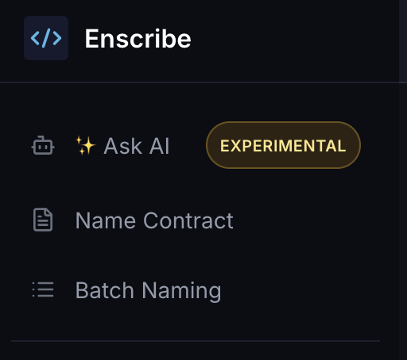
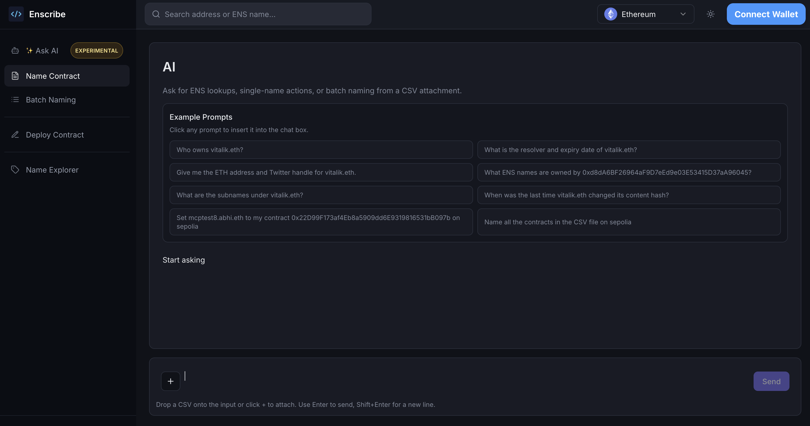
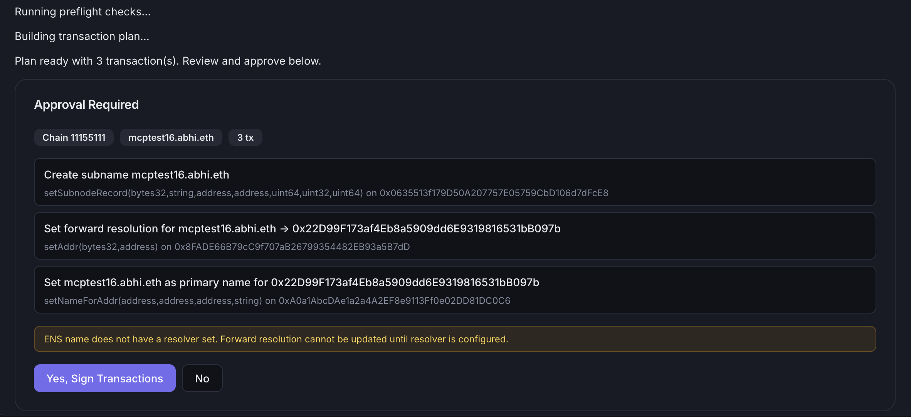
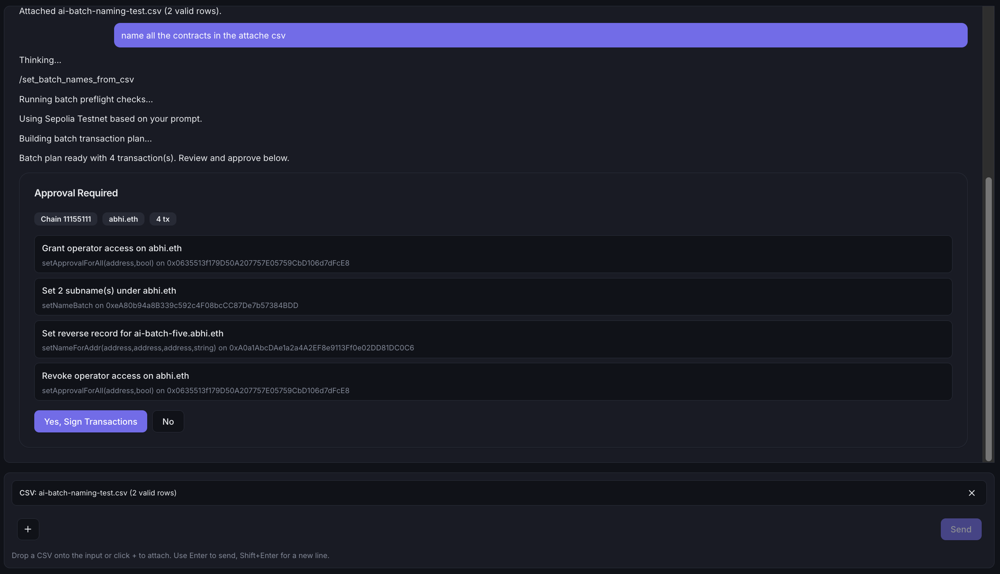
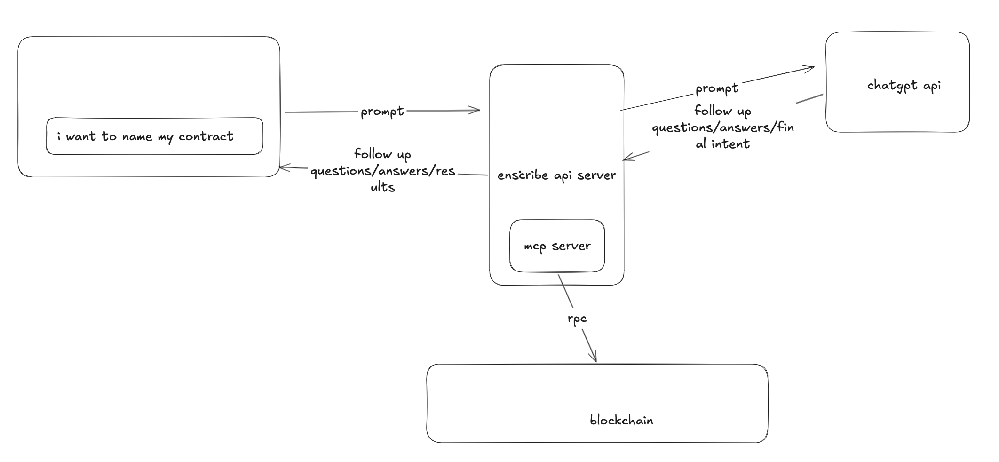

This is the era of AI dominance and almost every app on the internet has some or the other use case fulfilled by AI. A common intention nowadays is to integrate AI with documentation to enable users learn about the app and its features. But what about integrating AI to help users execute actions on the app?

This is what we are excited to announce with Enscribe Ask AI chat agent. You will see the Ask AI  as the first menu item in the left sidebar.

Clicking on it will open the AI chat page.

You can ask practical ENS questions, such as:

- what a primary name is,
- how reverse resolution works, or 
- how to name contracts from a CSV. 

You can also ask the agent to name your contract on a particular chain or give it a csv containing multiple contracts to name and it will do the rest.

Here's what it looks like when you ask the agent to name a contract on a particular chain:

Clicking on the "Yes, Sign Transactions" button will open the connect wallet to approve the transactions.

And here's what it looks like when you ask the agent to name multiple contracts from a CSV:

You can either drag and drop the CSV file in the chat box or click on the "+" button to upload it.

We'll now see how the AI agent is designed to help you execute ENS workflows.

## Technical architecture overview

At a high level, Enscribe AI chat has three layers:

1. **AI chat page:** This is where users ask ENS questions, upload a CSV for batch naming, and review next steps.
2. **Decision layer (OpenAI intent API):** The model decides whether to answer directly or route the request into an execution flow.
3. **Execution layer (MCP server):** For action requests, MCP runs the ENS workflow: checks prerequisites, prepares transactions, tracks progress, and verifies outcomes.

That structure keeps the experience simple for users. You can ask, “What is a primary name?” and get a clear answer. You can also ask, “Name all contracts in this CSV on Sepolia,” and move into a guided transaction flow.

For naming flows, we keep safety steps in the loop: deterministic CSV validation, explicit approval before signing, status tracking, and operator access revocation after execution, including cleanup paths when something fails.

We also have extended the MCP server with [Namespace's ens-mcp server](https://github.com/thenamespace/ens-mcp) to support more ENS workflows, such as:

- Who owns `vitalik.eth`?
- What ENS names are owned by `0xd8dA6BF26964aF9D7eEd9e03E53415D37aA96045`?

## Getting agentic

Users are becoming more familiar with AI and interact with it using languages that we speak. We are building Enscribe AI chat to help users execute ENS workflows with prompts.

We are constantly working on improving the agent to support more ENS workflows and make it even more easier for users to name their contracts on ENS.

You can try it out on the [Enscribe UI app](https://app.enscribe.xyz/ask-ai).

Happy naming! 🚀