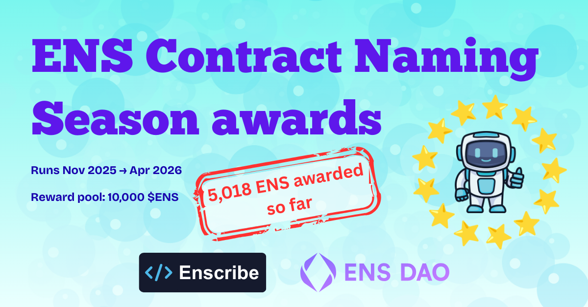
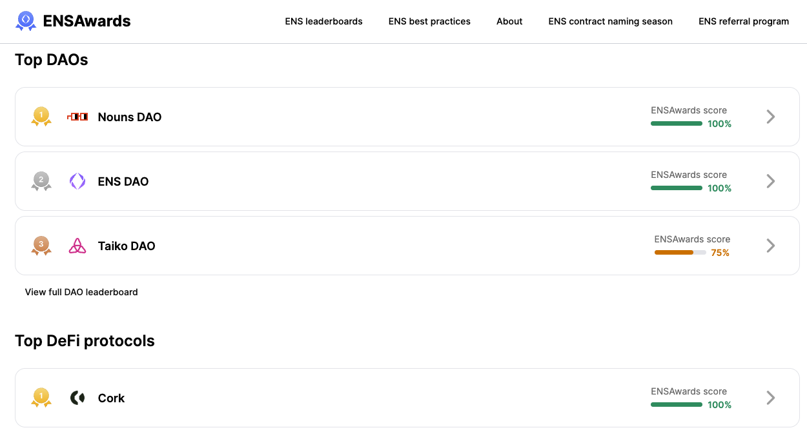
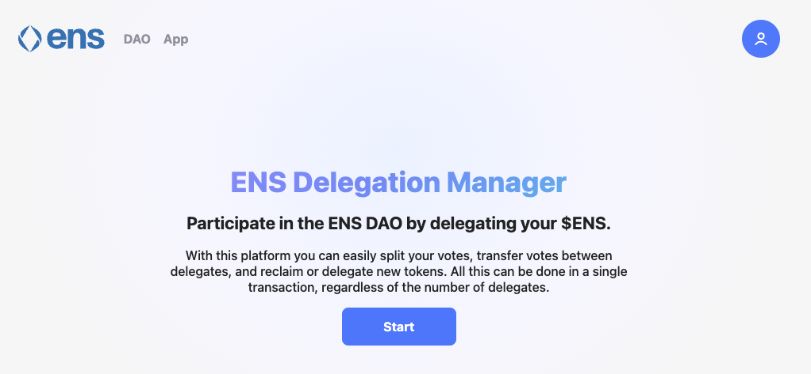

When we published our first [Contract Naming Season update](/blog/naming-season-update-1) in January, the focus was on momentum and what had been achieved. Teams were beginning to name contracts, tooling had improved, and the first public protocol announcements had started to appear.

At that stage, the awards themselves were still ahead of us.

We have now reached a more concrete milestone. The first batch of ENS Contract Naming Season awards has been distributed, and with two months still to go before the program closes at the end of April, we now have a clearer picture of how participation is taking shape.

{/* truncate */}

## 5,018 ENS has now been distributed

At the start of Contract Naming Season, the ENS DAO set aside **10,000 ENS** to reward protocols, developers, and individuals naming smart contracts and related onchain infrastructure with ENS.

So far, **5,018 ENS** has been distributed.

That means just over half of the available pool has already been allocated in the first phase of the program, while a substantial amount remains available for the final two months.

Award sizes have varied deliberately. The smallest awards in this first batch were **10 ENS**, intended to recognize individual deployments and smaller acts of participation. Larger awards of **100 ENS** and **500 ENS** have gone to people and projects that played a more pivotal role by bringing protocols in, or by contributing as established projects in the space.

The variety of recipients is important. Contract identity is not only relevant to major protocols. It also matters for individual deployments, multisigs, treasury wallets, and operational addresses that would otherwise remain as anonymous hexadecimal strings.

## Participation is coming from both protocols and individuals

One of the more encouraging aspects of the first distributions is that participation has not been limited to a single segment of the ecosystem.

On the protocol side, recipients in this first batch include **Nouns DAO, Liquity, Cork, Giveth, and Based Nouns**. Alongside them are individual developers and smaller projects that have also started naming their contracts and related addresses.

This diversity is important. If contract naming only happens at the top end of the ecosystem, it remains a niche activity. What Contract Naming Season is trying to encourage instead is a broader standard, where naming becomes a routine part of deploying onchain systems, regardless of whether the deployment belongs to a major protocol or a single builder.

In that sense, the first awards are less interesting as a leaderboard and more useful as an early signal that this behavior is starting to spread.

If you want to track protocol-level progress, the [ENSAwards site](https://ensawards.org/) captures this activity for larger protocols.

## The work is still uneven, which is exactly why this matters

A point we made in the earlier update is that contract naming takes time, particularly for mature protocols with more complex governance and operational setups. Inventorying contracts and wallets, deciding on naming structures, coordinating multisigs, and reviewing ENS hygiene is rarely something that happens overnight.

This is still true. What the first distributions show is that once teams start paying attention to identity, the scope tends to expand. A protocol may begin by naming a few obvious contracts, then realize that treasury wallets, deployment wallets, timelocks, and other contracts and wallets also need to be legible.

In practice, naming rarely stops at the first address.

That is part of why this season still has room to run. The work is iterative, and many of the teams participating now are still partway through making their onchain footprint understandable.

## A note on delegation

As these rewards begin to reach recipients, it is also worth thinking about what can be done with ENS token rewards.

The ENS tokens distributed through Contract Naming Season carry governance rights. While some recipients may choose to sell their rewards, another option is to delegate them to active ENS governance participants. Delegation helps keep those tokens involved in governance rather than leaving the ecosystem.

If you receive a Naming Season reward, you can delegate your ENS through the [ENS delegation app](https://delegate.ens.domains/).

There is also an ongoing discussion in ENS DAO about strengthening delegation participation, which interested readers can follow on the [ENS forum](https://discuss.ens.domains/t/temp-check-delegation-incentives-program/21824?u=estmcmxci).

## Two months remain

Contract Naming Season is still open until the end of April.

That means there are two months left for teams and individuals to participate, and close to half of the ENS pool remains unallocated.

If you have contracts, multisigs, treasury wallets, or deployment wallets that still appear as raw hex strings across explorers and wallets, there is still time to change that. Naming is often less about doing something novel and more about doing something that should have become normal much earlier.

## What comes next

Over the final stretch of Contract Naming Season, the focus remains the same: encouraging more protocols and developers to name their onchain infrastructure, making those systems easier to understand, and reinforcing the idea that identity is part of operational discipline rather than an optional extra.

We will continue sharing progress as more naming work is completed and more awards are distributed. If you want to follow the broader program, refer to the [Naming Season thread](https://discuss.ens.domains/t/ens-contract-naming-season/21596) on the ENS Forum.

If you have not already, head over to the [Enscribe App](https://app.enscribe.xyz/) to get started.

Happy naming!
