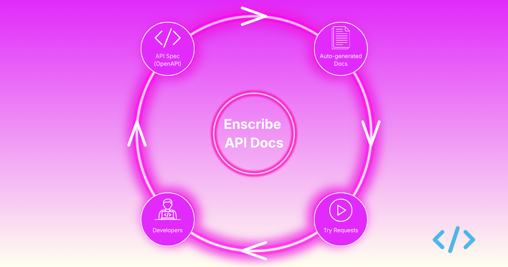
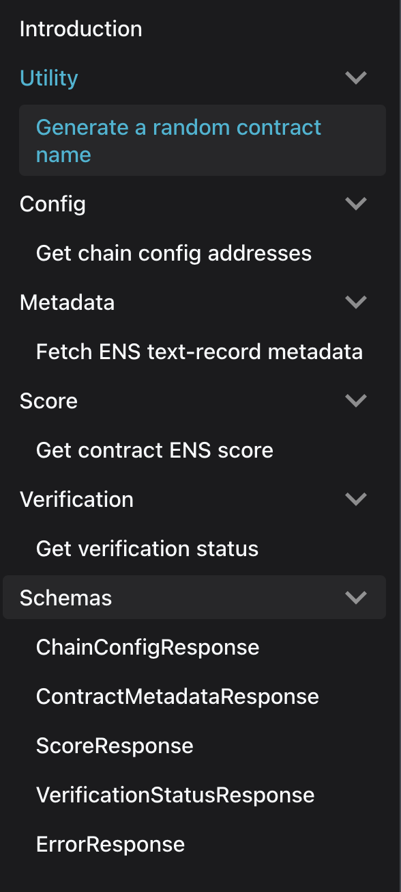
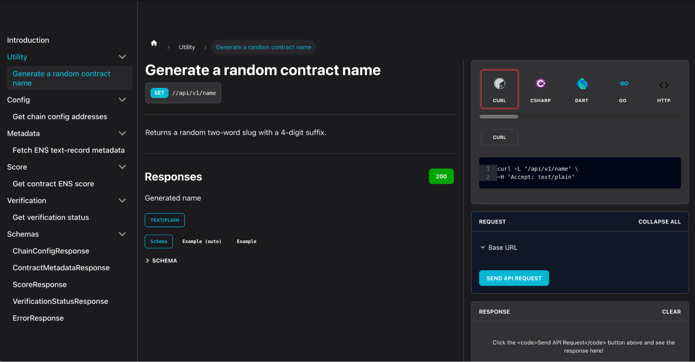
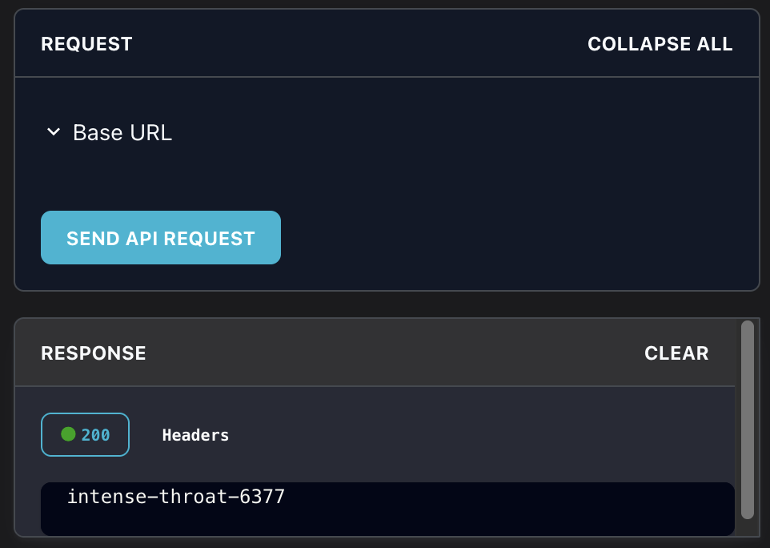

API documentation is often treated as a follow-up task after endpoints ship. In practice, that delay creates support overhead, slows onboarding, and increases integration mistakes. Developers need one place where they can see available endpoints, required parameters, expected responses, and error behavior. When that information is missing or not up-to-date, teams spend time reverse-engineering requests from code examples or trial and error.

Adding API docs early creates a shared reference for product, backend, frontend, and partner teams. It improves handoffs during development, and it reduces the gap between what an API is intended to do and what external users think it does. Good docs also improve operational reliability because they make edge cases visible before production traffic hits them.

{/* truncate */}

For Enscribe docs, generating API references with a Docusaurus plugin helped keeping this content maintainable. Instead of manually rewriting endpoint pages, we can generate documentation directly from the API definition and publish it with the rest of the site. That gives us a repeatable workflow: update the API spec, regenerate docs, review, and ship. It lowers the chance of drift between implementation and documentation, especially when endpoints change over time. These are the endpoints automatically generated:

Another benefit is interactive API calls inside the docs. Readers can test requests from the same page where they read the endpoint contract. This shortens the feedback loop: developers can adjust payloads, inspect responses, and validate assumptions without jumping between documentation, scripts, and external tools. For internal teams, this speeds QA and integration checks. For external builders, it reduces first-use friction and makes adoption more predictable.

For example, here’s the API endpoint to generate a name for a contract:

You can test this endpoint by clicking on the SEND API REQUEST button:

API docs are part of the product infrastructure. Treating documentation generation and in-doc testing as part of the release process leads to clearer integrations, fewer support tickets, and faster iteration to ship them.

Head over to the [Enscribe API documentation](https://www.enscribe.xyz/api/enscribe-api) & try out testing our public API.

Happy Naming! 🚀
