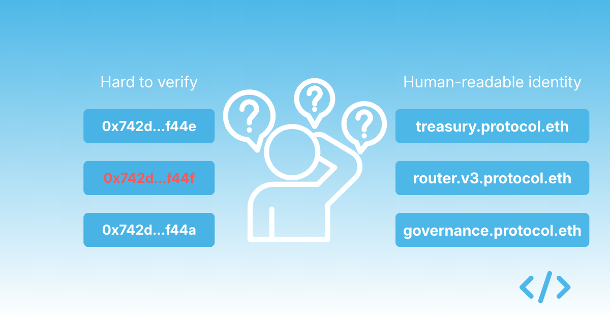
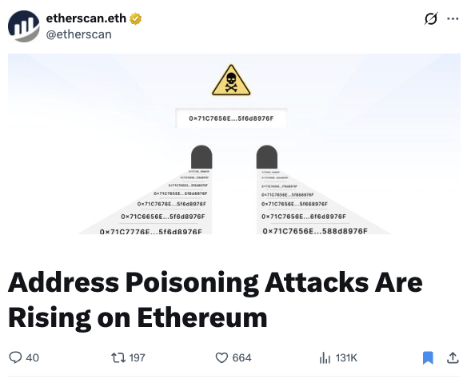
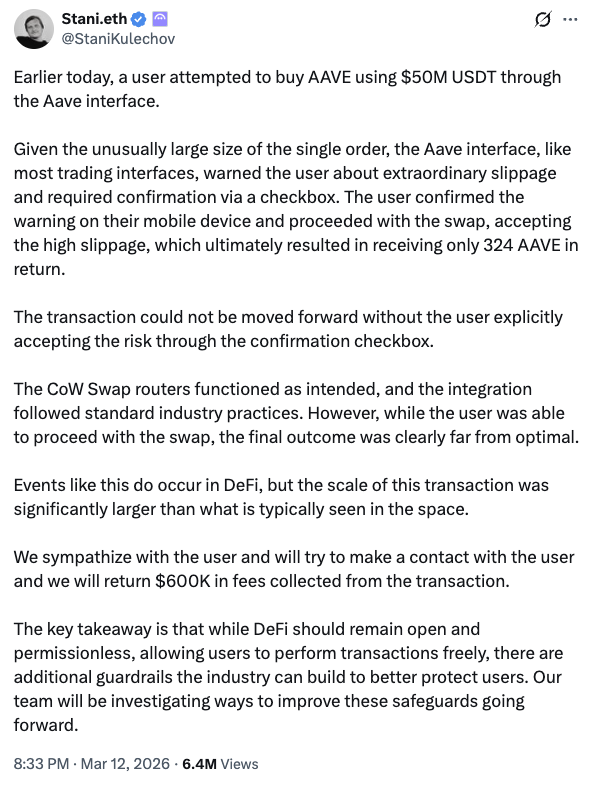

One of the stranger design choices Ethereum inherited early on is that users are still routinely shown raw hexadecimal addresses when they interact with smart contracts. These strings were never meant to be human-readable identifiers — they exist because machines need them, not because humans should be making decisions based on them.

Yet in many wallets and transaction flows today, users are still expected to look at a 42-character hexadecimal string and determine whether the interaction they are about to approve is legitimate. That expectation is only reasonable for developers. For regular people, it asks something the human brain is simply not well-suited to do.

{/* truncate */}

## The limits of what users can actually verify

A hexadecimal string is not something most people can reliably distinguish or remember. In practice, users fall back on weak signals such as the first few characters, the last few characters, or simply an assumption that the interface they are using would not present them with something malicious.

Attackers understand this dynamic all too well, and have built exploit patterns around it. Address poisoning is one of the most common.

Attackers generate addresses that visually resemble legitimate ones and send small transactions to victims so that the malicious address appears in their transaction history. Later, when a user copies a previously used address from their wallet, they may inadvertently select the attacker's version rather than the legitimate one.

In practice, the core weakness they identify is not a flaw in cryptography or smart contracts, but a flaw in how humans are asked to interact with addresses in the first place.

Etherscan recently published an [article](https://x.com/etherscan/status/2032067841734951008) on how address poisoning attacks are rising on Ethereum. This reflects how widespread the problem has become. Address poisoning is not a theoretical risk. It is something infrastructure providers now routinely flag.

## When interfaces encourage blind confirmation

The broader problem extends beyond address poisoning. Even when a transaction is legitimate, users are often approving interactions they cannot meaningfully interpret. Wallet prompts frequently contain contract addresses, method calls, and calldata that only a developer would recognise. Most users simply click through to complete their transaction.

This is not irrational behaviour so much as a coping mechanism. When every transaction prompt contains unfamiliar information, users quickly learn that attempting to verify it is largely futile, and the interface ends up conditioning them to approve without scrutiny because the alternative is very time-consuming. This results in hexadecimal addresses becoming background noise rather than meaningful information for users.

## The Aave incident and what it illustrates

Last week, an Aave user [executed a trade involving roughly $50 million worth of USDT](https://x.com/StaniKulechov/status/2032193345414664659) and received a tiny fraction of that value back in AAVE tokens. The exact mechanics are still being debated, but the incident illustrates a wider point: the systems we are asking users to interact with are often difficult to interpret even for experienced participants. When large values can move through interfaces that display little more than contract addresses and token symbols, mistakes become surprisingly easy to make.

In many ways this is a design problem as much as a user problem. We have built financial infrastructure where the core identifiers are opaque to the people expected to trust them.

## Names were supposed to fix this

This is precisely the type of problem that naming systems like ENS were originally designed to address. Human-readable names create a layer of identity that allows users to reason about what they are interacting with. Instead of asking someone to verify `0x742d35Cc6634C0532925a3b844Bc454e4438f44e`, you show them something like `treasury.uniswap.eth` or `governance.aave.eth`.

The difference is not simply cosmetic. It alters how trust works. Names allow users to build mental models of systems, recognise familiar patterns, spot inconsistencies, and understand relationships between contracts and organisations. Hexadecimal strings provide none of that context.

Unfortunately, ENS adoption has historically focused on wallet identities for individuals rather than contract identities for protocols. As a result, even sophisticated protocols often deploy dozens of contracts that remain unnamed and therefore indistinguishable to end users.

## Identity needs to extend to contracts

This gap is one of the reasons we created Enscribe. The goal is not simply to attach names to contracts after the fact, but to make contract identity a standard part of deployment workflows. When protocols name their contracts and organise those names in a coherent structure, the surface area of their systems becomes far easier to understand. Users see a structured hierarchy that reflects how the protocol actually works, rather than a collection of unrelated addresses.

In practice, this changes the experience of interacting with onchain systems in subtle but consequential ways. Transaction prompts become easier to interpret. Wallets can surface more meaningful information. Explorers can show relationships between contracts rather than isolated addresses.

## The strange persistence of hexadecimal

What is perhaps most surprising is how long we have accepted hexadecimal addresses as the default interface. In most areas of computing, raw identifiers are hidden behind meaningful names — we do not ask users to navigate the internet by IP address or interact with applications by referencing internal database keys. Onchain systems remain a conspicuous exception.

Address poisoning attacks and transaction mistakes are, in many ways, symptoms of this deeper design decision. Naming does not eliminate every risk, but it dramatically reduces the amount of blind trust users must place in interfaces they cannot interpret. If the goal is for people to interact confidently with onchain systems, expecting them to verify 42-character hexadecimal strings is a poor foundation to build that confidence on.
