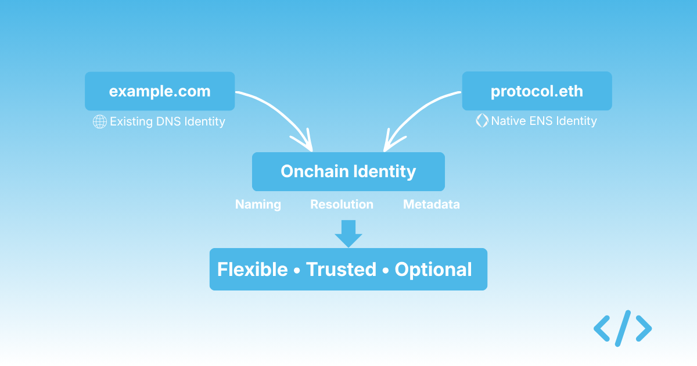
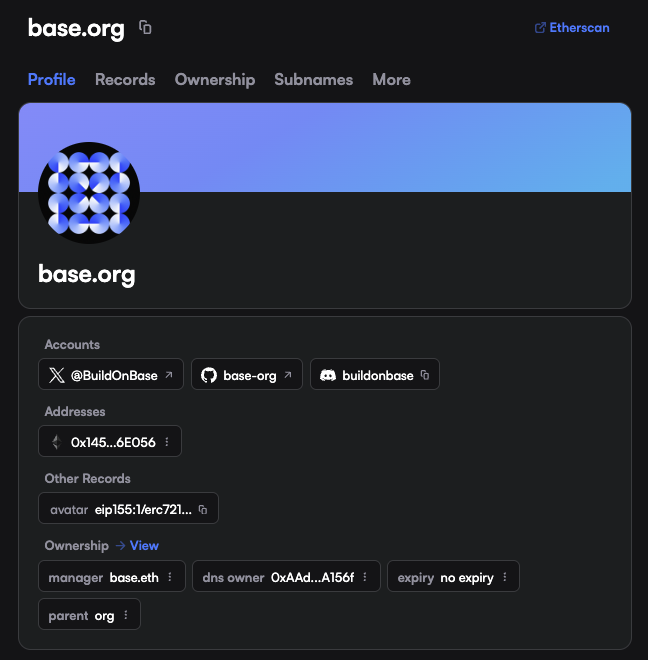
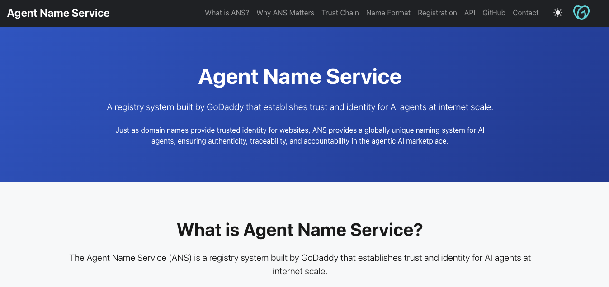

# **DNS on ENS and why optionality matters**

Most discussions around ENS tend to focus on `.eth` names as a new primitive — a way for individuals or projects to establish a native onchain identity. That framing is broadly correct, but it misses a second path that is arguably more relevant for organisations: ENS also supports DNS names, and that support changes the nature of the conversation quite significantly.

Instead of asking an organisation to adopt a completely new identity system, ENS allows them to extend the identity they already have. A company can take a domain like `example.com`, prove ownership, and bring that identity onchain, gaining access to ENS functionality without introducing a new naming surface.

*The DNS name `base.org` lives on ENS, along with `base.eth` which manages the record*

This creates a form of flexibility that is easy to overlook. An organisation can choose to operate entirely with a native ENS name, such as `protocol.eth`. Or it can bridge its existing DNS identity into ENS and retain continuity with how users already recognise it. Both approaches are valid, and both lead to the same destination: a named, identifiable presence onchain. The difference is how much change is required to get there.

{/* truncate */}

## **Trust does not start from zero**

For most organisations and brands, identity does not begin onchain.

It already exists in the form of a DNS domain, a website, and a set of social profiles that users recognise. That identity has accumulated trust over time, not through cryptography, but through familiarity and repeated interaction.

What ENS does, when DNS is integrated, is allow that existing trust to be carried across. Rather than asking users to trust a new identifier, such as `protocol.eth`, the organisation can anchor its onchain presence to something that is already widely recognised, like `mybrand.com`. The ENS layer then becomes an extension of that identity rather than a replacement.

This is particularly relevant in environments where users are still being shown hexadecimal addresses. In those contexts, any recognisable name — especially one tied to a known domain, provides a meaningful improvement in how interactions are understood.

## **The DNSSEC constraint**

Historically, one of the barriers to this approach has been DNSSEC.

DNSSEC adds cryptographic signatures to DNS records so that domain ownership can be verified in a trust-minimised way. ENS relies on it to ensure that when a domain is bridged onchain, it is actually controlled by the entity claiming it. 

The issue is that adoption has been uneven — many domains are still not configured with DNSSEC, either because it is not widely understood, or because it has not been necessary for existing use cases. As a result, the path from DNS to ENS has often been technically possible, but operationally inconvenient.

That appears to be changing.

## **Why this is becoming relevant again**

There is a growing interest in agentic systems — environments where software agents interact with services, contracts, and each other with a higher degree of autonomy.

*GoDaddy's [Agent Name Service](https://www.agentnameregistry.org/)*

Companies like GoDaddy have started to explore "agentic registries," where domains act as identity anchors for automated systems. DNSSEC, in those cases, is recomended (ENS also has its own standard for agentic registries via [ENSIP-25](https://docs.ens.domains/ensip/25/)). It is required to establish verifiable control over a domain in a way that other systems can trust. Other infrastructure providers are moving in a similar direction, treating DNS not just as a routing layer, but as a foundation for identity in automated environments.

ENS sits somewhat adjacent to this trend. It offers a comparable model of verifiable identity, but anchored on Ethereum rather than traditional DNS infrastructure. In some ways, ENS can be thought of as an extension of these ideas into a different trust domain, and the connection between the two runs through DNSSEC. As DNSSEC becomes more widely adopted for agent-driven systems, the barrier to bringing DNS identities onchain via ENS starts to diminish.

## **Choice as a design principle**

What makes this interesting is not that ENS can replace DNS, it is that it does not need to.

Organisations can adopt a native ENS identity and build around it. Or they can use ENS as a layer that extends their existing DNS identity into onchain systems. The underlying capabilities are the same. They still have naming, resolution, metadata, but the starting point is different. In my view, this is one of ENS's more important properties, particularly for organisations that are hesitant to introduce new naming conventions. It allows teams to move onchain without forcing a binary decision about identity.

## **The operational gap**

The gap, at the moment, is not conceptual, it is educational and operational. Organisations need to be aware that they don't have to purchase and ENS name to have identity on Ethereum. This requires education. On the operation side, to use DNSSEC it may still need to be configured. Tooling still needs to be simplified. The path from a traditional domain to a fully usable onchain identity is not yet as straightforward as it could be.

This is something we are looking at with Enscribe, approaching it from two directions. One is to make it easier for organisations to come onchain using the identities they already have, particularly where DNS is the starting point. The other is to provide infrastructure that is more aligned with how organisations actually manage identity, rather than assuming a purely individual or wallet-centric model. Both are, in some sense, about reducing the amount of change required.

If identity onchain is going to become more widely adopted, it will not be because organisations abandon what they already use. It will be because the systems they already trust can be extended in a way that feels natural. ENS, when combined with DNS, is one of the more practical ways of doing that today.
