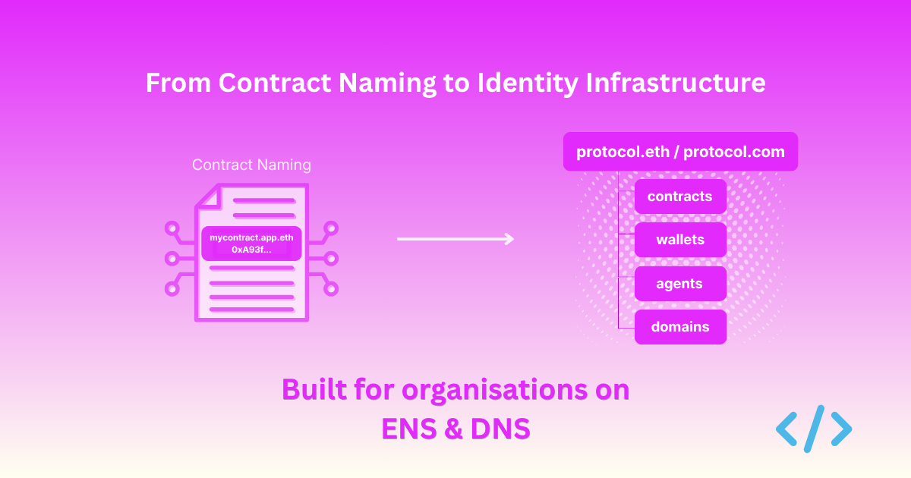
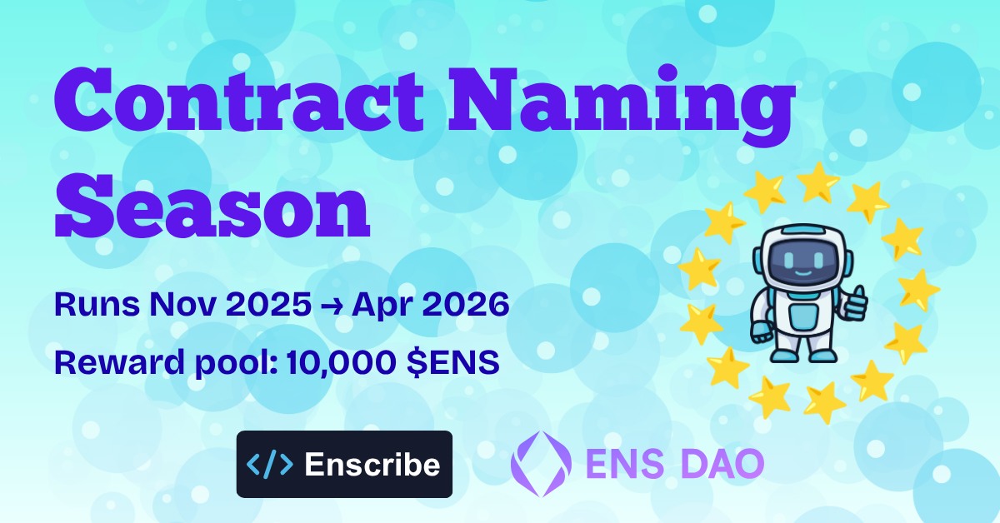
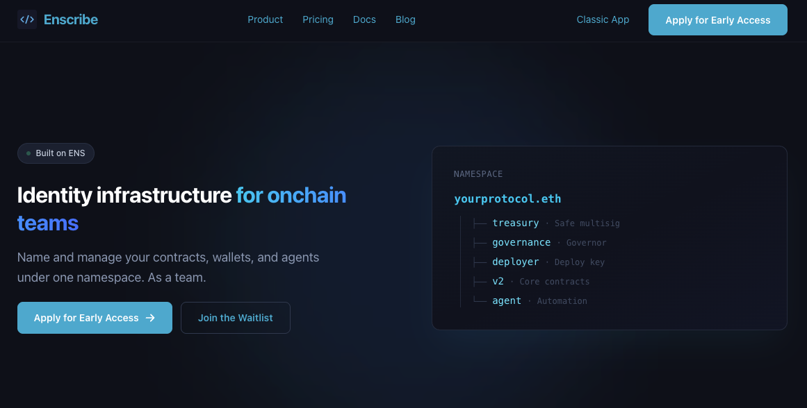
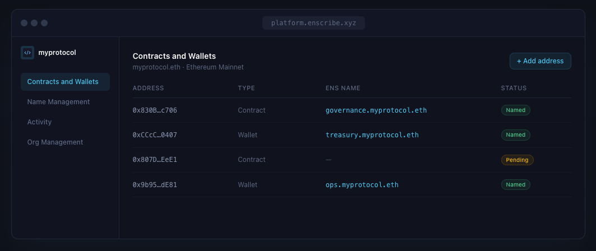

{/*  */}

Over the past year, we have spent a lot of time working on onchain naming. We ran ENS Contract Naming Season, worked with teams such as Nouns DAO, Liquity, Cork, and Giveth, built a Safe integration, shipped a Foundry plugin, and watched thousands of contracts move from anonymous hexadecimal addresses to human-readable names.

That work changed how we think about both Enscribe and ENS.

{/* truncate */}

## What contract naming taught us

When we started Contract Naming Season, we assumed the hardest part would be the naming itself: registering subnames, configuring resolvers, and setting records. This wasn't the case.

The harder part was everything around it. Teams did not have a clear view of what they had deployed. They were not always sure who should manage names internally. Many had no process for deciding what to name, how to structure a namespace, or who should be allowed to make changes. When we worked with teams such as Liquity and Cork to name their infrastructure, the transaction execution was often the easy part. The real work was mapping the system, designing a naming hierarchy, and coordinating across contributors.

We saw the same pattern repeatedly. ENS itself was not the problem. The problem was that most of the tooling around it had been built for individuals: one person, one wallet, one name at a time. That works for a personal wallet name. It does not work well for a team managing contracts, multisigs, deployer wallets, operational wallets, and agents.

## Why organisations matter

A useful comparison here is DNS. Most of the value in DNS comes from organisations, not individuals. Teams use domains to coordinate products, infrastructure, operations, and brand identity.

On Ethereum today, ENS usage still leans much more heavily toward personal identity. That will not stay true forever. As Ethereum matures, more teams will need human-readable identity for contracts, wallets, multisigs, agents, and service endpoints. That becomes more practical as costs fall and as ENS evolves.

In our view, this is where a large part of ENS adoption can grow next. The need is already there. The tooling has just not been designed around team workflows.

## What the new Enscribe looks like

*The new Enscribe call to action*

We have rebuilt Enscribe around a simple idea: identity infrastructure for teams building on Ethereum.

The core product is a shared workspace where multiple people can manage a namespace together. Teams can name contracts, wallets, multisigs, and agents under a `.eth` name or an existing DNS domain imported through DNSSEC. If a team already owns `yourprotocol.com`, they can use that as their onchain root instead of managing a separate naming surface.

*The new Enscribe App has a lot of great new functionality for managing ENS records*

Here is what we have built so far:

- **Multi-user workspaces** so teams can manage the same namespace with visibility and access control.
- **Record and metadata management** for the structured data behind each name.
- **Safe and multisig support** so teams can manage names from the wallets they already use.
- **One-click execution** to stage changes and execute them together.
- **API keys, CLI support, and agent workflows** for deployment pipelines and automation.
- **Activity tracking** so teams can see who changed what, and when.

And here is some of what is coming next:

- Approval workflows
- Smart account support
- Autorenewals
- Activity notifications
- DNSSEC import improvements
- ENSv2 support

## Why DNS matters

One of the clearest signals from our work with teams was that many already have a domain they use everywhere else: their website, docs, and brand. Asking them to also adopt a separate `.eth` root can add another asset to manage and renew.

ENS already supports DNSSEC-enabled DNS names. That means a team can bring an existing domain onchain and use it directly. Contracts can live under names such as `vault.yourprotocol.com`, and operational wallets can live under names such as `ops.yourprotocol.com`.

That matters because it lets teams start with the identity they already own.

## What this changes for Contract Naming Season

Contract Naming Season is still important. It has helped teams take the first step and made contract identity more visible across the ecosystem.

What we learned, though, is that naming the first set of contracts is only the start. The ongoing work is where the real operational need shows up: new deployments, ownership changes, metadata updates, and access control for multiple contributors.

That is why Enscribe is expanding from a contract naming tool into a platform for managing onchain identity across a team using ENS.

## Work with us

We are looking for teams that want to help shape how organisational identity works onchain.

If your team manages contracts, wallets, or agents on Ethereum and wants tooling built for shared ENS operations, we would like to hear from you. We can help design your namespace, get you set up on testnet, and work with you on a structure that fits how your team actually operates.

You can apply for early access on the [Enscribe homepage](https://www.enscribe.xyz) or email us at [hi@enscribe.xyz](mailto:hi@enscribe.xyz).

Happy naming! 🚀