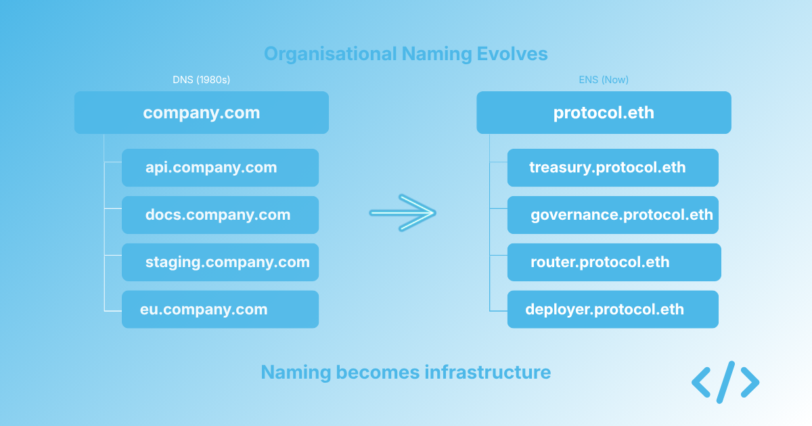
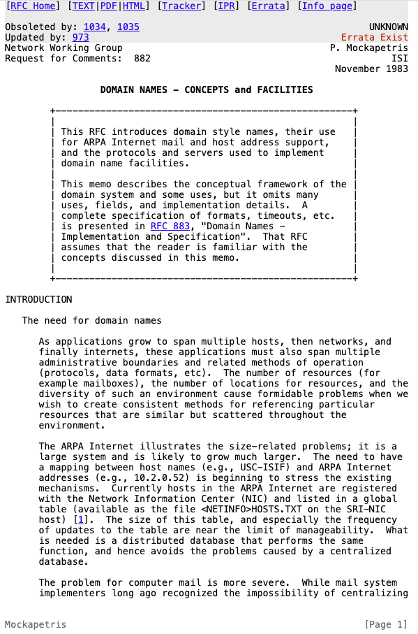

When DNS was introduced in 1983, it was framed as a technical convenience. The internet was growing, the host file approach was starting to break down, and a naming system was needed to translate human-readable names into machine addresses at scale.

That is how DNS was designed. It is not how it ended up being used.

The interesting part of DNS was not just the protocol. It was what organisations did with it once they realised they had a structured naming system at their disposal.

Within a few years, companies stopped treating a domain as just the place where a website lived and started using it as the root of an identity hierarchy. Sales, engineering, support, corporate, and internal tools all got their own subdomain. Production, staging, and development environments were separated by name. Regional deployments were organised by geography. Service names started mapping to functions rather than machines.

By the late 1990s, no serious organisation operated without a structured DNS namespace. By the mid-2000s, the namespace had become almost invisible because it was so fundamental to how companies operated.

{/* truncate */}

*[RFC-882](https://www.rfc-editor.org/rfc/rfc882.html) introduced the idea of DNS*

## The pattern that mattered

The pattern is worth pausing on because it is easy to miss in hindsight. DNS did not succeed because organisations were forced to use it. It succeeded because once a few of them started using it strategically, the operational benefits became hard to ignore.

The early adopters benefitted in three ways from this.

First, they got coordination. Multiple teams could work on different parts of the infrastructure without stepping on each other because each team had a clear part of the namespace to own.

Second, they got legibility. New employees, partners, and customers could understand the shape of the organisation just by looking at the names.

Third, they got composability. New services could be added to the namespace without renegotiating the structure because the hierarchy was already there.

These were not features anyone had to argue for. They emerged from the act of using DNS thoughtfully.

The organisations that did not adopt structured naming carried on with ad hoc approaches. They had a domain, but their internal infrastructure was still identified by IP addresses, hostnames, or naming conventions that had grown organically over time. For a while, that was manageable. Then it became technical debt.

## Where ENS sits today

ENS is at a similar starting point today. The protocol works. The technical foundation is solid. Early adopters mainly use it for individual identity, especially wallet names, and many people still think of it as a convenience layer for personal use.

What has not happened yet at scale is the shift that DNS went through. Most onchain organisations still identify their infrastructure by hexadecimal addresses. Their treasury is a string of characters. Their governance contract is a string of characters. Their deployer wallet is a string of characters. Their team wallets are strings of characters. The infrastructure exists, it is used every day, and it often has no structured identity.

We have spent the past year working with teams to change this, and the pattern that emerges looks very similar to the early DNS adopters. Once a team starts naming its infrastructure, the operational benefits become self-evident. Coordination improves because everyone can see what exists and who owns what. Legibility improves because contributors and users can understand the system without needing a separate map. Composability improves because new contracts and wallets can slot into a structure instead of being tacked on case by case.

These are not speculative benefits, they are practical consequences of embracing naming.

## What follows from here

The most likely outcome is that onchain naming follows the same trajectory as DNS, but on a faster timeline. The reason it can move faster is that the lessons from DNS are already known. Organisations building on Ethereum do not need to rediscover from first principles that structured naming is valuable. They can apply patterns that have already proved themselves elsewhere on the internet.

The teams that do this early are likely to get the same advantages the early DNS adopters got. They can coordinate more easily across contributors. Their users can build trust more easily because contracts are legible instead of anonymous. They can add new infrastructure without reworking their identity every time something changes.

The teams that do not do this will probably still get there eventually. The longer they wait, the more they will have to unpick later.

## Work with us

We are taking a small number of teams into Enscribe Early Access before the public launch. We help teams set up their onchain identity and structure their namespace around the contracts, wallets, and agents they already manage.

If that sounds relevant to your team, apply at [enscribe.xyz](https://www.enscribe.xyz/) or email [hi@enscribe.xyz](mailto:hi@enscribe.xyz).
