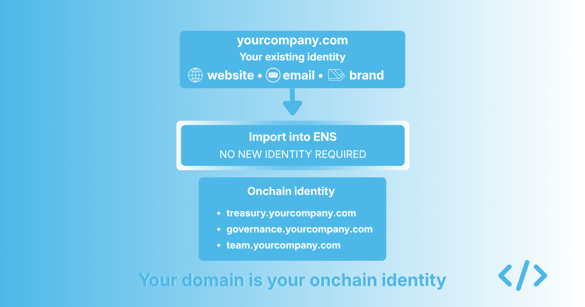
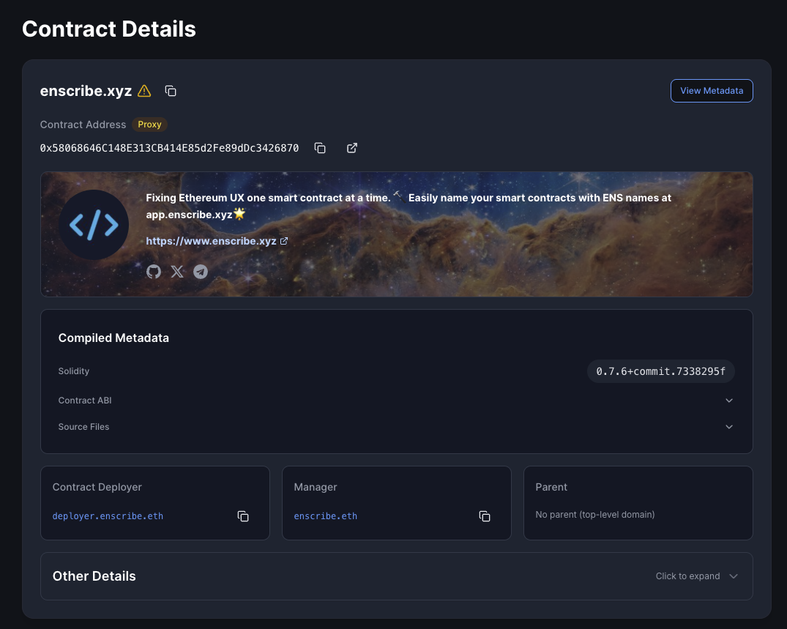
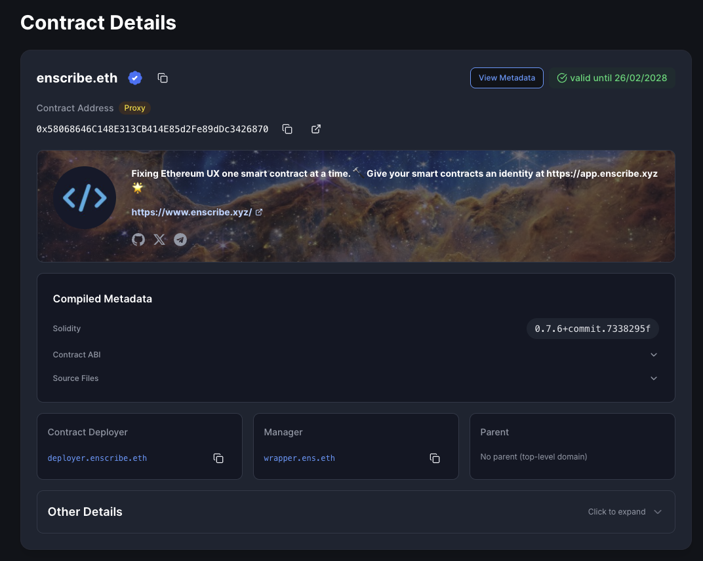

The most common reason organisations give for not using ENS is not technical. It is not cost either, though that gets mentioned. The real reason, when you talk to enough teams, is that they do not want to manage another identity.

They already have a domain. They already have a brand built around it. Their users know them by it. Their email runs through it. Their website lives on it. Adding a separate `.eth` name on top of that feels like duplication, and duplication is something experienced operators try to avoid.

There is a related concern that gets voiced less openly, but matters just as much. Their existing domain comes with legal protections they have come to rely on, including trademark coverage, dispute resolution mechanisms, and decades of case law. ENS does not have an equivalent legal layer today. For organisations with valuable brands to protect, building part of their identity on a system without those protections is a real concern.

These concerns are reasonable. They are also both addressed by something most teams do not realise ENS supports.

ENS has supported DNSSEC-enabled DNS names for years. In practice, that means if your organisation already owns a DNS domain such as `yourcompany.com`, you can import that name directly into ENS and use it as your onchain root. You do not need to register a `.eth` name. You do not need to manage two identities. You do not need to give up the legal protections attached to the domain you already own.

{/* truncate */}

## What importing actually means

The DNSSEC import process sounds technical, but the practical experience is straightforward. If your domain has DNSSEC enabled, and most modern DNS providers support this with a single setting, you can configure a record at your DNS provider that proves you control the domain. ENS reads that proof and lets you use the domain onchain as a name you can attach addresses, records, and metadata to.

After the import, the domain works in ENS much like a `.eth` name does. You can create subnames under it. You can resolve it to addresses. Wallets that support ENS can resolve your domain to whatever address you have configured. Block explorers can display it. The broader ENS ecosystem can treat your domain as a first-class name.

*Enscribe.xyz on ENS, viewable in the [Enscribe App](https://app.enscribe.xyz/explore/1/enscribe.xyz)*

The important thing to understand is that the domain does not move. It still lives at your DNS provider. You still manage it the way you always have. ENS adds a layer that makes the domain meaningful onchain without changing how your existing web operations work.

## Why this matters for organisations

Most organisations approaching ENS for the first time are already thinking about identity the same way they think about DNS. They have a domain. They have spent years building recognition around it. Their users know it. Asking them to set up a parallel identity under a different naming system creates friction at the exact moment they are deciding whether onchain identity is worth the effort.

Removing that friction matters. When the conversation changes from “you need to set up a new identity” to “you can use the identity you already own,” the decision changes too. A team does not need to justify a second renewal cycle, a second brand asset, or a second thing to remember. It can build on what it already has.

For some teams, this is the difference between adopting ENS and not adopting it. Not because the `.eth` path is bad, and for some organisations it is the right choice, but because the path of least resistance is usually the path that gets taken.

## What it looks like in practice

A team that owns `yourcompany.com` can import that domain into ENS and immediately have a structured namespace it can build on. Its treasury can become `treasury.yourcompany.com`. Governance can become `governance.yourcompany.com`. Team addresses can live under `team.yourcompany.com`. Every name in the namespace resolves onchain through ENS, while the domain itself continues to support the website, email, and everything else the organisation already does with it.

The brand consistency this creates matters. A user interacting with the organisation sees the same domain whether they are visiting the website, sending an email, or executing a transaction. The onchain identity matches the offchain identity because it is the offchain identity.

For organisations that have spent years building recognition around their domain, this is often a more natural way to extend onto Ethereum than starting from scratch with a separate name.

## The legal layer that ENS does not replicate

There is another reason established organisations often gravitate toward DNS-on-ENS, and it does not get discussed enough. DNS is not just a naming system. It also comes with decades of legal infrastructure. Trademark protection. Dispute resolution mechanisms such as the Uniform Domain-Name Dispute-Resolution Policy. Established case law for handling bad-faith registrations and brand impersonation.

ENS does not replicate that today. There is no equivalent UDRP for `.eth` names, no formal trademark dispute resolution process, and no long body of case law to fall back on. If a bad actor registers `yourbrand.eth` before you do, the available remedies are limited.

For an individual user, that may not matter much. For an organisation with a valuable brand, it often matters a great deal.

DNS-on-ENS addresses this directly. The legal protections attached to your domain still apply because it remains your domain. When you import `yourcompany.com` into ENS, you are not stepping outside that legal framework. You are extending a name that already has legal protection into an onchain context.

## When .eth still makes sense

DNS-on-ENS is not always the right choice. Some organisations want a `.eth` identity to match the communities they serve. Some want the symbolic value of a native ENS name. Some want ENS-native features that fit most naturally with `.eth` names.

For those teams, `.eth` is the right path.

*The Enscribe team also uses Enscribe.eth as a native ENS name, this too can be viewed in the [Enscribe App](https://app.enscribe.xyz/explore/1/enscribe.eth)*

But for the much larger group of organisations that already have a domain, a brand, and an identity they trust, DNS-on-ENS removes one of the biggest barriers to getting started.

## The bigger point

This matters because barriers shape adoption.

For ENS to become organisational infrastructure in the way DNS already is, organisations need a path that does not force them to rethink their identity from scratch. DNS-on-ENS makes that possible. It lets organisations bring an identity they already own into an onchain environment with minimal disruption.

The path of least resistance is often the path that wins. For many teams approaching ENS, that path is the domain they already own.

## Work with us

If you want to put this into practice for your team, we can help. Enscribe Early Access helps teams set up a structured onchain identity for contracts, wallets, and agents. Apply at [enscribe.xyz](https://www.enscribe.xyz/).
