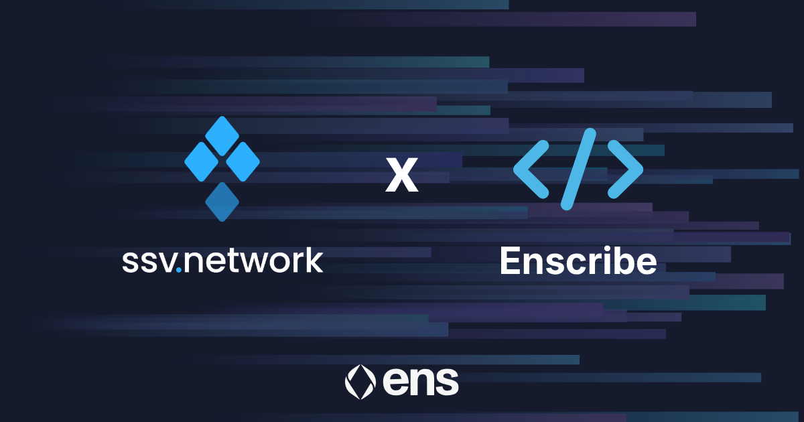
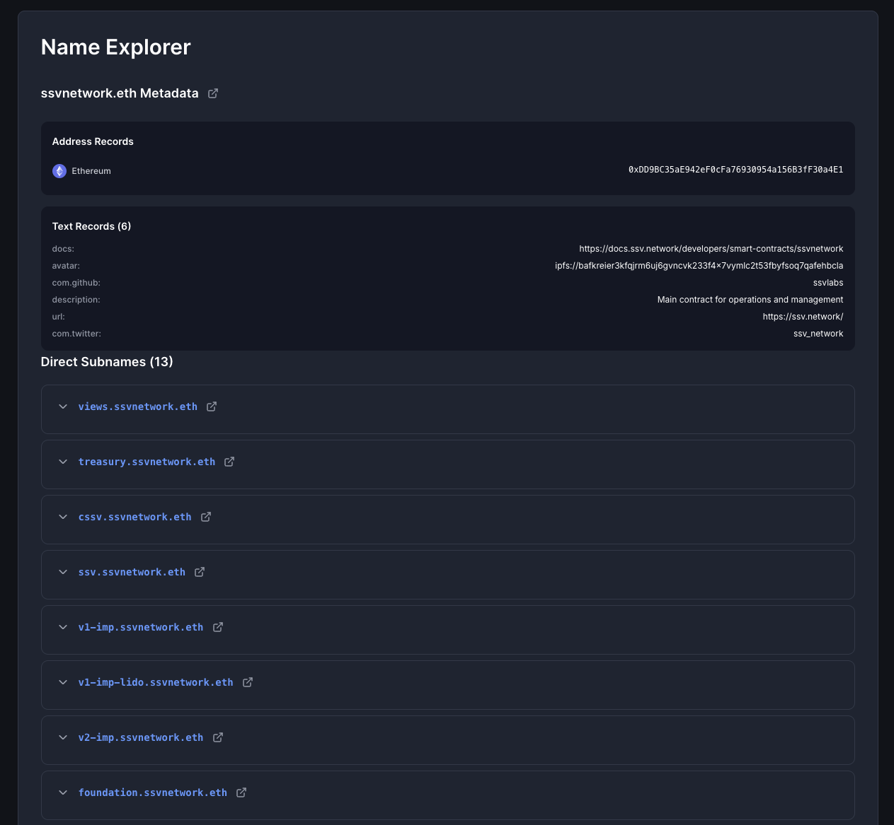
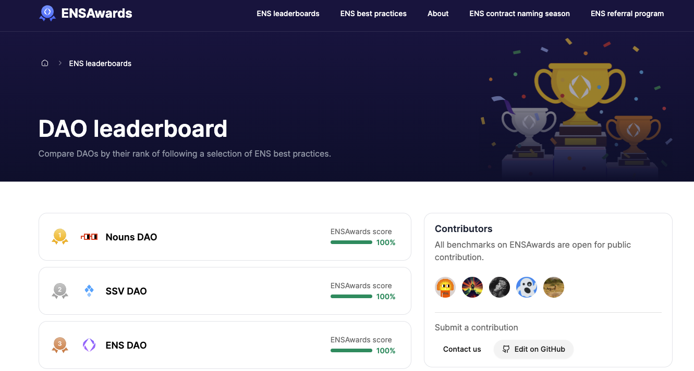

[SSV Network](https://ssv.network/) has adopted ENS-based naming across its smart contract infrastructure as part of Contract Naming Season.

SSV is a leading implementation of Distributed Validator Technology on Ethereum. Its protocol distributes validator keys across multiple independent operators to reduce single points of failure in staking. With more than 7.5 million ETH secured and roughly 19 percent of Ethereum validators running through its infrastructure, SSV is one of the more important pieces of staking infrastructure on the network.

{/* truncate */}

## The verification problem at scale

Staking protocols like SSV sit at an interesting intersection. Operators, stakers, and institutional integrators all interact with the same contracts regularly, whether they are registering validators, managing clusters, or coordinating fee payments. When those contracts are identified only by hexadecimal addresses, verification becomes slower and riskier than it needs to be.

Operators end up cross-referencing addresses manually when configuring nodes. Institutional integrators maintain separate offchain mappings that can drift out of sync. Auditors spend time tracing address-to-function relationships that should be obvious from the contract name itself.

None of this is unmanageable, but it adds operational overhead that compounds as protocols scale, and SSV has scaled considerably.

ENS naming helps address this in a direct way. Each contract gets a human-readable identity that can surface across wallets, explorers, and dashboards. The identity travels with the address rather than living only in a docs page or internal spreadsheet.

## How SSV’s contracts are named

SSV’s contracts are structured with ENS names that reflect each component’s role within the protocol architecture. The result is a browsable onchain directory where people interacting with SSV can understand what a contract does and verify its authenticity through ENS resolution without needing to rely on external documentation.

*You can view all the named contracts under ssvnetwork.eth in the [Enscribe App](https://app.enscribe.xyz/nameMetadata?name=ssvnetwork.eth)*

For a protocol trusted by exchanges such as Kraken and institutional staking providers, this kind of transparency is a good fit. When infrastructure secures billions in staked ETH and powers validator operations for a meaningful portion of the network, contract identity should be easy to inspect.

## ENS Awards recognition

SSV Network now sits at #2 on the [ENS Awards DAO leaderboard](https://ensawards.org/leaderboards/dao) with a 100 percent score, alongside Nouns DAO and ENS DAO itself. The ENS Awards leaderboard tracks how well protocols have implemented ENS-based identity across their contract infrastructure, and SSV’s naming rollout puts them among the leaders.

*SSV DAO now features prominently in the [ENS Awards DAO leaderboard](https://ensawards.org/leaderboards/dao)*

## Part of a broader shift

SSV’s adoption fits into a broader pattern we have seen through [Contract Naming Season](https://www.enscribe.xyz/blog/contract-naming-season). Nouns DAO, Cork Protocol, Liquity, Giveth, and Based Nouns have all adopted ENS-based contract identity over the past few months.

The pattern is that naming is starting to look less like an optional UX improvement and more like a baseline expectation for production-grade protocols.

That does not mean every serious protocol already names its contracts, and it does not need to. But for teams thinking about long-term maintainability, auditability, and how their infrastructure presents itself onchain, naming is increasingly part of the conversation.

## Name your contracts

If you are building on Ethereum and want to bring this kind of clarity to your own contracts, we can help. Enscribe provides the tooling and guidance to make contract naming practical at scale.

Happy naming! 🚀
