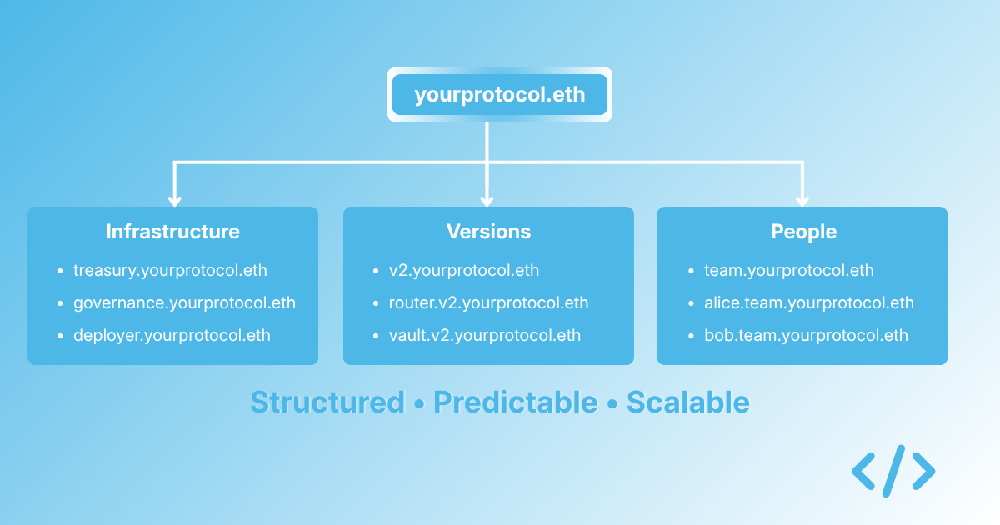

Most teams approaching ENS for the first time start with the same question: what do I actually name? It sounds like a small question, but it is usually the hardest part of getting onchain identity right. Get the structure wrong at the start and you can spend years unpicking it. Get it right and everything that comes after is much simpler.

The good news is that we do not need to invent the answer from scratch. Three decades of DNS have already given us a set of patterns that work well, and most of them translate directly to onchain identity.

{/* truncate */}

## Start with the root, not the leaves

The most common mistake teams make is starting at the bottom. They have a single contract they want to name, so they name it. Then another. Then another. Within a few months they have a set of names that do not relate to each other and no clear hierarchy.

DNS got this right by forcing the root first. You register `example.com` before you create `vault.example.com` or `ops.example.com`, and the root sets the shape of everything underneath. The same applies onchain. Decide on your root, whether that is `yourprotocol.eth` or `yourprotocol.com` imported via DNSSEC, and then let everything else hang off it in a way that is predictable and extensible.

The root should usually be the name your organisation is already known by. If your protocol is called Mercury, the root is probably `mercury.eth` or `mercury.com`. Human-readable identity only works if humans recognise it quickly.

## Group by function, not by chain

In DNS, you do not organise your namespace by which server something runs on. You organise it by what it does. `api.example.com` and `dashboard.example.com` describe function. Where those services actually run is an implementation detail.

The same principle should hold onchain. Do not structure your namespace around which chain a contract is deployed on, which version it is, or who deployed it. Structure it around what the contract does. Your treasury is `treasury.yourprotocol.eth` whether it is on mainnet, Base, or Arbitrum. Your governance contract is `governance.yourprotocol.eth` whether the underlying implementation changes or not. The name should describe the function. The technical details can live in metadata.

This matters because chains, versions, and deployment details change. Functions usually do not. If you encode implementation details in the name, you will be renaming things every time you upgrade. If you encode the function, the name can persist across upgrades and your users do not need to relearn what they are looking at.

## Use depth deliberately

DNS namespaces can go arbitrarily deep, but well-designed ones rarely need more than three or four levels. Anything deeper becomes harder to remember and harder to communicate.

A reasonable onchain hierarchy might look like this:

```text
yourprotocol.eth
  treasury.yourprotocol.eth
  governance.yourprotocol.eth
  deployer.yourprotocol.eth
  ops.yourprotocol.eth
  v2.yourprotocol.eth
    vault.v2.yourprotocol.eth
    router.v2.yourprotocol.eth
  alice.yourprotocol.eth
```

Two levels are enough for most things. Three levels can make sense when you need to group related contracts, such as all the contracts in a major version. Four levels should be rare. Every extra level makes names harder to use and the structure harder to explain.

## Separate humans, machines, and infrastructure

In DNS, different categories of things often live in different parts of the namespace. Internal services live under one prefix, external services under another, and individual users under a third if they are included at all.

Onchain, the same separation is worth preserving. Contracts and infrastructure should live in one part of the namespace, team members in another, and agents in a third. When someone looks at your namespace, they should be able to tell immediately what kind of thing each name refers to. Mixing humans and infrastructure under the same prefix makes the structure harder to read and harder to manage.

A simple convention is to use the root for organisational infrastructure and a clearly named subnamespace for team members:

```text
yourprotocol.eth                # root
treasury.yourprotocol.eth       # infrastructure
governance.yourprotocol.eth     # infrastructure
team.yourprotocol.eth           # team subnamespace
alice.team.yourprotocol.eth     # individual
bob.team.yourprotocol.eth       # individual
```

It is not the only way to do it, but the principle is reliable: separate categories should live in separate parts of the namespace.

## Treat the namespace as a product

The final lesson from DNS is the most important one. Your namespace is not just a technical artefact. It is part of how your organisation presents itself to the world. Users see it. Partners see it. Auditors see it. Other developers see it. The care you put into designing it tells people something about how you operate.

Teams that treat their DNS structure carelessly often end up with naming that is inconsistent and hard for outsiders to navigate. Teams that treat it deliberately tend to have clean, predictable structures that signal competence before anyone reads a line of documentation.

The same is true onchain. Your namespace is a public artefact. Designing it well costs little, but it pays off every time someone interacts with your protocol.

## Work with us

Enscribe Early Access is open. We are working with a small number of teams to help them set up their onchain identity, with contracts, wallets, and agents named and managed together. If you would like to work with us, apply at [enscribe.xyz](https://www.enscribe.xyz/).
