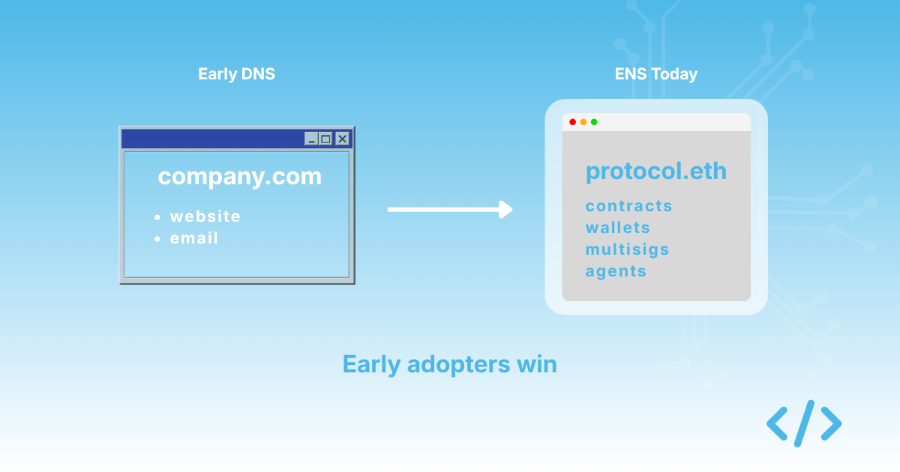
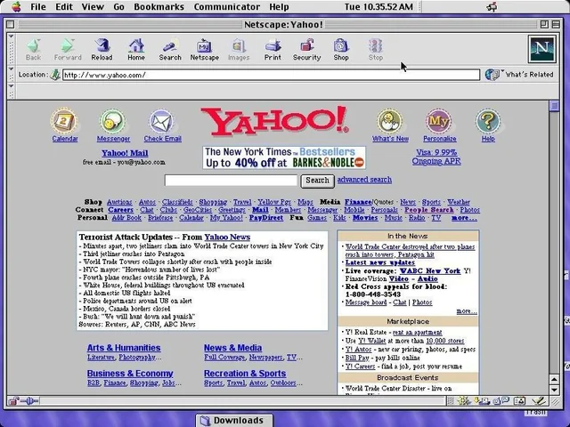

In 1995, most organisations did not have a domain name. The ones that did were not always sure what to do with it. Email and a static website were considered ambitious uses. The idea that an organisation might one day operate the bulk of its identity, infrastructure, and customer relationships through structured DNS namespaces would have seemed unlikely to many business leaders.

A small number of companies were thinking differently. They saw the trajectory of the internet, recognised that their organisation was going to need to operate in this new environment, and started building the structures that would let them do it. They registered their domains early. They thought about subdomains for departments, products, and services. They put email addresses on business cards before most of their competitors knew what email was for.

Five years later, those companies looked prescient. Ten years later, they looked obvious.

I think we are at a similar inflection point with onchain identity, and the parallel is worth taking seriously.

{/* truncate */}

## What 1995 actually looked like

It is easy to look back at the mid-1990s and assume the trajectory of the internet was clear, but it was not. Plenty of serious commentators thought the web was a fad. Plenty of large organisations decided that registering a domain was something they could put off until later. The technology worked, but its implications for how organisations would operate were not obvious to most people who were not already paying close attention.

The organisations that got it right shared a few characteristics. They did not wait for industry-wide consensus. They did not wait for perfect tooling. They did not wait for the protocol to be formally blessed by regulators. They looked at what the technology made possible, decided those possibilities were likely to matter to them eventually, and started building the structures they would need.

They also did not try to do everything at once. Most started with the basics: register the domain, set up email, put up a simple website, and add structure over time. The teams that tried to design the perfect corporate intranet from day one mostly failed. The teams that started simple and iterated mostly succeeded.

## What is true today

Onchain identity is in a similar position. The protocol works, the basic primitives exist, and a few teams are taking it seriously by building structured identity for their organisations. Most are not. Many have a vague sense that they should probably do something about it eventually, but no urgent reason to act.

The parallel is not about technology adoption curves. It is about what early-moving organisations gained. The 1995 companies that took DNS seriously did not get ahead because they had better technology. They got ahead because they had legibility, coordination, and operational structure that others lacked. Their employees could find things. Their customers could trust them. Their partners knew how to integrate with them. By the time the rest of the industry caught up, those advantages had compounded into something hard to replicate.

I think the same thing will happen with onchain identity, on a faster timeline. The teams that build structured identity for their contracts, wallets, multisigs, and agents now will have advantages that compound. Their users can trust them more because their infrastructure is legible. Their teams can coordinate more effectively because their namespace has a structure. Their partners can integrate more easily because there is a predictable shape to their onchain presence. None of this is dramatic on day one, but it compounds over time.

## What is different

There are two important differences between 1995 and now, and both favour faster adoption.

The first is that the lessons from DNS are already known. Onchain organisations do not need to discover from first principles that structured naming is valuable. They can look at how every other industry organised its digital identity over the past three decades and apply the same patterns. The conceptual work is done. What remains is implementation.

The second is that the cost of getting started is much lower. In 1995, registering a domain was expensive, slow, and required dealing with institutions that most organisations had never heard of. Building infrastructure to serve content at that domain required hiring people with skills that barely existed in the labour market. Today, the equivalent steps for ENS take minutes, and much of the technical complexity has been abstracted away. There is no good reason for an organisation that wants onchain identity not to have it.

## What I am not saying

I am not predicting that ENS will become as universal as DNS, or that every organisation will need onchain identity within five years. Nobody knows exactly how this plays out. The pace of adoption depends on how quickly Ethereum matures, how the cost structure evolves, what the next generation of applications requires from users, and a dozen other factors that are difficult to forecast precisely.

What I am saying is more modest. If onchain identity becomes important, and I think the evidence points that way, then organisations that start early will have advantages late movers cannot easily replicate. The cost of being early is small. The cost of being late could be significant.

That asymmetry is what 1995 looked like. I think it is what 2026 looks like too.

## Work with us

Choosing between a `.eth` name, your DNS domain, or both? We help protocol teams figure out the right path and get everything set up. Enscribe Early Access is open. Apply at [enscribe.xyz](https://www.enscribe.xyz/).
