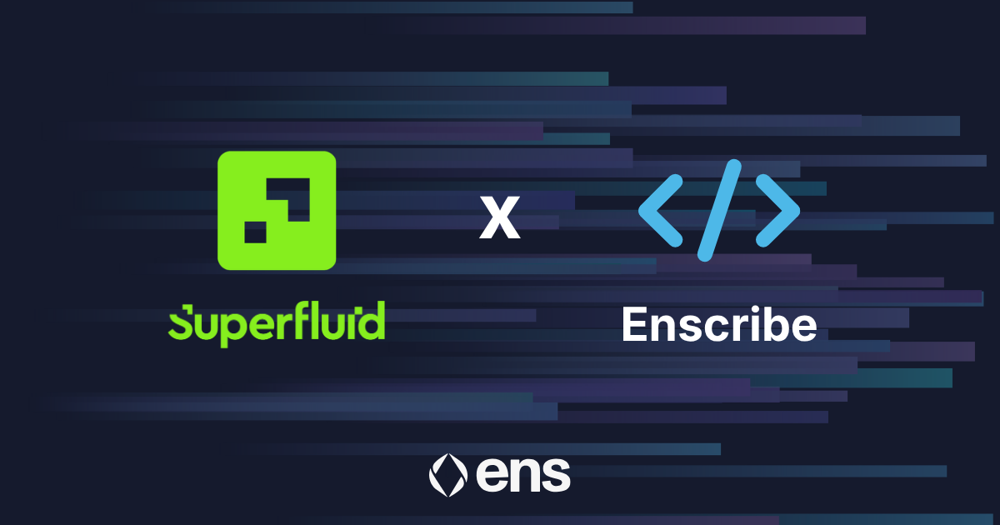
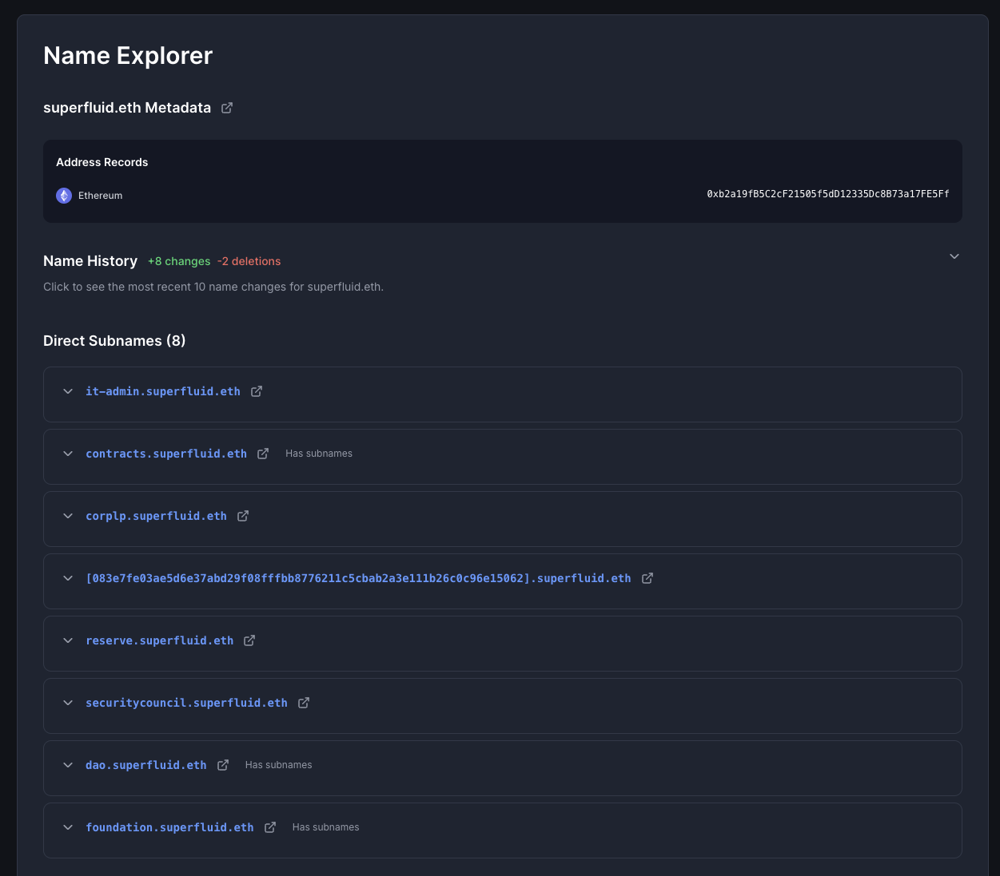

[Superfluid](https://superfluid.org/) has adopted Enscribe-powered ENS naming across its smart contract infrastructure as part of Contract Naming Season.

Superfluid is onchain financial infrastructure for programmable, real-time value transfer. With more than $1.6 billion in volume, more than 1.2 million wallets, and 50,000 active users across 11 EVM networks, Superfluid powers payment infrastructure for organisations including ENS DAO, Optimism, and Gitcoin.

One of those organisations happens to be ENS DAO, which uses Superfluid to stream grants and contributor payments. There is a nice circularity to this announcement: the protocol that streams payments for ENS DAO is now using ENS to name its own contracts.

{/* truncate */}

## Naming at scale

Superfluid presents an interesting naming challenge. The protocol consists of many contracts spread across multiple chains: host contracts, agreement contracts for constant flows and instant distributions, resolvers, Super Token factory contracts, and more. Multiply that by 11 networks and you end up with a substantial surface area of deployed infrastructure that developers, DAOs, and integrators interact with daily.

When that much infrastructure is identified only by hexadecimal addresses, the overhead adds up. Integrators building on Superfluid have to maintain their own mappings across chains. Developers debugging stream flows spend time cross-referencing addresses to understand which contract handled which part of a transaction. DAOs configuring new streams need confidence that they are pointing at the right resolver on the right network.

Because Superfluid had many contracts to name, the team used Enscribe’s batch naming capability. This allowed the full set of contracts to be named in a coordinated workflow rather than contract by contract.

This is one of the use cases where ENS naming matters most. When the number of contracts is small, a manual spreadsheet can just about work. Once a protocol reaches Superfluid’s scale, that approach stops being practical.

## How Superfluid’s contracts are named

Working with Enscribe, Superfluid has assigned structured ENS names across its contract stack, with names that reflect each component’s role within the protocol architecture. This creates a coherent, browsable onchain directory that mirrors how Superfluid is built.

Anyone interacting with Superfluid can understand what a contract does and verify its authenticity through ENS resolution, across whichever network they are working on.

*Superfluid contracts in the [Enscribe App](https://app.enscribe.xyz/nameMetadata?name=superfluid.eth)*

## Why it matters for streaming infrastructure

Money streaming protocols occupy a slightly unusual position. Unlike a one-off DeFi transaction, a stream is a persistent, long-running agreement. Users often set up streams and leave them running for months or years. The contracts holding that agreement need to be trustworthy not just at setup, but throughout the lifetime of the stream.

Clear, verifiable contract identities support that over the long term. When a DAO treasurer or developer comes back months later to inspect or modify a stream, they can verify what they are looking at by name rather than by address. That kind of continuity matters for infrastructure that handles recurring financial flows.

## Part of a broader shift

Superfluid’s adoption fits into what we have been seeing more broadly through [Contract Naming Season](https://discuss.ens.domains/t/ens-contract-naming-season/21596). Nouns DAO, Cork Protocol, Liquity, Giveth, Based Nouns, SSV Network, and Kleros have all adopted ENS-based contract identity over the past few months.

The pattern that is emerging is that naming is becoming something closer to a baseline expectation for production-grade protocols rather than an optional UX enhancement.

That does not mean every serious protocol already names its contracts. Plenty do not, and that is fine. But for teams thinking about long-term maintainability, multi-chain coherence, and how their infrastructure presents itself onchain, naming is increasingly part of the conversation.

## Name your contracts

If you are building on Ethereum and have a large contract footprint to work with, Enscribe’s batch naming workflow is designed for this kind of rollout. Whether you have five contracts or 50, Enscribe provides the tooling and guidance to make contract naming work at your scale.

Happy naming! 🚀
