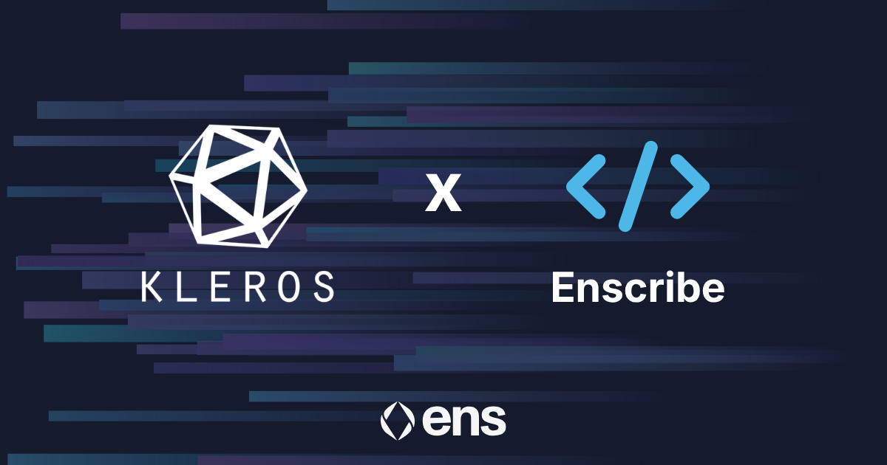
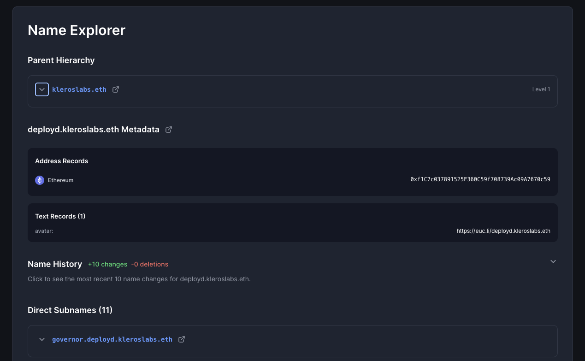

[Kleros](https://kleros.io/) has adopted Enscribe-powered ENS naming across its smart contract infrastructure as part of Contract Naming Season.

Kleros is a decentralised arbitration protocol on Ethereum, providing dispute resolution for use cases ranging from escrow and curated lists to oracles and insurance applications. Its Kleros Curate system also maintains a database of verified smart contracts, tokens, and addresses used by Etherscan, Blockscout, MetaMask, and Ledger.

For a protocol whose work depends on trust and verification, contract identity matters.

{/* truncate */}

## The verification problem for an arbitration protocol

Kleros sits in an unusual position within the Ethereum ecosystem. Its contracts coordinate juror selection, hold escrowed PNK stakes, manage dispute lifecycles, and integrate with arbitrable contracts across DeFi, insurance, content moderation, and beyond. Every interaction depends on participants being confident they are talking to the right contract.

When those contracts are identified only by hexadecimal addresses, that confidence has to be established the hard way: through external documentation, manual verification, or trust that the interface being used has done the work correctly.

For integrators building arbitrable contracts that designate Kleros as their arbitrator, this friction can be an issue. Auditors reviewing Kleros integrations have to maintain their own address-to-purpose mappings. Jurors interacting with the protocol have less visibility into what they are signing.

ENS naming addresses this in a direct way. Each contract gets a human-readable identity that is cryptographically verifiable and can surface across wallets, explorers, and dashboards. The identity travels with the address rather than living in a spreadsheet or docs page.

## How Kleros’s contracts are named

Working with Enscribe, Kleros has assigned structured ENS names across its contract stack, with names that reflect each component’s role within the protocol architecture. This creates a coherent, browsable onchain directory that mirrors how Kleros is built.

Anyone interacting with Kleros can understand what a contract does and verify its authenticity through ENS resolution without needing to rely on external documentation.

*You can view the named Kleros contracts in the [Enscribe App](https://app.enscribe.xyz/nameMetadata?name=deployd.kleroslabs.eth)*

## A natural fit for Kleros

There is something fitting about a dispute resolution protocol adopting verifiable contract identity. Kleros has spent years building infrastructure for resolving ambiguity onchain, and applying the same principle to its own contracts is consistent with that mission.

It also matters at scale. Kleros Curate is queried by some of Ethereum’s most-used wallets and explorers. When a protocol provides verification infrastructure to others, clear and verifiable identities for its own contracts set the right baseline.

## Part of a broader shift

Kleros’s adoption fits into what we have been seeing more broadly through [Contract Naming Season](https://discuss.ens.domains/t/ens-contract-naming-season/21596). Nouns DAO, Cork Protocol, Liquity, Giveth, Based Nouns, SSV Network, and Superfluid have all adopted ENS-based contract identity over the past few months.

The pattern that is emerging is that naming is becoming something closer to a baseline expectation for production-grade protocols rather than an optional UX enhancement.

That does not mean every serious protocol already names its contracts. Plenty do not, and that is fine. But for teams thinking about long-term maintainability, auditability, and how their infrastructure presents itself onchain, naming is increasingly part of the conversation.

## Name your contracts

If you are building on Ethereum and want to bring this kind of clarity to your own contracts, we can help. Enscribe provides the tooling and guidance to make contract naming practical at scale.

Happy naming! 🚀
