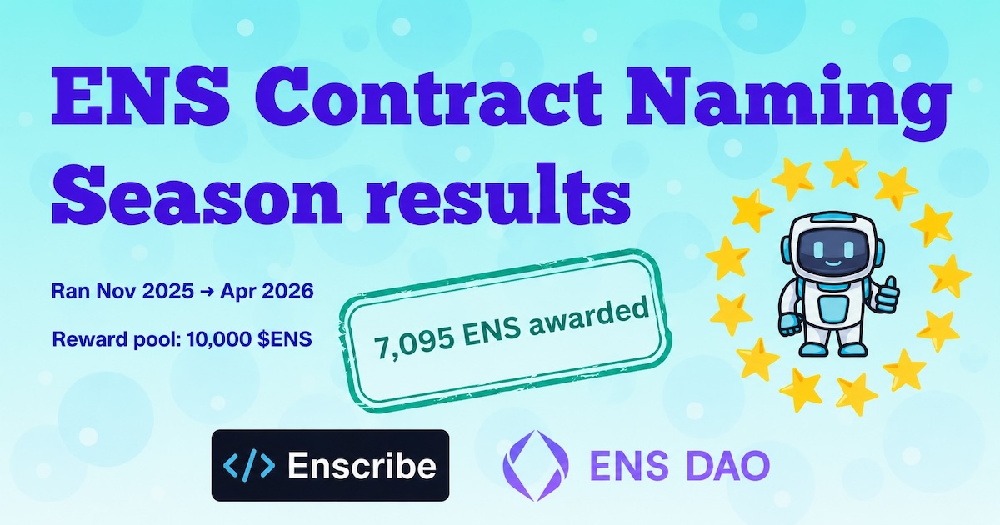
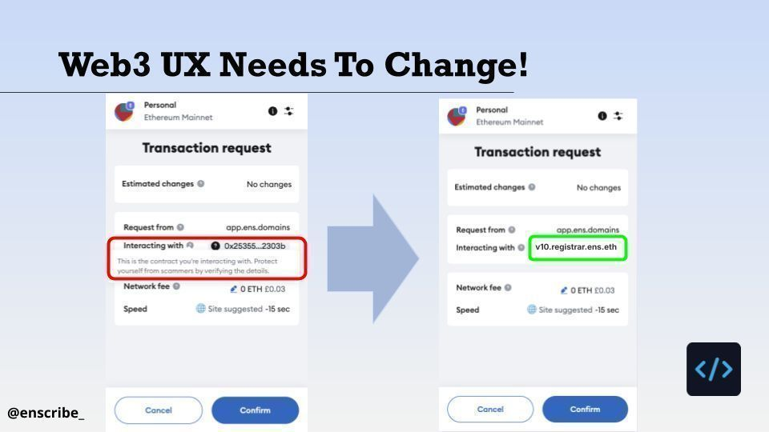
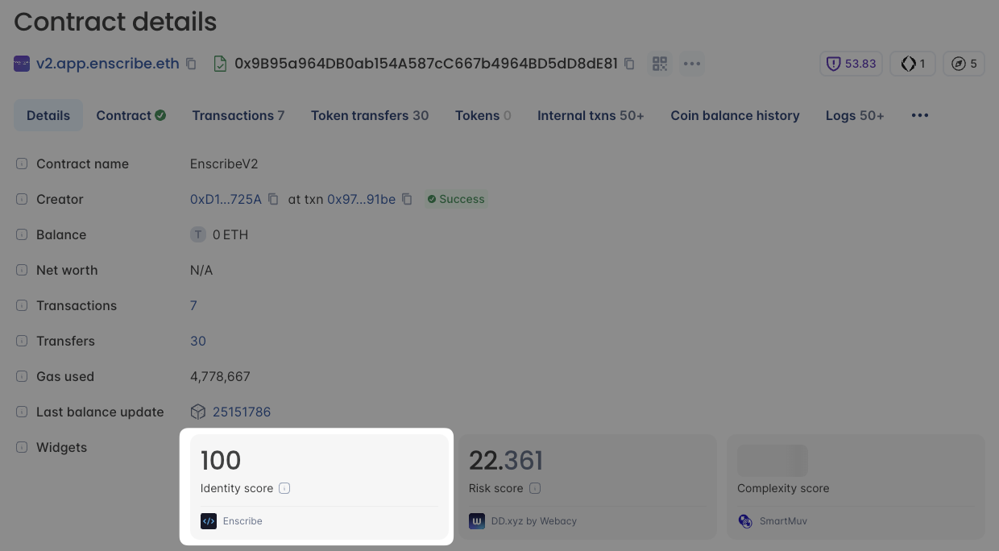
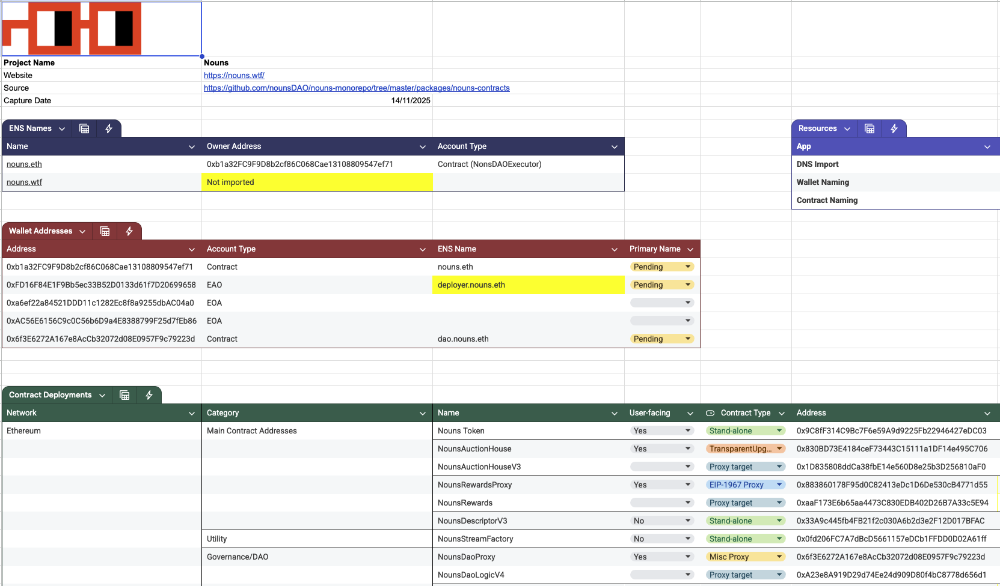
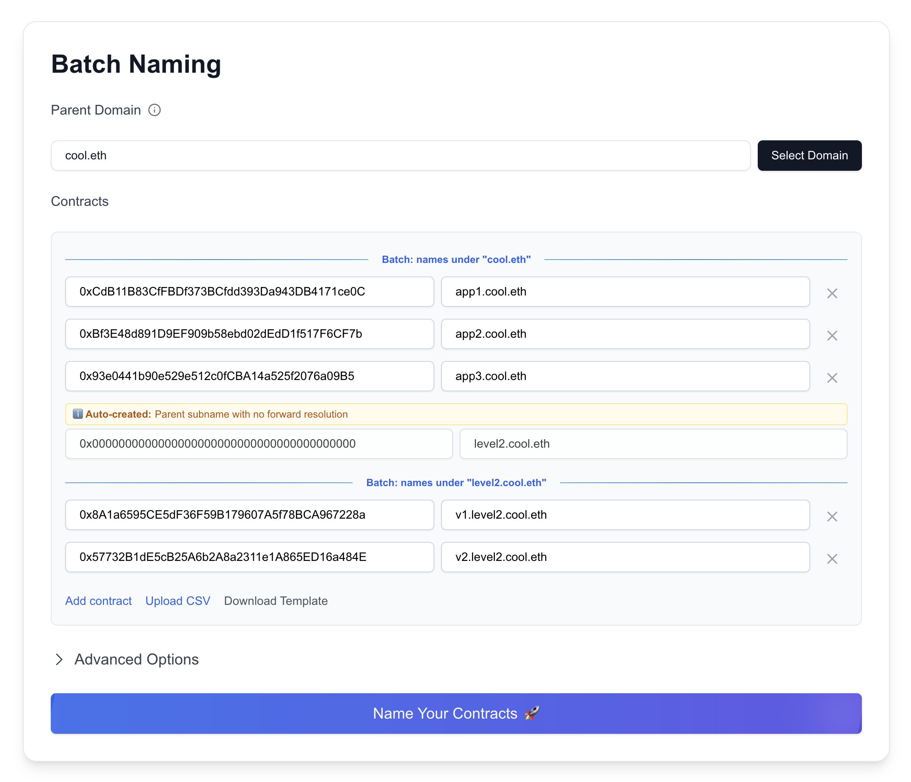
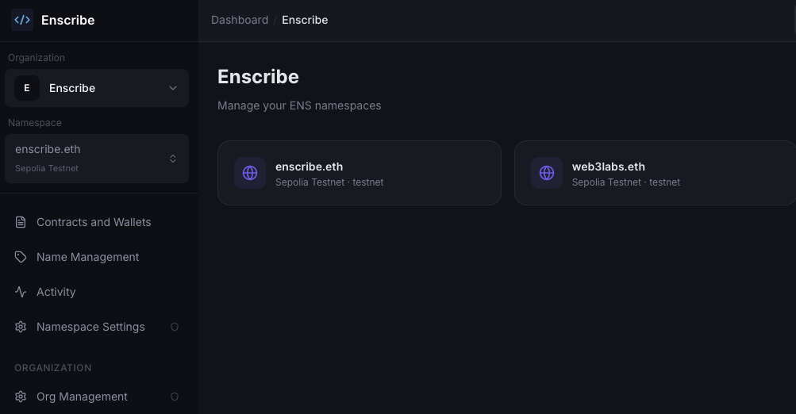
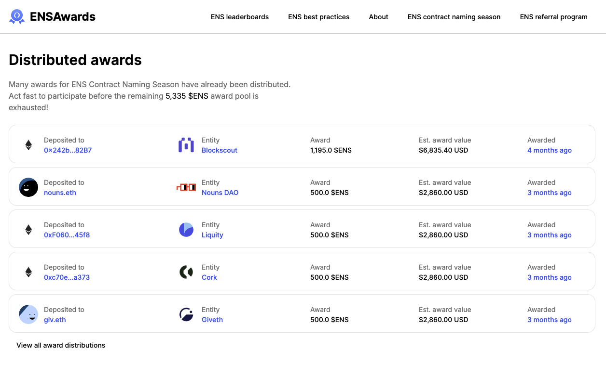

With May upon us, ENS Contract Naming Season has come to an end. It has been six months since the initiative launched in November, and it is time to reflect on the journey.

{/* truncate */}

## A brief history

Naming Season was approved by the ENS DAO. Initially [proposed](https://discuss.ens.domains/t/temp-check-ens-contract-naming-season/21402) by ENS DAO delegate Fireeyes, the goal was to run an experiment to see how ENS token awards could incentivise greater engagement with the ENS protocol.

For Naming Season, the naming of smart contracts through the Enscribe app was the key activity being assessed.

Enscribe was created out of a frustration we saw across the Ethereum ecosystem: users were still expected to interact with protocols through hexadecimal contract addresses.

ENS has always supported the naming of smart contracts, but the existing ENS App was designed primarily for individuals naming wallets. Smart contract naming is the niche Enscribe has remained focused on.

Naming Season ran for six months, starting in November 2025 and wrapping up in April 2026.

## Successes

Through Naming Season, a number of high-profile projects embraced contract naming, including:

- SSV Network
- Cork Protocol
- Liquity Protocol
- Giveth
- Superfluid
- Nouns DAO
- Based Nouns DAO
- Kleros

In addition, Blockscout added Enscribe Identity Scores to its smart contract view, scoring smart contracts from 0 to 100 based on their use of ENS naming practices.

*The Enscribe identity score in [Blockscout explorer](https://eth.blockscout.com/address/0x9B95a964DB0ab154A587cC667b4964BD5dD8dE81)*

## Disbursements

The ENS DAO made 10,000 ENS available in awards. Of these, 7,095 ENS were distributed during two phases of Naming Season across 50 different wallets.

The first half of Naming Season paid out 4,665 ENS, with a further 2,430 ENS distributed in the second half.

## Learnings

The Enscribe team had several key learnings from Naming Season.

While naming a contract may only require a single transaction, many projects have tens of contracts and wallets that need naming. That means getting naming done becomes another priority competing for a team’s time.

We noted this in our [first Naming Season update](https://www.enscribe.xyz/blog/naming-season-awards-update#the-work-is-still-uneven-which-is-exactly-why-this-matters), where we saw it typically took two to three months for teams to complete their contract naming from the initial discussions.

Prioritising the work was not the only reason for this delay. The process itself could be time-consuming.

Identifying which wallets and contracts are in scope takes time. To simplify this process, we started performing naming audits, where we provided teams with a sheet of recommended names to use for their contracts and wallets.

*Naming audits made it significantly easier for projects to identify and name their core contracts*

This gave teams a plan to follow. However, the naming itself still needed to be performed by the team.

Most teams we worked with used a multisig to secure their ENS names. Every naming transaction therefore required coordination among project members.

This is another area where we optimised Enscribe by adding support for [batch naming operations](https://www.enscribe.xyz/blog/batch-naming), enabling teams to upload a spreadsheet of naming operations to be performed.

But even with this support, the responsibility of doing the naming operations ultimately lies with the team, and there is a real cost to getting it done.

## Challenges

When a team completed naming, there is no guarantee that they will continue to name new contracts and update their ENS names over time.

These are some of the challenges ENS continues to face:

- Wallets still lack first-class support for ENS name resolution of smart contracts.
- Coordinating ENS name updates across team members is time-consuming, and often does not benefit users due to limited wallet support.
- Many leading projects still have not named their smart contracts, which creates less incentive for other teams to follow suit.

Even with ENS token awards ranging from approximately $500 to $5,000 available, established teams with competing priorities were not always able to complete naming within the timeline of Naming Season.

Fewer awards were paid out in the second half, as a number of projects did not complete their naming activities within the programme timeline.

This leaves two options for the remaining ENS tokens. They can either be returned to the DAO, or remain available as an incentive for when projects complete their naming activities.

## The future

Although there are still barriers to wider adoption, running Contract Naming Season gave us useful insight into the challenges teams face when adopting ENS.

During Naming Season, we made a number of updates to Enscribe to make naming easier for teams. We now believe one of the biggest unlocks is better infrastructure for teams working with ENS.

These learnings are feeding into the next iteration of Enscribe. We have gone beyond contract naming and are now focused on infrastructure that makes ENS name management feel closer to DNS management today.

*The new Enscribe platform is already live, you can access it at [enscribe.xyz](https://enscribe.xyz/)*

We also saw initiatives such as [ENS Awards](https://ensawards.org/) by NameHash Labs and [Walletbeat](https://www.walletbeat.fyi/) launch, both of which are creating greater awareness of limited ENS support in some wallets.

*The Contract Naming Season page on the [ENS Awards site](https://ensawards.org/ens-contract-naming-season)*

This work, along with ENS Labs’ ENSv2 launch, new ENS apps, and work by other service providers in the ecosystem, will continue to strengthen ENS tooling.

Naming Season enabled a number of leading protocols to name their contracts. In the process, it generated public announcements from project teams about their work, helping build awareness of why naming smart contracts with ENS matters.

Six months is a short period of time in the grand scheme of things. Continuing to educate teams and keep ENS front of mind will be important if we want more teams building on Ethereum to think seriously about UX and identity.

This is something we will continue to do with Enscribe, but it will take time and requires ongoing commitment across the ENS and Ethereum ecosystems.

Happy naming! 🚀