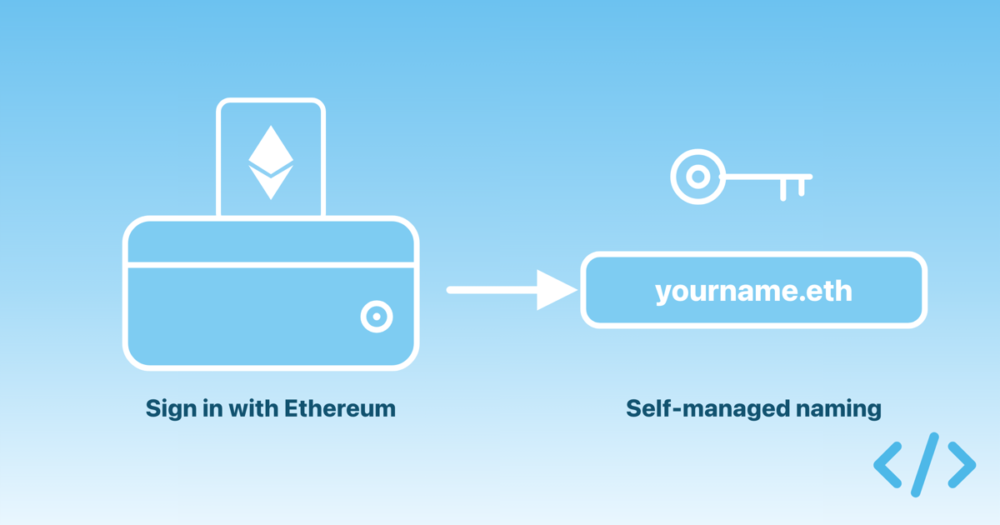
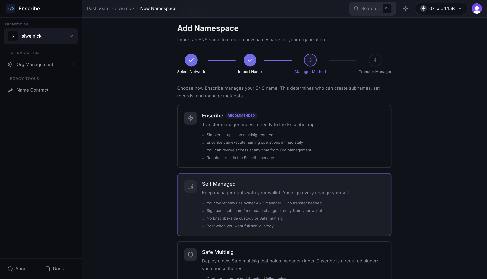
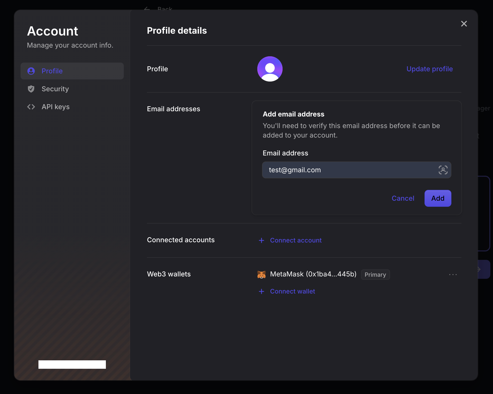

The Enscribe dashboard now supports Sign-In with Ethereum (SIWE). You can create an account and log in with your wallet, without an email address. Alongside this, we added a self-managed naming mode for wallet accounts, where you keep control of your ENS name and sign every change yourself.

Until now, the dashboard only offered email sign-up. That works well for teams, but individual users who don't want to share their email were limited from using Enscribe. Wallet sign-in removes that step: your wallet is your identity.

{/* truncate */}

## Two ways to sign up

import signupImg from './signup.png';

import signinImg from './signin.png';

  
  

When you open the dashboard, you now choose how to sign up:

- **Email.** The existing flow. Good for teams who want to invite members and manage access.
- **Wallet.** Connect a wallet, sign a message, and you are in. No email required.

Both paths land you in the same dashboard, with the same naming, namespace, and contract management features. The difference is what identity backs your account, and which team features are available.

## How wallet sign-in works

Sign-In with Ethereum is an open standard [(EIP-4361)](https://eips.ethereum.org/EIPS/eip-4361) for proving you control a wallet. Instead of a password, you sign a short message with your wallet. There is no transaction and no gas cost for signing in.

To sign up or log in with a wallet:

1. Open the dashboard and choose the wallet option.
2. Connect a wallet such as MetaMask, Base Account, or Coinbase Wallet.
3. Sign the message your wallet shows you.

Your wallet address becomes your account. Because the wallet is the login, your session is tied to it. If you disconnect the wallet, the dashboard signs you out so you are never left in a half-connected state.

## Self-managed naming

Wallet accounts can pick a new manager mode for a namespace: **Self Managed**.

A quick recap on what a manager mode does, and what it does not. **Whichever mode you choose, you always own your ENS name.** Ownership stays in your wallet and is never transferred to Enscribe or a Safe, so you remain in full control of the name itself. The only thing a manager mode decides is who holds the *manager* role: the role that executes naming changes, such as creating a subname or updating a record.

- **Enscribe.** You transfer manager rights to Enscribe, and Enscribe executes naming changes for you.
- **Safe multisig.** A Safe holds manager rights, and its signers approve each change.
- **Self Managed.** Your wallet keeps both the owner and the manager role. Nothing is delegated, so you sign every change yourself.

In self-managed mode, those changes — creating a subname, deleting one, or updating records and metadata — each happen as transactions from your own wallet. This suits people who want to keep full custody and sign every change directly, rather than delegating execution to Enscribe or a Safe.

When you confirm a set of changes, Enscribe prepares the transactions and walks you through them one at a time. You see each transaction, sign it in your wallet, and watch it confirm before the next one starts.

Once every transaction confirms, you land on the activity tab, where each operation is recorded with its transaction hash.

## What wallet accounts can and cannot do

A wallet account can do everything that involves naming: create namespaces, name contracts, create and delete subnames, update records, and use the self-managed mode described above.

Some features need an email address, so they stay off for wallet-only accounts:

- Inviting members to your organization.
- Managing members and their access.

These features rely on email, both to send invitations and to give each teammate a stable identity. A wallet address alone does not carry an inbox, so we gate these behind a verified email.

## Add an email anytime

If you signed up with a wallet and later want team features, you can add an email to your account from the account menu. Add the address, verify it with the code we send, and the team features turn on.

Adding an email does not change how you log in. Your wallet remains your primary identity and your way into the dashboard. The email is there to enable the features that need one.

## Try it

If you would rather name your contracts straight from your wallet, sign in with Ethereum on the Enscribe dashboard and give the self-managed mode a try. If you run a team, sign up with email, or start with a wallet and add an email when you are ready to invite others.

Head over to [enscribe.xyz](https://dashboard.enscribe.xyz) to get started.

Happy naming! 🚀
