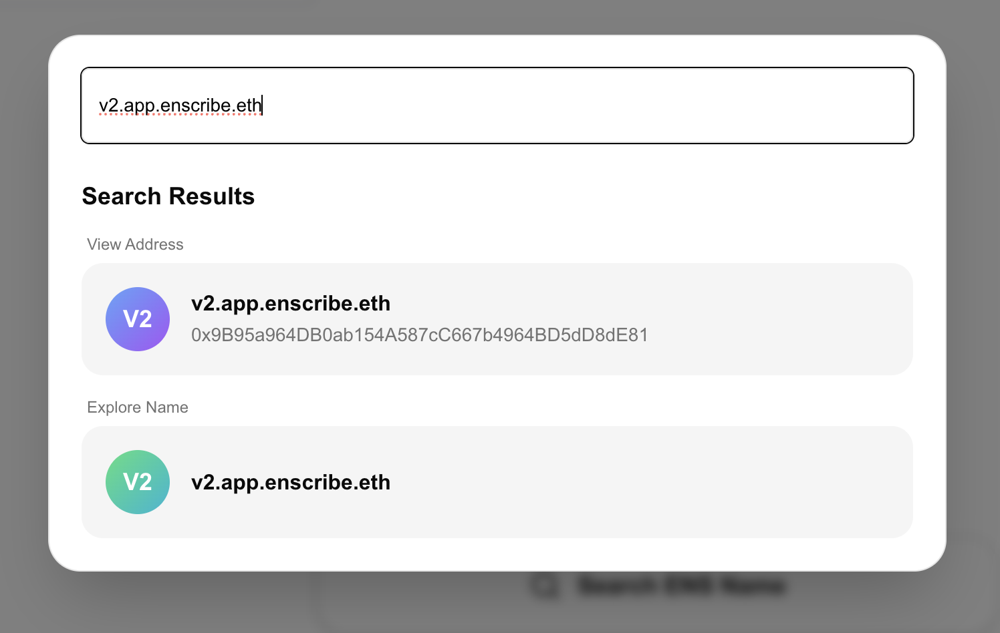
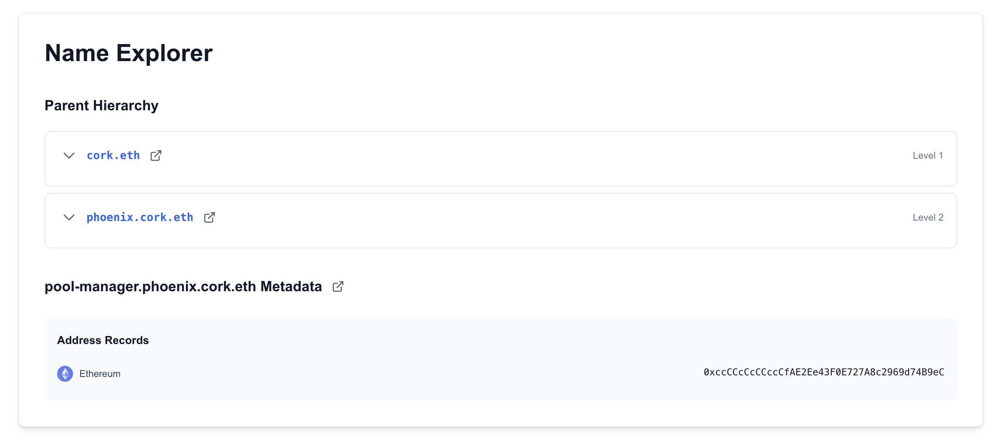
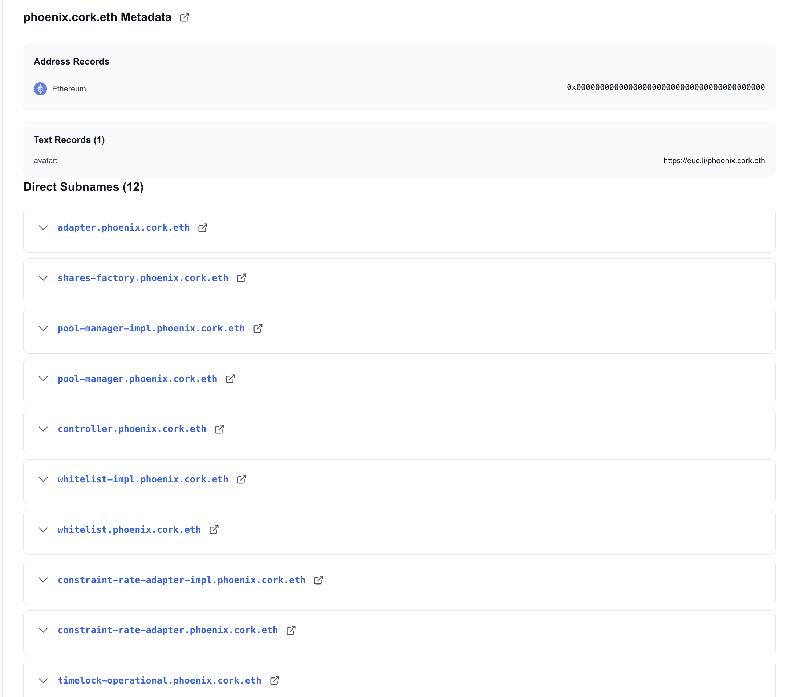
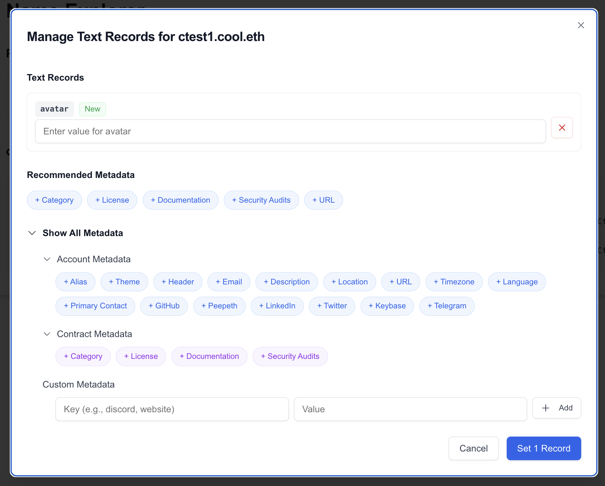

# Name Explorer

import AppUrl from '@site/src/components/AppUrl';

Name Explorer is a dedicated interface for exploring ENS names, their metadata, and their place in the naming hierarchy. You can access it from the main navigation, via search results, or through contract details pages.

## Two ways to search: address vs name

When you search for an ENS name in Enscribe, you get **two exploration options**:



### View address

If the name resolves to an address (forward resolution is set), you can view the **contract or account details** at that address:
- Contract verification and source code
- Associated ENS names
- ENS org and expiry status
- Contract metadata (if set)

This is the traditional "explore" experience, focused on the destination address.

### Explore name

This opens the **Name Explorer** view, focused on the ENS name itself:
- All text records and metadata
- Parent hierarchy navigation
- Subnames list
- Edit and setting new text records (if you're the owner or manager)

You don't need the name to resolve to an address. Any valid ENS name can be explored, whether it points somewhere or not.

## Navigating the hierarchy

Name Explorer's hierarchical navigation lets you traverse the ENS tree structure. ENS names are organized as a tree, and you can move up to parents or down to subnames with a click.

### Parent hierarchy



Every ENS name (except TLDs) has a parent. Name Explorer shows the complete parent chain:

```
pool-manager.phoenix.cork.eth
  ├─ phoenix.cork.eth (parent)
  │   ├─ cork.eth (grandparent)
  │   │   └─ eth (TLD)
```

Each parent name is clickable. Click any parent to instantly navigate up the hierarchy and explore its metadata.

### Direct subnames



If a name has subnames beneath it, Name Explorer lists them all:

```
phoenix.cork.eth
  ├─ adapter.phoenix.cork.eth
  ├─ shares-factory.phoenix.cork.eth
  ├─ pool-manager.phoenix.cork.eth
  ├─ controller.phoenix.cork.eth
  └─ whitelist.phoenix.cork.eth
  └─ ...
```

Click any subname to explore it. You can browse an entire project's naming structure this way.

**Use cases:**
- **Understand organizational structure**: See how a project organizes its contracts
- **Trace ownership**: Follow parent names to find the root organization
- **Discover related names**: Find other contracts under the same parent
- **Find specific contract versions** quickly
- **Check inherited metadata**: See what metadata comes from parent levels

## Viewing and editing metadata

Name Explorer shows every text record set on an ENS name. All metadata is displayed in one view.

If you're the owner or manager of an ENS name, Name Explorer lets you **edit metadata directly**.



Click the **"Set Metadata"** button next to any ENS name you own to open the metadata editor.

### Recommended keys

The editor provides **recommended metadata keys** based on the address type, if it is a contract or an account. Also you manually add other keys related to account or contract or even custom keys if you want to.

**Account metadata** (for wallets)
- email, phone, location
- Social profiles
- Personal information

**Contract metadata** (for smart contracts)
- Technical documentation
- Audit reports
- License information
- Compiler metadata

These recommendations follow the [draft Contract Metadata ENSIP](https://github.com/ensdomains/ensips/pull/50) and community best practices.

### Multicall support

Set multiple metadata fields in a single transaction using **multicall**. This saves gas and time when you're setting up metadata for the first time or making bulk updates.

The interface shows exactly which records will be updated and lets you review before signing.

## Try it now

Open Name Explorer in the <AppUrl path="nameMetadata" label="Enscribe App" /> to search for any ENS name, explore its hierarchy, and manage metadata.
